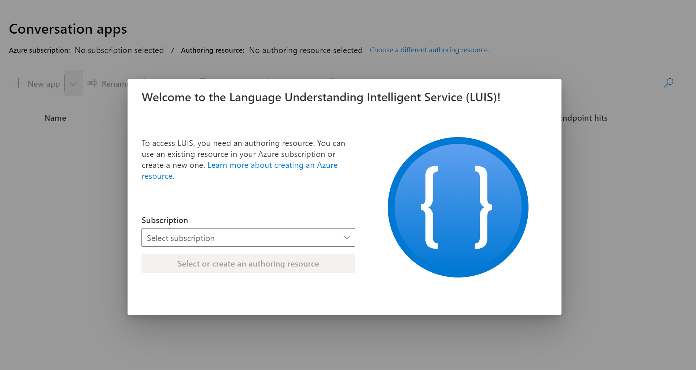
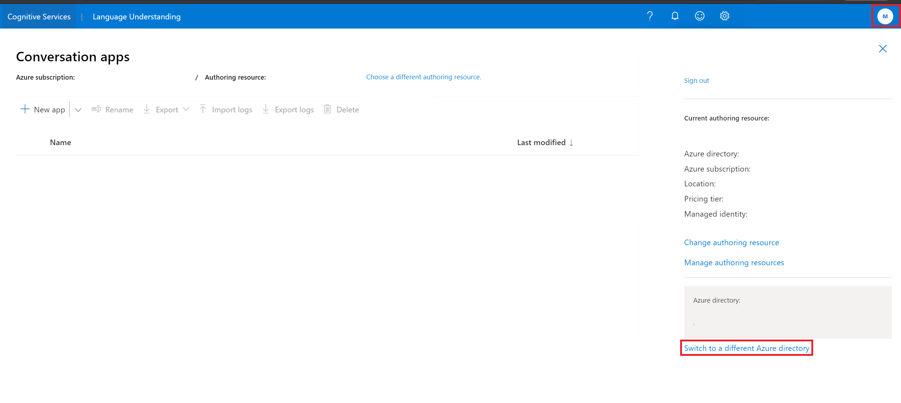
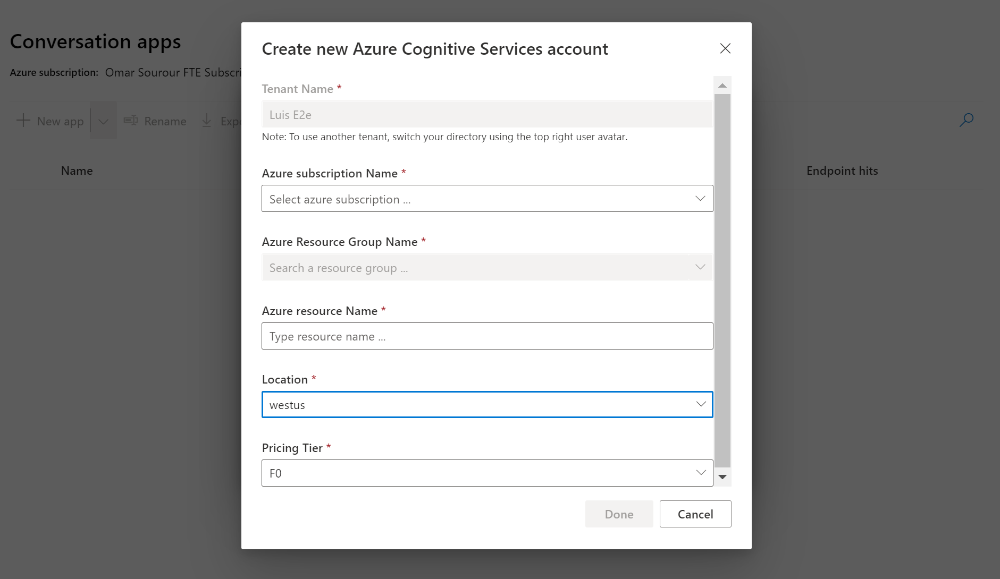

# Sign in to LUIS portal

Use this article to get started with the LUIS portal, and create an authoring resource. After completing the steps in this article, you will be able to create and publish LUIS apps.

## Access the portal

1. To get started with LUIS, go to the [LUIS Portal](https://www.luis.ai). If you do not already have a subscription, you will be prompted to go create a [free account](https://azure.microsoft.com//free/cognitive-services/) and return back to the portal.
2. Refresh the page to update it with your newly created subscription
3. Select your subscription from the dropdown list

    > [!div class="mx-imgBorder"]
    > 

4. If your subscription lives under another tenant, you will not be able to switch tenants from the existing window. You can switch tenants by closing this window and selecting the rightmost avatar containing your initials in the top bar. Click on **Choose a different authoring resource** from the top to re-open the window.

    > [!div class="mx-imgBorder"]
    > 

5. If you have an existing LUIS authoring resource associated with your subscription, choose it from the dropdown list. You can view all applications that are created under this authoring resource.
6. If not, then click on **Create a new authoring resource** at the bottom of this modal.
7.  When creating a new authoring resource, provide the following information:

    > [!div class="mx-imgBorder"]
    > 

    * **Tenant Name** - the tenant your Azure subscription is associated with. You will not be able to switch tenants from the existing window. You can switch tenants by closing this window and selecting the avatar at the top right corner of the screen, containing your initials. Select **Choose a different authoring resource** from the top to re-open the window.
    * **Azure Resource group name** - a custom resource group name you choose in your subscription. Resource groups allow you to group Azure resources for access and management. If you currently do not have a resource group in your subscription, you will not be allowed to create one in the LUIS portal. Go to [Azure portal](https://ms.portal.azure.com/#create/Microsoft.ResourceGroup) to create one then go to LUIS to continue the sign-in process.
    * **Azure Resource name** - a custom name you choose, used as part of the URL for your authoring transactions. Your resource name can only include alphanumeric characters, `-`, and can’t start or end with `-`. If any other symbols are included in the name, creating a resource will fail.
    * **Location** - Choose to author your applications in one of the [three authoring locations](https://docs.microsoft.com/azure/cognitive-services/luis/luis-reference-regions) that are currently supported by LUIS including: West Us, West Europe and East Australia
    * **Pricing tier** - By default, F0 authoring pricing tier is selected as it is the recommended. Create a [customer managed key](https://docs.microsoft.com/azure/cognitive-services/luis/luis-encryption-of-data-at-rest#customer-managed-keys-for-language-understanding) from the Azure portal if you are looking for an extra layer of security.
8. Now you have successfully signed in to LUIS. You can now start creating applications.

## Troubleshooting

* When creating a new resource, make sure that the resource name only includes alphanumeric characters, '-', and can’t start or end with '-'. Otherwise, it will fail.
* Make sure that you have the [proper permissions on your subscription to create an Azure resource](../../role-based-access-control/rbac-and-directory-admin-roles.md#azure-roles). If you do not have the proper permissions, contact the admin of your subscription to give you sufficient permissions.

## Next steps

* Learn how to [start a new app](luis-how-to-start-new-app.md)
