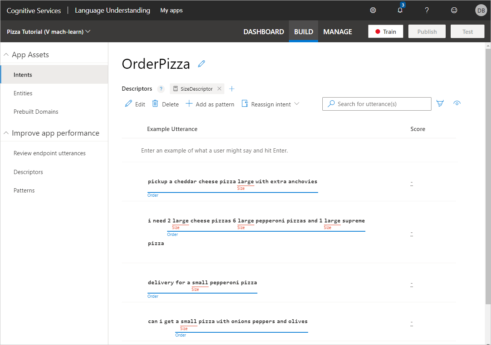
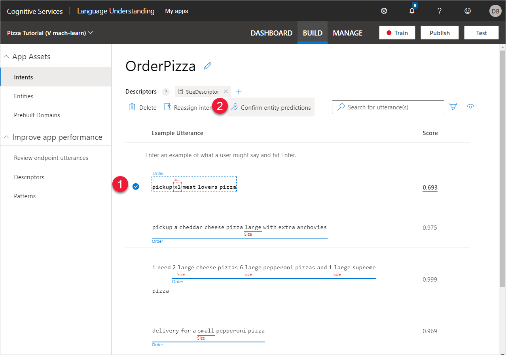
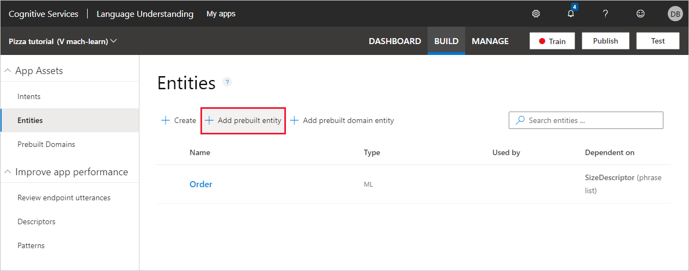
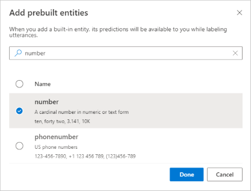
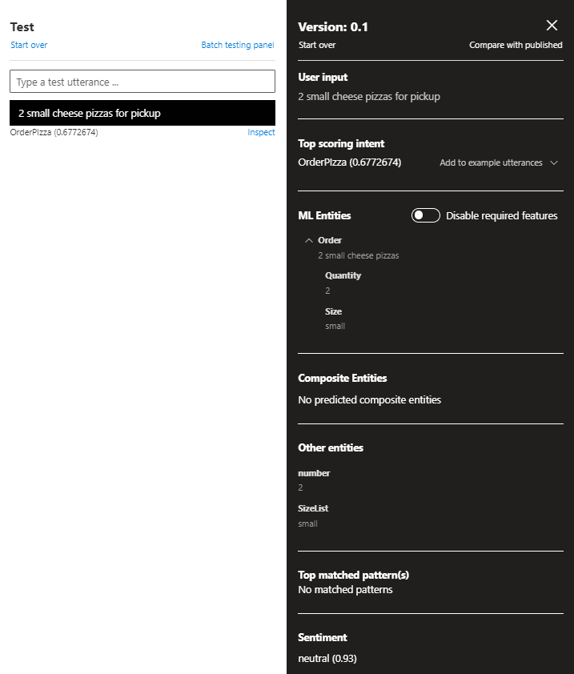

# Tutorial: Extract names with machine-learned entities

In this tutorial, extract machine-learned data from an utterance using the machine-learned entity. The machine-learned entity supports the [model decomposition concept](luis-concept-model.md#v3-authoring-model-decomposition) by providing subcomponent entities with their descriptors and constraints. 

[!INCLUDE [Uses preview portal](includes/uses-portal-preview.md)]

**In this tutorial, you learn how to:**

<!-- green checkmark -->
> [!div class="checklist"]
> * Import example app
> * Add machine-learned entity 
> * Add subcomponent
> * Add subcomponent's descriptor
> * Add subcomponent's constraint
> * Train app
> * Publish app
> * Get entity prediction from endpoint

[!INCLUDE [LUIS Free account](includes/quickstart-tutorial-use-free-starter-key.md)]


## Machine-learned entity

This tutorial adds a machine-learned entity to extract data from an utterance. The purpose of the entity is to teach LUIS what the entity is and where it can be found in an utterance. The part of the utterance that is the machine-learned entity can change from utterance to utterance based on word choice and utterance length. LUIS needs examples of the entity.  

This machine-learned entity is the beginning and top-level for data extraction. The decomposability of the machine-learned entity allows LUIS to find and label the specific words inside the utterance's text for each part of the entity. 

While you may not know how detailed you want your entity when you begin your app, a best practice is to start with a machine-learned entity, then add subcomponents are your app matures.

## Import example app

1.  Download and save the [app JSON file](https://github.com/Azure-Samples/cognitive-services-language-understanding/blob/master/documentation-samples/tutorials/machine-learned-entity/pizza-intents-only.json).

1. In the [preview LUIS portal](https://preview.luis.ai), on the **My apps** page, select **Import**, then **Import as JSON**. Find the saved JSON file from the previous step. You don't need to change the name of the app. Select **Done**

1. From the **Manage** section, on the **Versions** tab, select the version, then select **Clone** to clone the version, and name it `mach-learn`. Then select **Done** to finish the clone process.

    Cloning is a best practice before you modify your app. Because the version name is used as part of the URL route, the name can't contain any characters that are not valid in a URL.

## Mark entities in example utterances

To extract information about a Pizza order, mark the details in the example utterances. To extract details about a pizza order, create a top level, machine-learned `Order` entity. This should include all words that are important to get the order correct and only those words.

1. [!INCLUDE [Start in Build section](includes/tutorial-start-in-build-section.md)]

1. On the **Intents** page, select **OrderPizza** intent. 

1. In the example utterances list, select the following utterance. 

    |Order example utterance|
    |--|
    |`pickup a cheddar cheese pizza large with extra anchovies`|

    Begin just before the left-most text of `pickup` (#1), select it (this begins the marking process), then go just beyond the right-most text, `anchovies` (#2 - this ends the marking process).

    An entity won't always be the entire utterance. In this specific case, `pickup` indicates how the order is to be received so it should be part of the marked entity for the order.


    FIX THIS IMAGE


    

1. In the pop-up box, enter the name of the entity as `Order` (#1). Then select that name from the list (#2).

    FIX THIS IMAGE

    

1. In the **Choose an entity type** box, select **Add Structure** (#1) then select **Next** (#2).

    

1. In the **Create a machine learned entity** box, in the **Structure** box, add `Size`. For the **Size** component, add a **descriptor** named `SizeDescriptor`, then select **Create new phrase list**.

    

1. In the **Create new phrase list descriptor** box, enter values of: `small`, `medium`, and `large`. When the **Suggestions** box fills in, select `extra-large`, and `x-large`. Select `xl` when it appears in the **Suggestions** box. Select **Done** to create the new phrase list as a descriptor to the Size subcomponent.  

    

1. In the **Create a machine learned entity**, select **Create** to finish the machine-learned entity.

1. When the Intent details page appears, the example utterance has a solid line under the marked text. This indicates the marked text agrees with the prediction. Because you explicitly marked it and labeled it, they will match. This visual indicator is valuable, not on the first utterance marked, but on the remaining utterances. 

    FIX THIS IMAGE

    

1. In the example utterance, mark and select the **Size** subcomponent. Again the line is solid under the text because both the marking and prediction match because you explicitly marked the text.

1. Mark the `Order` entity in the remaining utterances. The square brackets in the text indicate the marked entity.

    |Order example utterances|
    |--|
    |`can i get [a pepperoni pizza and a can of coke] please`|
    |`can i get [a small pizza with onions peppers and olives]`|
    |`[delivery for a small pepperoni pizza]`|
    |`i need [2 large cheese pizzas 6 large pepperoni pizzas and 1 large supreme pizza]`|

    The `a` is part of the order because it implies a quantity of 1.

1. Mark the words indicating size such as `large` and `small` with the Size entity. 

    FIX THIS IMAGE

    

1. Train the app, select **Train**. 

1. After training, add a new example utterance to understand how well LUIS understands the new machine-learned entity. 

    |Order example utterance|
    |--|
    |`pickup XL meat lovers pizza`|

    The overall top entity, `Order` is marked and the `Size` subcomponent is also marked with dotted lines.  

    

    The dotted link indicates the prediction. 

1. In order to accept the prediction, select the row, then select **Confirm entity predictions**.

    

    For now, the machine-learned entity is working. 

## Add prebuilt number to app

The order information should also include how many of an item in the order, such as how many pizzas. To extract this data, a new machine-learned subcomponent needs to be added and that component needs a constraint of a prebuilt number. 

Begin by adding the prebuilt number to the app. 

1. Select **Entities** from the left menu, then select **+ Create**. 

    

1. In the **Add prebuilt entities** box, search for and select **Number** then select **Done**. 

    

    The prebuilt entity is added to the app but isn't a constraint yet. 

## Create subcomponent entity with constraint

The `Order` entity should have a `Quantity` subcomponent to determine how many of an item are in the order. 

1. Select **Entities** then select the `OrderPizza` intent. 
1. Select **+ Add Component** then enter the name `Quantity` then select Enter to add the new entity to the app.
1. After the success notification, select the `Quantity` subcomponent then select the Constraint pencil.
1. In the drop-down list, select the prebuilt number. 

    

    The entity with the constraint is create but not yet applied to the example utterances.

## Mark example utterance with subcomponent for quantity

1. Select **Intents** from the left-hand navigation then select the **OrderPizza** intent. The three numbers in the following utterances are marked but are visually below the `Order` entity line. This lower level means the entities are found but are not considered apart of the `Order` entity.
1. Mark the numbers with the `Quantity` entity by selecting the `2` in the example utterance then selecting `Quantity` from the list. 

    

1. Mark the `6` and the `1` in the same example utterance. 
1. In the following example utterance, mark the `a` as a quantity, because it implies a quantity of 1: 

    `delivery for a small pepperoni pizza`

    Label the `a` when it implies quantity in the remaining example utterances. 

1. Select **Train** to train the app with these new utterances.

    

    At this point, the order has some details that can be extracted (size, quantity, and total order). There is further refining of the `Order` entity such as pizza toppings, type of crust, and side orders. Each of those should be created as subcomponents of the `Order` entity. 

## Test the app

Test the app using the interactive test panel. This process lets you enter a new utterance then view the prediction results to see how well the active model is working. The intent prediction should be fairly confident (above 70%) and the entity extraction should pick up at least the `Order`.

1. Select **Test** in the top navigation.
1. Enter the utterance `deliver a medium veggie pizza` and select Enter. The active model predicted the correct intent with over 70% confidence.

    

1. Select **Inspect** to see the entity predictions.

    

    The size was correctly identified but the quantity was not. More utterances with the subcomponents marked will help with this issue.

## Publish the app so the trained model is queryable from the endpoint

[!INCLUDE [LUIS How to Publish steps](../../../includes/cognitive-services-luis-tutorial-how-to-publish.md)]

## Get intent and entity prediction from endpoint 

1. [!INCLUDE [LUIS How to get endpoint first step](../../../includes/cognitive-services-luis-tutorial-how-to-get-endpoint.md)]

1. Go to the end of the URL in the address and enter the same query as you entered in the interactive test panel. 

    `deliver a medium veggie pizza`

    The last querystring parameter is `query`, the utterance **query**. 

    ```json
    {
        "query": "deliver a medium veggie pizza",
        "prediction": {
            "topIntent": "OrderPizza",
            "intents": {
                "OrderPizza": {
                    "score": 0.7812769
                },
                "None": {
                    "score": 0.0314020254
                },
                "Confirm": {
                    "score": 0.009299271
                },
                "Greeting": {
                    "score": 0.007551549
                }
            },
            "entities": {
                "Order": [
                    {
                        "Size": [
                            "medium"
                        ],
                        "$instance": {
                            "Size": [
                                {
                                    "type": "Size",
                                    "text": "medium",
                                    "startIndex": 10,
                                    "length": 6,
                                    "score": 0.9955588,
                                    "modelTypeId": 1,
                                    "modelType": "Entity Extractor",
                                    "recognitionSources": [
                                        "model"
                                    ]
                                }
                            ]
                        }
                    }
                ],
                "$instance": {
                    "Order": [
                        {
                            "type": "Order",
                            "text": "a medium veggie pizza",
                            "startIndex": 8,
                            "length": 21,
                            "score": 0.7983857,
                            "modelTypeId": 1,
                            "modelType": "Entity Extractor",
                            "recognitionSources": [
                                "model"
                            ]
                        }
                    ]
                }
            }
        }
    }    
    ```
    

## Clean up resources

[!INCLUDE [LUIS How to clean up resources](../../../includes/cognitive-services-luis-tutorial-how-to-clean-up-resources.md)]

## Related information

* [Tutorial - intents](luis-quickstart-intents-only.md)
* [Concept - entities](luis-concept-entity-types.md) conceptual information
* [Concept - features](luis-concept-feature.md) conceptual information
* [How to train](luis-how-to-train.md)
* [How to publish](luis-how-to-publish-app.md)
* [How to test in LUIS portal](luis-interactive-test.md)

## Next steps

In this tutorial, the app uses a machine-learned entity to find the intent of a user's utterance and extract details from that utterance. Using the machine-learned entity allows you to decompose the details of the entity.  

> [!div class="nextstepaction"]
> [Add a prebuilt keyphrase entity](luis-quickstart-intent-and-key-phrase.md)
