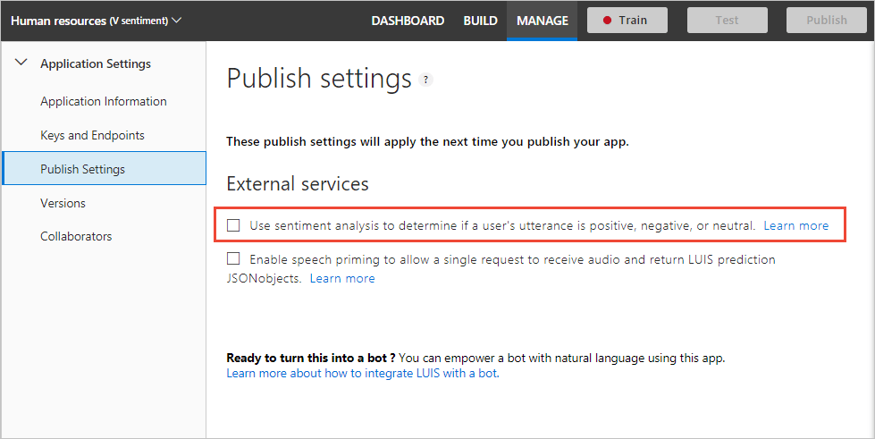

# Tutorial:  Configure publishing settings

In this tutorial, modify the publishing settings then query the LUIS endpoint to understand publishing settings.

**In this tutorial, you learn how to:**

<!-- green checkmark -->
> [!div class="checklist"]
> * Add sentiment analysis as publish setting
> * Get sentiment of utterance from endpoint

[!INCLUDE [LUIS Free account](../../../includes/cognitive-services-luis-free-key-short.md)]

## Sentiment analysis is a publish setting

The following utterances show examples of sentiment:

|Sentiment|Score|Utterance|
|:--|:--|:--|
|positive|0.91 |John W. Smith did a great job on the presentation in Paris.|
|positive|0.84 |The Seattle engineers did fabulous work on the Parker sales pitch.|

Sentiment analysis is a publish setting that applies to every utterance. Once set, your app returns the sentiment of an utterance without you having to labeling data\.

Because it is a publish setting, you do not see it on the intents or entities pages. You can see it in the [interactive test](luis-interactive-test.md#view-sentiment-results) pane or when testing at the endpoint URL.

## Import example .json to begin app

1.  Download and save the [app JSON file](https://github.com/Azure-Samples/cognitive-services-language-understanding/blob/master/documentation-samples/tutorials/machine-learned-entity/pizza-tutorial-with-entities.json).

[!INCLUDE [Import app steps](includes/import-app-steps.md)]

## Configure app to include sentiment analysis

1. Select **Manage** in the top right navigation, then select **Publish settings** from the left menu.

1. Select **Use sentiment analysis to determine if a user's utterance is positive, negative, or neutral.** to enable this setting.

    

## Publish the app so the trained model is queryable from the endpoint

[!INCLUDE [LUIS How to Publish steps](../../../includes/cognitive-services-luis-tutorial-how-to-publish.md)]

## Get the sentiment of an utterance from the endpoint

1. [!INCLUDE [LUIS How to get endpoint first step](../../../includes/cognitive-services-luis-tutorial-how-to-get-endpoint.md)]

1. Go to the end of the URL in the address and enter the following utterance:

    `Jill Jones work with the media team on the public portal was amazing`

    The last querystring parameter is `q`, the utterance **query**. This utterance is not the same as any of the labeled utterances so it is a good test and should return the `EmployeeFeedback` intent with the sentiment analysis extracted.

    ```json
    {
      "query": "Jill Jones work with the media team on the public portal was amazing",
      "topScoringIntent": {
        "intent": "EmployeeFeedback",
        "score": 0.9616192
      },
      "intents": [
        {
          "intent": "EmployeeFeedback",
          "score": 0.9616192
        },
        {
          "intent": "None",
          "score": 0.09347677
        }
      ],
      "entities": [
        {
          "entity": "jill jones",
          "type": "builtin.personName",
          "startIndex": 0,
          "endIndex": 9
        }
      ],
      "sentimentAnalysis": {
        "label": "positive",
        "score": 0.8694164
      }
    }
    ```

    The sentimentAnalysis is positive with a score of 86%.

    Try another utterance by removing the value for `q` in the address bar of the browser: `William Jones did a terrible job presenting his ideas.` The sentiment score indicates a negative sentiment by returning a low score `0.18597582`.

## Clean up resources

[!INCLUDE [LUIS How to clean up resources](../../../includes/cognitive-services-luis-tutorial-how-to-clean-up-resources.md)]

## Related information

* Sentiment analysis is provided by Cognitive Service [Text Analytics](../Text-Analytics/index.yml). The feature is restricted to Text Analytics [supported languages](luis-language-support.md##languages-supported).
* [How to train](luis-how-to-train.md)
* [How to publish](luis-how-to-publish-app.md)
* [How to test in LUIS portal](luis-interactive-test.md)


## Next steps
This tutorial adds sentiment analysis as a publish setting to extract sentiment values from the utterance as a whole.

> [!div class="nextstepaction"]
> [Review endpoint utterances in the HR app](luis-tutorial-review-endpoint-utterances.md)

