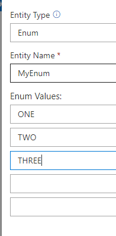
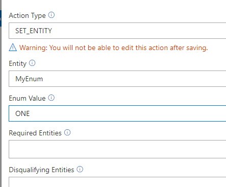
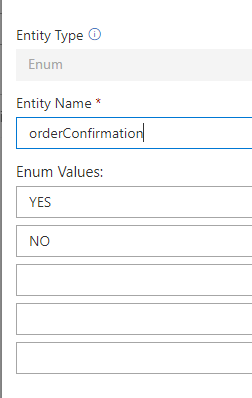
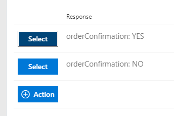
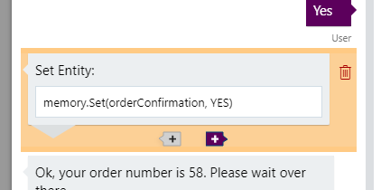

# When to use ENUM entities and SET ENTITY actions

This tutorial will explain when you should use ENUM (enumeration) entities and SET_ENTITY actions.

## Video

## What is covered

This tutorial will introduce two new features. A new type of entity called ENUM (short for enumeration) and a new type of action called SET_ENTITY which can refer to one of these enum values and as the name implies sets the entity to this value. As you will learn below these new features are usually used together and we will explain what they are and how to use them below. Before we get into the details it is important to understand what problem these features help solve.

## Problem

There are cases in conversations where the meaning of words depends on the context.  Normally the key words are learned and extracted using a language understanding service, but in these cases those systems may not be able to learn this

Imagine you overhear part of a conversation between people nearby and you only hear the word "Yes." You would not know what the "Yes" is agreeing to or confirming since you didn't hear the question asked before it. The question asked before is the context which gives meaning to the answer. Similarly since "Yes" is such a common response to many different questions it cannot be learned by providing examples as you would do with [Custom Trained](04-introduction-to-entities.md) entities because then it would learn to label every "Yes" as that entity.

### Example

Let's further clarify with the following example:

Bot: Do you like Microsoft Cognitive Services?
User: Yes
Bot: Do you like ice cream?
User: Yes

In previous tutorials we looked at [Custom Trained](04-introduction-to-entities.md) entities and your initial thought might be to create an entity named "likesCogServices" and label the first "Yes" as this entity.  However, the system would also label the second "Yes". When we attempted to correct the label of the second "Yes" to "likesIceCream" we would then create a conflict of two same inputs "Yes" meaning different thens and would be stuck.

It is in these cases where you would need to use ENUM entities and SET_ENTITY actions.

## When to use ENUMs or SET_ENTITY actions

Use these rules below to know when to use ENUM entities and SET_ENTITY actions.

- Detection or setting of entity is context dependent
- Number of possible values is fixed (Yes and No would be two values)

In other words use these for any close-ended prompts such as confirmation questions that always result in Yes or No.

> [!NOTE]
> We currently have limitation of up to 5 values per enum entity. Each value uses one of slots in the current 64 limit. See [cl-values-and-boundaries](./cl-values-and-boundaries.md)

Example:
Bot: Is your order correct?
User: Yes

When the possible values of the entity is open-ended and not fixed you would need to use an alternative feature such as [expected entity](09-expected-entity.md).

Example:
Bot: What is your name?
User: Matt
Bot: What is your favorite color?
User: Silver

These prompts are considered open-ended because they could be answered with arbitrary values.

## What

### EUM entities

ENUM entities are created just like the other entities. Similar to "programmatic" you cannot label words as these entities they must be set through code or SET_ENTITY actions

### Set Entity Actions

As mentioned above "Set Entity" actions simply set an entity to a known enum value. You could achieve the same results by creating an API callback action and using the memory manager to set the entity to a value. E.g. `memory.Set(entityName, entityValue)`. Having to write this code and create these actions would become tedious and hard to manage so Conversation Learner has special actions to facilitate this work and automatically generate these actions when they are used. Having these as independent actions preserves the ability to compose these without being coupled with other actions or code in your bot.

- Set entity actions can only be created when referring to a value of an enum entity so you must create an enum entity first.
- Set entity actions are also "non-await" since they have no visible output and need to be followed up by a "wait" action the user can see.
- Set entity actions are immutable meaning you cannot edit them after creation. We plan to remove this restriction in the future.

### Automatic action generation

If an enum entity exists in your model Conversation Learner will create placeholder actions for each of the possible values and make them available to select during training. Upon selection the action it would automatically be created and taken by your bot to be ranked in future similar situations of the conversation.

For example, if I create an enum entity with the values "Yes" and "No".

Even without explicitly creating actions for this new enum you would see two new actions available during training:

## Create a Bot using EUM entities and SET_ENTITY actions

### Requirements

This tutorial requires that the general tutorial bot is running

    npm run tutorial-general

We will create a bot to simulate fast food ordering. It will having discrete values for sizes of drinks and fries SMALL, MEDIUM, and LARGE as well as confirmation questions with YES / NO answers both of these satisfy the two rules above of being context dependent answers and fixed values.

### Create the model

1. In the web UI, click on "Import"
2. Select the tutorial named "Tutorial-Enum-Set-Entity"

This will navigate you to the model management page.
Notice the model already contains a few enum entities and set entity actions.

### Create the first dialog

1. On the left navigation panel, click "Train Dialogs", then click the "New Train Dialog" button.
2. As the user type in, "Hi, I would like to order a coke and fries please".
3. Click the "Score Actions" button

   > The user hasn't specified sizes for the drink or fries so we need to ask them.

4. Select the action with response: "What size drink would you like?"
5. As the user type in, "large"
6. Click the "Score Actions" button
7. Select the action SET_ENTITY - "drinkSize: LARGE"
8. Select the action with response: "What size fries would you like?"
9. As the use type in, "Um, make those a medium.
10. Click the "Score Actions" button
11. Select the action SET_ENTITY - "friesSize: MEDIUM"
12. Select the action with response: "Would you like any condiments?"
13. As the use type in, "Yes"
14. Click the "Score Actions" button
15. Select the action SET_ENTITY - "condimentsConfirmation: YES"
16. Select the action with response: "Ok, I have an order for a LARGE drink and MEDIUM fries. Is that correct?"
17. As the use type in, "Yes"
18. Click the "Score Actions" button
19. Select the action SET_ENTITY - "orderConfirmation: YES"
20. Select the action with response: "Ok, your order number is 58. Please wait over there."
21. Click "Save" to close the dialog

You have just created your first dialog using ENUM entities and SET_ENTITY actions. You can make many more combinations of the user specifying partial information or experimenting with other types of close-ended questions.

> [NOTE]
> During training you will see placeholders for the SET_ENTITY actions such as
>
> 
>
> but when creating log dialogs use deployed bots users will not see these.

## Next steps

> [!div class="nextstepaction"]
> [Introduction to entities](./04-introduction-to-entities.md)
