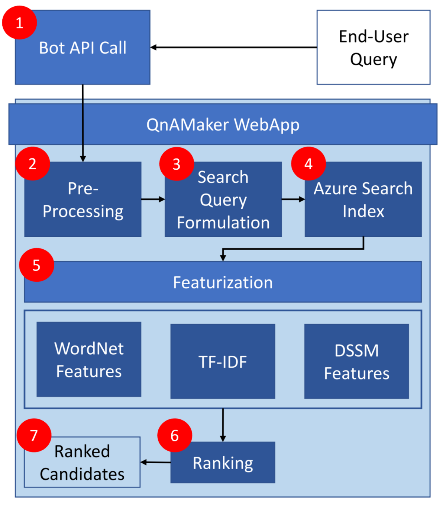

# What is a QnA Maker Knowledge base?

A QnA Maker knowledge base consists of a set of question/answer (QnA) pairs and optional metadata associated with each QnA pair.

## Key knowledge base concepts

* **Questions** - A question contains text that best represents a user query. 
* **Answers** - An answer is the response that is returned when a user query is matched with the associated question.  
* **Metadata** - Metadata are tags associated with a QnA pair and are represented as key-value pairs. Metadata tags are used to filter QnA pairs and limit the set over which query matching is performed.

A single QnA, represented by a numeric QnA ID, has multiple variants of a question (alternate questions) that all map to a single answer. Additionally, each such pair can have multiple metadata fields associated with it: one key, and one value.

 

## Knowledge base content format

When you ingest rich content into a knowledge base, QnA Maker attempts to convert the content to markdown. Read [this](https://aka.ms/qnamaker-docs-markdown-support) blog to understand the markdown formats understandable by most chat clients.

Metadata fields consist of key-value pairs separated by a colon **(Product:Shredder)**. Both key and value must be text-only. The metadata key must not contain any spaces. Metadata supports only one value per key.

## How QnA Maker processes a user query to select the best answer

The trained and [published](/quickstarts/create-publish-knowledge-base.md#publish-the-knowledge-base) QnA Maker knowledge base receives a user query, from a bot or other client application, at the [GenerateAnswer API](/how-to/metadata-generateanswer-usage.md#get-answer-predictions-with-the-generateanswer-api). The following diagram illustrates the process when the user query is received.

The process is explained in the following table:

|Step|Purpose|
|--|--|
|1|The client application sends the user query to the [GenerateAnswer API](/how-to/metadata-generateanswer-usage.md#get-answer-predictions-with-the-generateanswer-api).|
|2|Qna Maker preprocessing the user query with language detection, spellers, and word breakers.|
|3|This preprocessing is taken to alter user query for best search results.|
|4|This altered query is sent to Azure Search Index, receiving the `top` number of results. If the correct answer isn't in these results, increase the value of `top` slighly. Generally a value of 10 for `top` works in 90% of queries.|
|5|The search results returned from Azure Search Index have features applied.|
|6|The features scores are used to determine best ranking of the results from Azure Search Index.|
|7|The new results are returned to the client application in ranked order.|
|||

The following featurizations are used to preprocess (step 2 above) the user query:

|Feature|Purpose|
|--|--|
|WordNet|There are various features generated using WordNet matching with questions and answers. This takes care of the word level semantics.|
|Term frequency-inverse document frequency (TF-IDF)|This weight is a statistical measure used to evaluate how important a word is to a document in a collection or corpus. The importance increases proportionally to the number of times a word appears in the document but is offset by the frequency of the word in the corpus. |
|CDSSM||
|||

## Next steps

> [!div class="nextstepaction"]
> [Development lifecycle of a knowledge base](./development-lifecycle-knowledge-base.md)

## See also

[QnA Maker overview](../Overview/overview.md)
