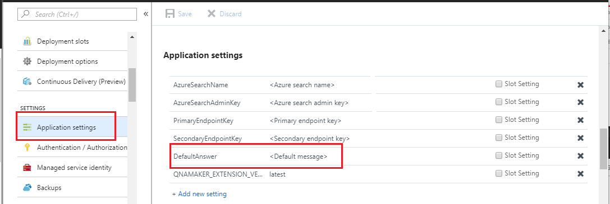

# Frequently Asked Questions

## Manage the knowledge base

### Why is my URL(s)/file(s) is not extracting question-answer pairs?

It's possible that QnA Maker can't auto-extract some question-and-answer (QnA) content from valid FAQ URLs. In such cases, you can paste the QnA content in a .txt file and see if the tool can ingest it. Alternately, you can editorially add content to your knowledge base through the [QnA Maker portal](https://qnamaker.ai).

### How large a knowledge base can I create?

The size of the knowledge base depends on the SKU of Azure search you choose when creating the QnA Maker service. Read [here](./Tutorials/choosing-capacity-qnamaker-deployment.md) for more details.

### Why can't I see anything in the drop-down when I try to create a new knowledge base?

You haven't created any QnA Maker services in Azure yet. Read [here](./How-To/set-up-qnamaker-service-azure.md) to learn how to do that.

### How do I share a knowledge base with others?

Sharing works at the level of a QnA Maker service, that is, all knowledge bases in the service will be shared. Read [here](./How-To/collaborate-knowledge-base.md) how to collaborate on a knowledge base.

### Can you share a KB with a contributor that is not in the same AAD tenant, to modify a KB? 

Sharing is based on Azure role-based access control (RBAC). If you can share _any_ resource in Azure with another user, you can also share QnA Maker.

### If you have an App Service Plan with 5 QnAMaker KBs. Can you assign read/write rights to 5 different users so each of them can access only 1 QnAMaker KB?

You can share an entire QnAMaker service, not individual KBs.

### How can I change the default message when no good match is found?

The default message is part of the settings in your App service.
- Go to your App service resource in the Azure portal

- Click on the **Settings** option

- Change the value of the **DefaultAnswer** setting
- Restart your App service

### Why is my SharePoint link not getting extracted?

The tool parses only public URLs and does not support authenticated data sources at this time. Alternately, you can download the file and use the file-upload option to extract questions and answers.

### The updates that I made to my knowledge base are not reflected on publish. Why not?

Every edit operation, whether in a table update, test, or setting, needs to be saved before it can be published. Be sure to click the **Save and train** button after every edit operation.

## Does the knowledge base support rich data or multimedia?

The knowledge base supports Markdown. However, the auto-extraction from URLs has limited HTML-to-Markdown conversion capability. If you want to use full-fledged Markdown, you can modify your content directly in the table, or upload a knowledge base with the rich content.

Multimedia, such as images and videos, is not supported at this time.

## Does QnA Maker support non-English languages?

See more details about [supported languages](./Overview/languages-supported.md).

If you have content from multiple languages, be sure to create a separate service for each language.

## Manage service

### When should I refresh my endpoint keys?

Refresh your endpoint keys if you suspect that they have been compromised.

### Can I use the same Azure Search resource for KBs using multiple languages?

To use multiple language and multiple KBs, the user has to create an QnA Maker resource for each language. This will create a separate Azure search services per language. Mixing different language KBs in a single Azure search service will result in degraded relevance of results.

## Integrate with other services including Bots

### Do I need to use Bot Framework in order to use QnA Maker?

No, you do not need to use the Bot Framework with QnA Maker. However, QnA Maker is offered as one of several templates in Azure Bot Service. Bot Service enables rapid intelligent bot development through Microsoft Bot Framework, and it runs in a server-less environment.

### How can I create a bot with QnA Maker?

Follow the instructions in [this](./Tutorials/create-qna-bot.md) documentation to create your Bot with Azure Bot Service.

### How do I embed the QnA Maker service in my website?

Follow these steps to embed the QnA Maker service as a web-chat control in your website:

1. Create your FAQ bot by following the instructions [here](./Tutorials/create-qna-bot.md).
2. Enable the web chat by following the steps [here](https://docs.microsoft.com/azure/bot-service/bot-service-channel-connect-webchat)

