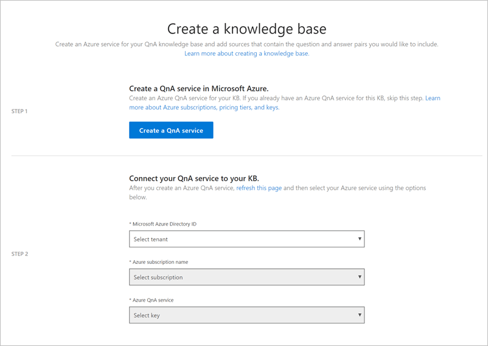
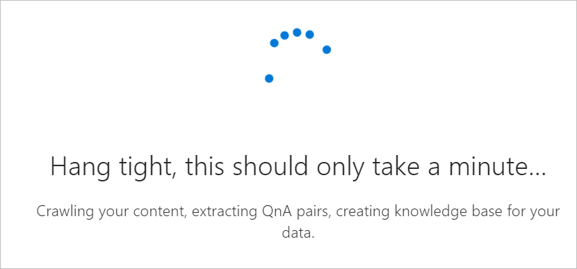

# Quickstart: Create a knowledge base using the QnA Maker API service portal

The QnA Maker API service portal makes it simple to add your existing data sources when creating a knowledge base. You can create a new QnA Maker knowledge base from the following document types:

<!-- added for scanability -->
* FAQ pages
* Products manuals
* Structured documents

Include a chit-chat personality to make your knowledge more engaging with your users.

If you don't have an Azure subscription, create a [free account](https://azure.microsoft.com/free/?WT.mc_id=A261C142F) before you begin. 

## Create a new knowledge base

1. Sign into to the [QnA Maker portal](https://qnamaker.ai) with your Azure credentials and select **Create a knowledge base**.

1. If you have not already created a QnA Maker service, select **Create a QnA service**. 

1. Select your Azure tenant, Azure subscription name, and Azure resource name associated with the QnA Maker service from the lists in **Step 2** in the QnA Maker portal. Select the Azure QnA Maker service that will host the Knowledge Base.

    

1. Enter the name of your knowledge base and the data sources for the new knowledge base.

    

1. Give your service a **name** such as `my first kb`. Duplicate names and special characters are supported.

1. Add the QnA Maker troubleshooting page as a URL: `https://docs.microsoft.com/en-us/azure/cognitive-services/qnamaker/troubleshooting`, then select `+ Add URL`. See more information on the types of sources supported [here](../Concepts/data-sources-supported.md). For this quickstart, **don't upload files** for data you want extracted. See the [pricing information](https://aka.ms/qnamaker-pricing) to see how many documents you can add.

1. Add **_professional_ Chit-chat** to your KB. 

1. Select **Create your KB**.

    

1. It can take a few minutes for data to be extracted.

    

1. When your knowledge base is successfully created, you are redirected to the **Knowledge base** page.

## Clean up resources

When you are done with the knowledge base, remove it in the QnA Maker portal.

## Next steps

For cost savings measures, you can [share](upgrade-qnamaker-service.md?#share-existing-services-with-qna-maker) some but not all Azure resources created for QnA Maker.

> [!div class="nextstepaction"]
> [Add chit-chat personal](./chit-chat-knowledge-base.md)
