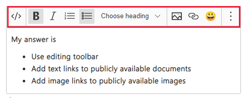

# Edit QnA pairs in your knowledge base

QnA Maker allows you to manage the content of your knowledge base by providing an easy-to-use editing experience.

QnA pairs are added from a datasource, such as a file or URL, or added as an editorial source. An editorial source indicates the QnA pair was added in the QnA portal manually. All QnA pairs are available for editing.

## Add an editorial QnA pair

1. Sign in to the [QnA portal](https://www.qnamaker.ai/), then select the knowledge base to add the QnA pair to.
1. On the **EDIT** page of the knowledge base, select **Add QnA pair** to add a new QnA pair.

    > [!div class="mx-imgBorder"]
    > 

1. In the new QnA pair row, add the required question and answer fields. The other fields are optional. All fields can be changed at any time.

    > [!div class="mx-imgBorder"]
    > 

1. Use the rich-text editor to write and format text and save as markdown.

    > [!div class="mx-imgBorder"]
    > 

    |Rich-text editor features|Keyboard shortcut|
    |--|--|
    |Toggle between rich-text editor and markdown. `</>`|CTRL+M|
    |Bold. **B**|CTR+LB|
    |Italics, indicated with an italicized **_I_**|CTRL+I|
    |Unordered list||
    |Ordered list||
    |Header style||
    |Image - add an image available from a public URL.|CTRL+G|
    |Add link to publicly available URL.|CTRL+K|
    |Emoticon - add from a selection of emoticons.|CTRL+E|
    |Advanced menu - undo|CTRL+Z|
    |Avanced menu - redo|CTRL+Y|

1. Optionally, add **[alternate phrasing](../Quickstarts/add-question-metadata-portal.md#add-additional-alternatively-phrased-questions)**. Alternate phrasing is any form of the question that is significantly different from the original question but should provide the same answer.

    When your knowledge base is published, and you have [active learning](use-active-learning.md) turned on, QnA Maker collects alternate phrasing choices for you to accept. These choices are selected in order to increase the prediction accuracy.

1. Optionally, add **[metadata](../Quickstarts/add-question-metadata-portal.md#add-metadata-to-filter-the-answers)**. To view metadata, select **View options** in the context menu. Metadata provides filters to the answers that the client application, such as a chat bot, provides.

1. Optionally, add **[follow-up prompts](multiturn-conversation.md)**. Follow-up prompts provide additional conversation paths to the client application to present to the user.

1. Select **Save and train** to see predictions including the new QnA pair.

## Edit a QnA pair

Any field in any QnA pair can be edited, regardless of the original data source. Some fields may not be visible due to your current **View Options** settings, found in the context tool bar.

## Delete a QnA pair

To delete a QnA, click the **delete** icon on the far right of the QnA row. This is a permanent operation. It can't be undone. Consider exporting your KB from the **Publish** page before deleting sets.

## Find the QnA pair ID

If you need to find the QnA pair ID, you can find it in two places:

* Hover on the delete icon on the QnA pair row you are interested in. The hover text includes the QnA pair ID.
* Export the knowledge base. Each QnA pair in the knowledge base includes the QnA pair ID.

## Add alternate questions

Add alternate questions to an existing QnA pair to improve the likelihood of a match to a user query.

## Linking QnA pairs

Linking QnA pairs is provided with [follow-up prompts](multiturn-conversation.md). This is a logical connection between QnA pairs, managed at the knowledge base level. You can edit follow-up prompts in the QnA Maker portal.

You can't link QnA pairs in the answer's metadata.

## Add metadata

Add metadata sets by first selecting **View options**, then selecting **Show metadata**. This displays the metadata column. Next, select the **+** sign to add a metadata set. This set consists of one key and one value.

## Save changes to the QnA pairs

Periodically select **Save and train** after making edits to avoid losing changes.

## When to use rich-text editing versus markdown

[Rich-text editing](#add-an-editorial-qna-set) of answers allows you, as the author, to use a formatting toolbar to quickly select and format text.

[Markdown](../reference-markdown-format.md) is a better tool when you need to autogenerate content to create knowledge bases to be imported as part of a CI/CD pipeline or for [batch testing](../Quickstarts/batch-testing.md).

## Next steps

> [!div class="nextstepaction"]
> [Collaborate on a knowledge base](./collaborate-knowledge-base.md)

* [Manage Azure resources used by QnA Maker](set-up-qnamaker-service-azure.md)