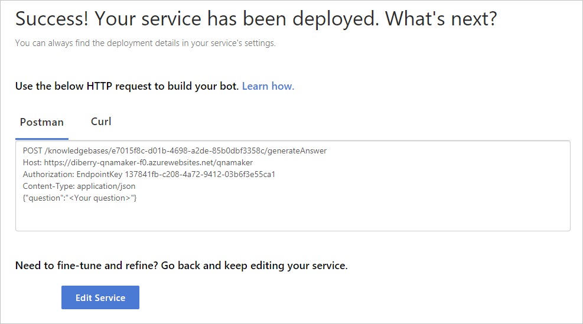
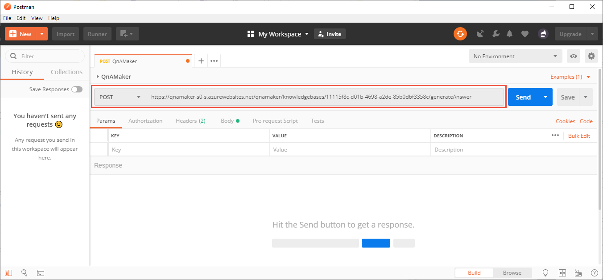
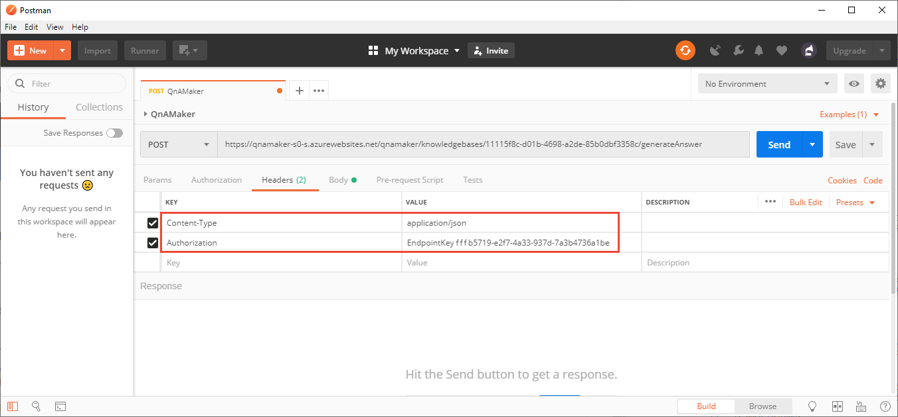
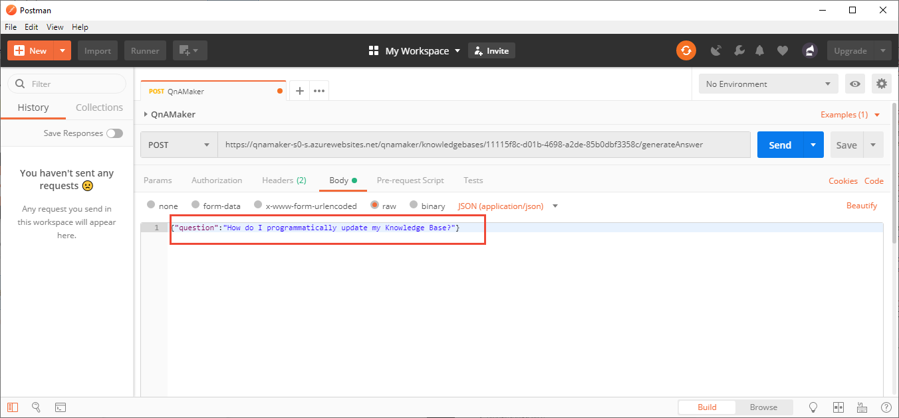
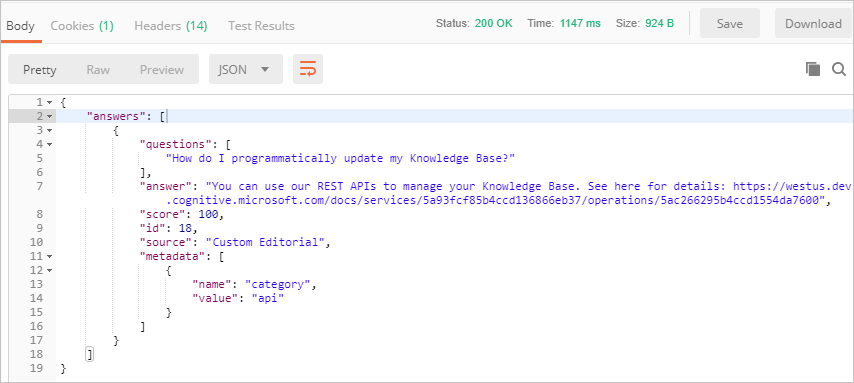
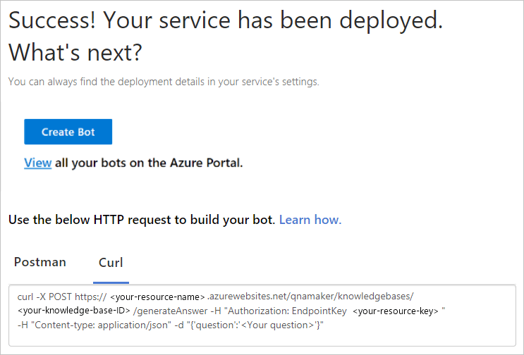

# Get answer from knowledge base

QnA Maker creates or refreshes the queryable endpoint when you publish the knowledge base. When publishing is complete, the HTTP request settings to generate an answer from your knowledge base are available. 

## Publish to get endpoint

When you are ready to generate an answer to a question from your knowledge base, [publish](publish-knowledge-base) your knowledge base.

## Use endpoint with Postman

When your knowledge base is published, the **Publish** page displays the HTTP request settings to generate an answer. The default view shows the settings required to generate an answer from [Postman](https://www.getpostman.com).

[](../media/qnamaker-use-to-generate-answer/publish-settings.png#lightbox)

To generate an answer with Postman, complete the following:

1. Open Postman. 
1. Select the building block to create a basic request.
1. Set the **Request name** as `Generate QnA Maker answer`and the **collection** as `Generate QnA Maker answers`.
1. In the workspace, select the HTTP method of **POST**.
1. For the URL, concatenate the HOST value and the Post value to create the complete URL. 

    [](../media/qnamaker-use-to-generate-answer/set-postman-method-and-url.png#lightbox)

1. Select the **Headers** tab under the URL. 
1. Add the first header key of **Content-Type** with a value of `application/json`.
1. Add the second header key of **Authorization** with the value of the word `Endpointkey`, then a space, then the key from the Publish page. 

    [](../media/qnamaker-use-to-generate-answer/set-postman-header.png#lightbox)

1. Select the **Body** tab.
1. Select the **raw** format and enter the JSON that represents the question.

    [](../media/qnamaker-use-to-generate-answer/set-postman-body-json-value.png#lightbox)

1. Select the **Send** button.
1. The response the answer. 

    [](../media/qnamaker-use-to-generate-answer/receive-postman-response.png#lightbox)

## Use endpoint with CURL

When your knowledge base is published, the **Publish** page displays the HTTP request settings to generate an answer. The **CURL** tab shows the settings required to generate an answer from the command-line tool, [CURL](https://www.getpostman.com).

[](../media/qnamaker-use-to-generate-answer/curl-command-on-publish-page.png#lightbox)

To generate an answer with CURL, complete the following:

1. Copy the text in the CURL tab. 
1. Open a command-line or terminal and paste the text.
1. Edit the question to be relevant to your knowledge base. Be careful not to remove the containing JSON surrounding the question.
1. Enter the command. 
1. The response includes the relevant information about the answer. 

    ```bash
    > curl -X POST https://qnamaker-f0.azurewebsites.net/qnamaker/knowledgebases/1111f8c-d01b-4698-a2de-85b0dbf3358c/generateAnswer -H "Authorization: EndpointKey 111841fb-c208-4a72-9412-03b6f3e55ca1" -H "Content-type: application/json" -d "{'question':'How do I programmatically update my Knowledge Base?'}"
    {
      "answers": [
        {
          "questions": [
            "How do I programmatically update my Knowledge Base?"
          ],
          "answer": "You can use our REST APIs to manage your Knowledge Base. See here for details: https://westus.dev.cognitive.microsoft.com/docs/services/5a93fcf85b4ccd136866eb37/operations/5ac266295b4ccd1554da7600",
          "score": 100.0,
          "id": 18,
          "source": "Custom Editorial",
          "metadata": [
            {
              "name": "category",
              "value": "api"
            }
          ]
        }
      ]
    }
    ```

## Next steps

> [!div class="nextstepaction"]
> [Use metadata while generating an answer](metadata-generateanswer-usage.md)