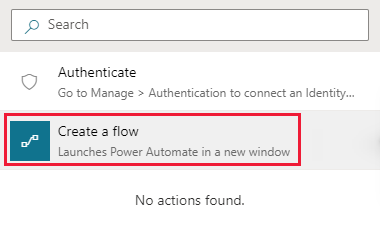

# How to add a QnA Maker knowledge base to Power Virtual Agent as the fallback action

Extend your [Power Virtual Agent](https://powervirtualagents.microsoft.com/) bot to provide the bot's fallback answer from your knowledge base. Use Power Automate to send the user's question to your knowledge base, and receive the knowledge base answer. Configure your bot's fallback action as part of your conversation flow from within the Power portal.

## Use QnA Maker knowledge base with an agent

QnA Maker is a cloud-based API service that lets you create a conversational question-and-answer layer over your existing data. Use it to build a knowledge base by extracting questions and answers from your semi-structured content, including FAQs, manuals, and documents. Answer questions from the QnA sets in your knowledge base. Your knowledge base gets smarter, too, as it continually learns from user behavior.
Once a QnA Maker knowledge base is published, a client application such as your agent, sends a question to your knowledge base endpoint and receives the answer.

## Create Power Virtual Agent's System fallback topic

The first step is to configure the agent's **System fallback** with QnA Maker's key and endpoint.

1. In the [Power Virtual Agents](https://powerva.microsoft.com/#/) portal, on the top-right corner of the navigation, select the **Settings** page. The icon for this page is the gear.

1. Select **System Fallback**.

    

1. On the pop-up **Settings** window, select **+ Add** to add a System fallback topic to your default list of topics.

    

1. After the topic is added, select the button  **Go to fallback topic** to author the fallback topic on the authoring canvas.

    > [!TIP] If you need to return to the fallback topic, the fallback topic is under **Topics** section, as part of the **System** topics.

## Connect the fallback topic to your knowledge base

Use the Power Virtual agent's authoring canvas to connect the fallback topic to your knowledge base.

1. The new fallback action may already have a flow designed. Delete all items in the flow except for the first item, **Trigger Phrases**.

    
lokm; 0    The **Trigger Phrases*:K9/666/666938383/689, with the unrecognized user input, as the text that is sent to your knowledge base.

1. Select the **+** connector, then select **Call an action**.

    

1. Select **Create a flow** to connect to your knowledge base.

    

    The process takes you to **Power Automate**, a different browser-based portal.

    In **Power Automate**, the **Flow Template** is started.

1. Select **Edit** to configure the input variable coming from your agent to your knowledge base. The input variable is the user-submitted text question from your agent.

    

1. Add a text input and name the variable `InputText` with a description of `UserQuestion`.

    

Step 5: Click on 'create a flow'. This will take you to Power Automate authoring screen with an already added step. Give a name to input 1 and a value as UserQuestion

Step 5.1: Add the QnA Maker GenerateAnswer action

Step 5.2: Add the details of the QnA Maker endpoint

Step 5.3: Initialize a variable that will hold the answer and set it to the first answer given by the previous step.

Step 5.4: Send the response to the Power Virtual Agent.

Step 5.6: Save your flow

Step 5.7: For the Flow to appear as options under 'Call an action' in Power Virtual Agent requires the Flow to be submitted as solution in the same development environment. The steps to register any flow as solution are listed here.

Step 6: Add the created Flow in the last step as an action in your PVA Fallback topic.

Step 7: Add 'Show a message' as the next node to show the output of the flow.

Step 8: Test the bot

## Next step