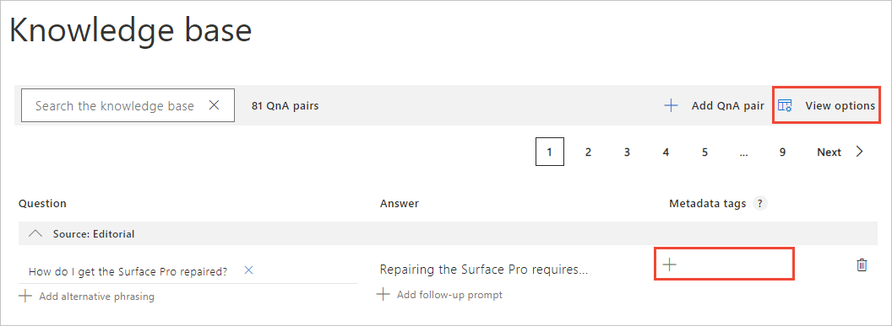

# Get a knowledge answer with the GenerateAnswer API and metadata

To get the predicted answer to a user's question, use the GenerateAnswer API. When you publish a knowledge base, this information to use this API is shown on the publish page. You can also configure the API to filter answers based on metadata tags and test the knowledge base from the endpoint with the test query string parameter.

QnA Maker lets you add metadata, in the form of key and value pairs, to your question/answer sets. This information can be used to filter results to user queries and to store additional information that can be used in follow-up conversations. For more information, see [Knowledge base](../Concepts/knowledge-base.md).

<a name="qna-entity"></a>

## Storing questions and answers with a QnA Entity

First it's important to understand how QnA Maker stores the question/answer data. The following illustration shows a QnA entity:


Each QnA entity has a unique and persistent ID. The ID can be used to make updates to a particular QnA entity.

<a name="generateanswer-api"></a>

## Get answer predictions with the GenerateAnswer API

You use the GenerateAnswer API in your Bot or application to query your knowledge base with a user question to get the best match from the question/answer sets.

<a name="generateanswer-endpoint"></a>

## Publish to get GenerateAnswer endpoint 

Once you publish your knowledge base, either from the [QnA Maker portal](https://www.qnamaker.ai), or using the [API](https://westus.dev.cognitive.microsoft.com/docs/services/5a93fcf85b4ccd136866eb37/operations/5ac266295b4ccd1554da75ff), you can get the details of your GenerateAnswer endpoint.

To get your endpoint details:
1. Log in to [https://www.qnamaker.ai](https://www.qnamaker.ai).
1. In **My knowledge bases**, click on **View Code** for your knowledge base.
    
1. Get your GenerateAnswer endpoint details.

    

You can also get your endpoint details from the **Settings** tab of your knowledge base.

[!INCLUDE [JSON request and response](../../../../includes/cognitive-services-qnamaker-quickstart-get-answer-json.md)] 

<a name="metadata-example"></a>

## Using metadata allows you to filter answers by custom metadata tags

Adding metadata allows you to filter the answers by these metadata tags. Consider the below FAQ data. Add metadata to your knowledge base by clicking on the metadata icon.



<a name="filter-results-with-strictfilters-for-metadata-tags"></a>

## Filter results with strictFilters for metadata tags

Consider the user question "When does this hotel close?" where the intent is implied for the restaurant "Paradise."

Since results are required only for the restaurant "Paradise", you can set a filter in the GenerateAnswer call on the metadata "Restaurant Name", as follows.

```json
{
    "question": "When does this hotel close?",
    "top": 1,
    "strictFilters": [
      {
        "name": "restaurant",
        "value": "paradise"
      }]
}
```

<name="keep-context"></a>

## Use question and answer results to keep conversation context

The response to the GenerateAnswer contains the corresponding metadata information of the matched question/answer set. This information can be used in your client application to store the context of the previous conversation for use in later conversations. 

```json
{
    "answers": [
        {
            "questions": [
                "What is the closing time?"
            ],
            "answer": "10.30 PM",
            "score": 100,
            "id": 1,
            "source": "Editorial",
            "metadata": [
                {
                    "name": "restaurant",
                    "value": "paradise"
                },
                {
                    "name": "location",
                    "value": "secunderabad"
                }
            ]
        }
    ]
}
```

## Next steps

The publish page also provides information to generate an answer with [Postman](../Quickstarts/get-answer-from-kb-using-postman.md) and [cURL](../Quickstarts/get-answer-from-kb-using-curl.md). 

> [!div class="nextstepaction"]
> [Create a knowledge base](./create-knowledge-base.md)
