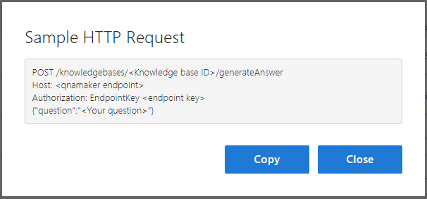

# Using metadata and the GenerateAnswer API

Metadata lets you add additional information to your QnAs, as key/value pairs. This information can be used in various ways like filtering results, boost results, store additional information which can be used in the follow up conversations, etc. Read more [here](../Concepts/knowledge-base.md)

## QnA Entity
Before we see an example of how to use metadata, it's important to understand how we store the QnA data. The QnA entity now looks like below:


Each QnA entity is uniquely identified by an ID which is persistent. The ID can be used to make any updates to a particular QnA entity.

## GenerateAnswer API
GenerateAnswer API is what you use in your Bot or application to query your knowledge base with an user question to get the best match.

### GenerateAnswer end point
When you publish your knowledge base either from the [qnamaker portal](https://www.qnamaker.ai) or via [APIs](https://westus.dev.cognitive.microsoft.com/docs/services/5a93fcf85b4ccd136866eb37/operations/5ac266295b4ccd1554da75ff), you will get the details of the generateAnswer endpoint.

To get your end point details:
1. Login to www.qnamaker.ai
2. Go to **My knowledge bases**, click on **View Code** of your knowledge base.

3. Get your GenerateAnswer end point details

4. You can also get your end point details from the settings tab of your knowledge base

### GenerateAnswer Request
The GenerateAnswer call is a simple HTTL POST request. See [here](../quickstarts/csharp.md) for code sample to use this API.

- **Request URL**: https://{qnamaker endpoint}/knowledgebases/{knowledge base ID}/generateAnswer

- **Request parameters**: 
    - **Knowledge base ID** (string) - GUID of your knowledge base. This is unique for every knowledge base
    - **QnAMaker endpoint** (string) - The hostname of the endpoint deployed in your Azure subscription
- **Request headers**
    - **Content-Type** (string) - Media type of the body sent to the API
    - **Authorization** (string) - Endpoint key
- **Request body**
    - **question** (string) - User question to be queried against your knowledge base
    - **top** (optional, integer) - Number of ranked results you want in the output. Default is 1.
    - **userId** (optional, string) - Unique id to identify user. This will be recorded in the chat logs
    - **strictFilters** (optional, string) - Returns only answers that have the specified metadata. See below for more details.
    ```
    {
        "question": "qna maker and luis",
        "top": 6,
        "strictFilters": [
        {
            "name": "category",
            "value": "api"
        }],
        "userId": "sd53lsY="
    }
    ```

### GenerateAnswer Response
- **Response 200** - A successful call returns the result of the question. The response contains the following fields:
    - **answers** - List of answers for the user query sorted in decreasing order of ranking score
        - **score**: Ranking score between 0 and 100.
        - **questions**: questions user provide. 
        - **source**: Source name from which answer was extracted or saved in knowledge base.
        - **metadata**: Metadata associated with the answer. 
            - name: Metadata name. (string, max Length: 100, required)
            - value: Metadata value. (string, max Length: 100, required)
        - **Id**: Unique id assigned to the answer.
    ```
    {
        "answers": [
            {
                "score": 28.54820341616869,
                "Id": 20,
                "answer": "There is no direct integration of LUIS with QnA Maker. But, in your bot code, you can use LUIS and QnA Maker together. [View a sample bot](https://github.com/Microsoft/BotBuilder-CognitiveServices/tree/master/Node/samples/QnAMaker/QnAWithLUIS)",
                "source": "Custom Editorial",
                "questions": [
                    "How can I integrate LUIS with QnA Maker?"
                ],
                "metadata": [
                    {
                        "name": "category",
                        "value": "api"
                    }
                ]
            }
        ]
    }
    ```

## Metadata example
Consider the below FAQ data for restaurants in Hyderabad. Add metadata to your knowledge base by clicking on gear icon.


### Filter results with strictFilters
Consider a user question "When does this hotel close?" where the intent is implied for the restaurant "Paradise".

Since results are required only for the restaurant "Paradise", we can set a filter in the GenerateAnswer call on the metadata "Restaurant Name", like below

```
{
    "question": "When does this hotel close?",
    "top": 1,
    "strictFilters": [
      {
        "name": "restaurant",
        "value": "paradise"
      }]
}
```

### Keep context
The response to the GenerateAnswer contains the corresponding metadata information of the matched QnA, like below:
```
{
    "answers": [
        {
            "questions": [
                "What is the closing time?"
            ],
            "answer": "10.30 PM",
            "score": 100,
            "id": 1,
            "source": "Editorial",
            "metadata": [
                {
                    "name": "restaurant",
                    "value": "paradise"
                },
                {
                    "name": "location",
                    "value": "secunderabad"
                }
            ]
        }
    ]
}
```
This information can be used to keep context of the previous conversation and accordingly take action downstream. 

## Next steps

> [!div class="nextstepaction"]
> [Create a knowledge base](../create-knowledge-base.md)