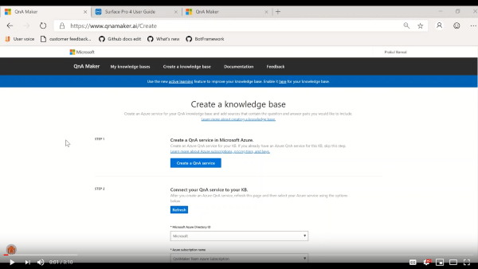
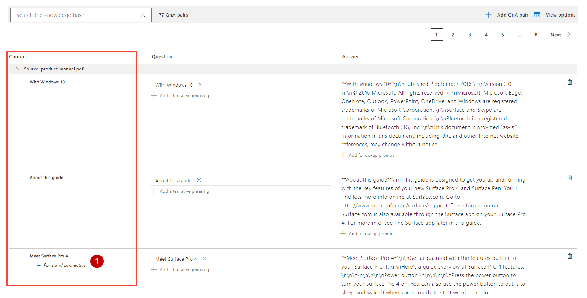
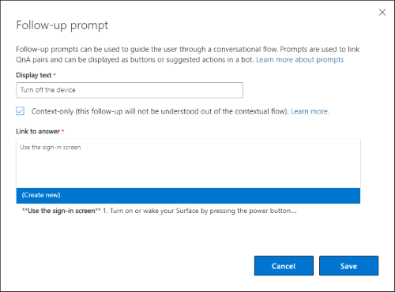
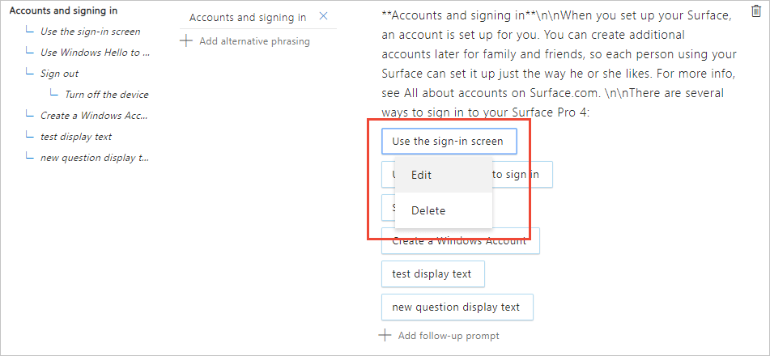

# Use follow-up prompts to create multiple turns of a conversation

Use follow-up prompts and context to manage the multiple turns, known as _multi-turn_, for your bot from one question to another.

Watch the following demonstration video to see how it is done.

[](https://aka.ms/multiturnexample).

## What is a multi-turn conversation?

Some questions can't be answered in a single turn. When you design your client application (chat bot) conversations, a user may ask a question that needs to be filtered or refined in order to determine the correct answer. This flow through the questions is possible by presenting the user with **follow-up prompts**.

When the user asks the question, QnA Maker returns the answer _and_ any follow-up prompts. This allows you to present the follow-up questions as choices. 

## Example multi-turn conversation with chat bot

A chat bot manages the conversation with the user, question by question, to determine the final answer.


In the preceding image, the user entered `My account`. The knowledge base has 3 linked QnA pairs. The user needs to select from one of the three choices to refine the answer. In the knowledge base, the question (#1), has three follow-up prompts, presented in the chat bot as three choices (#2). 

When the user selects a choice (#3), then the next list of refining choices (#4) is presented. This can continue (#5) until the correct and final answer (#6) is determined.

The preceding image has **Enable multi-turn** selected in order to displayed prompts. 

### Using multi-turn in a bot

You need to change your client application to manage the contextual conversation. You will need to add [code to your bot](https://github.com/microsoft/BotBuilder-Samples/tree/master/experimental/qnamaker-prompting) to see the prompts.  

## Create a multi-turn conversation from a document's structure

When you create a knowledge base, you will see an optional check-box to enable multi-turn extraction. 


If you select this option, when you import a document, the multi-turn conversation can be implied from the structure. If that structure exists, QnA Maker creates the follow-up prompt QnA pairs for you. 

Multi-turn structure can only be inferred from URLs, PDF, or DOCX files. 

The following image of a Microsoft Surface [PDF file](https://github.com/Azure-Samples/cognitive-services-sample-data-files/blob/master/qna-maker/data-source-formats/product-manual.pdf) is meant to be used as a manual. Due to the size of this PDF file, the Azure QnA Maker resource requires the Search pricing tier of B (15 indexes) or greater. 

](../media/conversational-context/import-file-with-conversational-structure.png#lightbox)

When importing the PDF document, QnA Maker determines follow-up prompts from the structure to create conversational flow. 

1. In **Step 1**, select **Create a knowledge base** from the top navigation.
1. In **Step 2**, create or use an existing QnA service. Make sure to use a QnA service with a Search service of B (15 indexes) or higher because the Surface Manual PDF file is too large for a smaller tier.
1. In **Step 3**, enter a name for your knowledge base, such as `Surface manual`.
1. In **Step 4**, select **Enable multi-turn extraction from URLs, .pdf or .docx files.** Select the URL for the Surface Manual

    ```text
    https://github.com/Azure-Samples/cognitive-services-sample-data-files/raw/master/qna-maker/data-source-formats/product-manual.pdf
    ```

1. Select the **Create your KB** button. 

    Once the knowledge is created, a view of the question and answer pairs displays.

## Show questions and answers with context

Reduce the question and answer pairs displayed to just those with contextual conversations. 

1. Select **View options**, then select **Show context (PREVIEW)**. The list shows question and answer pairs containing follow-up prompts. 

    

2. The multi-turn context displays in the first column.

    ](../media/conversational-context/surface-manual-pdf-follow-up-prompt.png#lightbox)

    In the preceding image, #1 indicates bold text in the column, which signifies the current question. The parent question is the top item in the row. Any questions below are the linked question and answer pairs. These items are selectable so you can immediately go to the other context items. 

## Add existing QnA pair as follow-up prompt

The original question of `My account` has follow-up prompts such as `Accounts and signing in`. 


Add a follow-up prompt to an existing QnA pair that isn't currently linked. Because the question isn't linked to any QnA pair, the current view setting needs to change.

1. To link an existing QnA pair as a follow-up prompt, select the row for the question and answer pair. For the Surface manual, search for `Sign out` to reduce the list.
1. In the row for `Signout`, select **Add follow-up prompt**  from the **Answer** column.
1. In the **Follow-up prompt (PREVIEW)** pop-up window, enter the following:

    |Field|Value|
    |--|--|
    |Display text|`Turn off the device`. This is custom text you choose to display in the follow-up prompt.|
    |Context-only|Selected. This answer will only be returned if the question specifies context.|
    |Link to Answer|Enter `Use the sign-in screen` to find the existing QnA pair.|


1.  One match is returned. Select this answer as the follow-up, then select **Save**. 

    

1. Once you have added the follow-up prompt, remember to select **Save and train** in the top navigation.
  
### Edit the display text 

When a follow-up prompt is created, and an existing QnA pair is selected as the **Link to Answer**, you can enter new **Display text**. This text does not replace the existing question, and it does not add a new alternate question. It is separate from those values. 

1. To edit the display text, search for and select the question in the **Context** field.
1. On that question's row, select the follow-up prompt in the answer column. 
1. Select the display text you want to edit, then select **Edit**.

    

1. The **Follow-up prompt** pop-up allows you to change the existing display text. 
1. When you are done editing the display text, select **Save**. 
1. Remember to select **Save and train** in the top navigation.


<!--

## To find best prompt answer, add metadata to follow-up prompts 

If you have several follow-up prompts for a given QnA pair, but you know as the knowledge base manager, that not all prompts should be returned, use metadata to categorize the prompts in the knowledge base, then send the metadata from the client application as part of the GenerateAnswer request.

In the knowledge base, when a question-and-answer pair is linked to follow-up prompts, the metadata filters are applied first, then the follow-ups are returned.

1. For the two follow-up QnA pairs, add metadata to each one:

    |Question|Add metadata|
    |--|--|
    |`Feedback on an QnA Maker service`|"Feature":"all"|
    |`Feedback on an existing feature`|"Feature":"one"|
    
     

1. Save and train. 

    When you send the question `Give feedback` with the metadata filter `Feature` with a value of `all`, only the QnA pair with that metadata will be returned. Both QnA pairs are not returned because they both do not match the filter. 

-->

## Add new QnA pair as follow-up prompt

Add a new QnA pair to the knowledge base. The QnA pair should be linked to an existing question as a follow-up prompt.

1. From the knowledge base's toolbar, search for and select the existing QnA pair for `Accounts and Signing In`. 

1. In the **Answer** column for this question, select **Add follow-up prompt**. 
1. The **Follow-up prompt (PREVIEW)**, create a new follow-up prompt by entering the following values: 

    |Text field|Value|
    |--|--|
    |**Display Text**|`Create a Windows Account`. This is custom text you choose to display in the follow-up prompt.|
    |**Context-only**|Selected. This answer will only be returned if the question specifies context.|
    |**Link to answer**|Enter the following text as the answer:<br>`[Create](https://account.microsoft.com/) a Windows account with a new or existing email account.`<br>When you save and train the database, this text will be converted into |
    |||

    


1. Select **Create new** then select **Save**. 

    This created a new question-and-answer pair and linked the selected question as a follow-up prompt. The **Context** column, for both questions, indicates a follow-up prompt relationship. 

1. Change the **View options** to [show context](#show-questions-and-answers-with-context).

    The new question shows how it is linked.

    

    The parent question shows the new question as one of its choices.

    ](../media/conversational-context/child-prompt-created.png#lightbox)

1. Once you have added the follow-up prompt, remember to select **Save and train** in the top navigation.

## Enable multi-turn when testing follow-up prompts

When testing the question with follow-up prompts in the **Test** pane, select **Enable multi-turn**, and enter your question. The response includes the follow-up prompts.


If you don't enable multi-turn, the answer will be returned but follow-up prompts are not returned.

## JSON request to return initial answer and follow-up prompts

Use the empty `context` object to request the answer to the user's question and include follow-up prompts. 

```JSON
{
  "question": "accounts and signing in",
  "top": 10,
  "userId": "Default",
  "isTest": false,
  "context": {}
}
```

## JSON response to return initial answer and follow-up prompts

The previous section requested an answer and any follow-up prompts to `Accounts and signing in`. The response includes the prompt information, located at `answers[0].context`, include the text to display to the user. 

```JSON
{
    "answers": [
        {
            "questions": [
                "Accounts and signing in"
            ],
            "answer": "**Accounts and signing in**\n\nWhen you set up your Surface, an account is set up for you. You can create additional accounts later for family and friends, so each person using your Surface can set it up just the way he or she likes. For more info, see All about accounts on Surface.com. \n\nThere are several ways to sign in to your Surface Pro 4: ",
            "score": 100.0,
            "id": 15,
            "source": "product-manual.pdf",
            "metadata": [],
            "context": {
                "isContextOnly": true,
                "promptsToAdd": [
                    {
                        "displayOrder": 0,
                        "qnaId": 16,
                        "qna": null,
                        "displayText": "Use the sign-in screen"
                    },
                    {
                        "displayOrder": 1,
                        "qnaId": 17,
                        "qna": null,
                        "displayText": "Use Windows Hello to sign in"
                    },
                    {
                        "displayOrder": 2,
                        "qnaId": 18,
                        "qna": null,
                        "displayText": "Sign out"
                    },
                    {
                        "displayOrder": 0,
                        "qnaId": 79,
                        "qna": null,
                        "displayText": "Create a Windows Account"
                    }
                ],
                "promptsToDelete":[]
            }
        },
        {
            "questions": [
                "Sign out"
            ],
            "answer": "**Sign out**\n\nHere's how to sign out: \n\n Go to Start , and right-click your name. Then select Sign out. ",
            "score": 38.01,
            "id": 18,
            "source": "product-manual.pdf",
            "metadata": [],
            "context": {
                "isContextOnly": true,
                "promptsToAdd": [
                    {
                        "displayOrder": 0,
                        "qnaId": 16,
                        "qna": null,
                        "displayText": "Turn off the device"
                    }
                ],
                "promptsToDelete":[]
            }
        },
        {
            "questions": [
                "Use the sign-in screen"
            ],
            "answer": "**Use the sign-in screen**\n\n1.  \n\nTurn on or wake your Surface by pressing the power button. \n\n2.  \n\nSwipe up on the screen or tap a key on the keyboard. \n\n3.  \n\nIf you see your account name and account picture, enter your password and select the right arrow or press Enter on your keyboard. \n\n4.  \n\nIf you see a different account name, select your own account from the list at the left. Then enter your password and select the right arrow or press Enter on your keyboard. ",
            "score": 27.53,
            "id": 16,
            "source": "product-manual.pdf",
            "metadata": [],
            "context": {
                "isContextOnly": true,
                "promptsToAdd": [],
                "promptsToDelete":[]
            }
        }
    ]
}
```

The `promptsToAdd` array provides text in the `displayText` property and the `qnaId` value so you can show these answers as the next displayed choices in the conversation flow, then send the selected value to QnA Maker in the following request. 

<!--

The `promptsToDelete` array provides the ...

-->

## JSON request to return non-initial answer and follow-up prompts

Fill the `context` object to include previous context.

In the following JSON request, the current question is `Use Windows Hello to sign in` and the previous question was `Accounts and signing in`. 

```JSON
{
  "question": "Use Windows Hello to sign in",
  "top": 10,
  "userId": "Default",
  "isTest": false,
  "qnaId": 17,
  "context": {
    "previousQnAId": 15,
    "previousUserQuery": "accounts and signing in"
  }
}
``` 

##  JSON response to return non-initial answer and follow-up prompts

The QnA Maker _GenerateAnswer_ JSON response includes the follow-up prompts in the `context` property of the first item in the `answers` object:

```JSON
{
    "answers": [
        {
            "questions": [
                "Use Windows Hello to sign in"
            ],
            "answer": "**Use Windows Hello to sign in**\n\nSince Surface Pro 4 has an infrared (IR) camera, you can set up Windows Hello to sign in just by looking at the screen. \n\nIf you have the Surface Pro 4 Type Cover with Fingerprint ID (sold separately), you can set up your Surface sign you in with a touch. \n\nFor more info, see What is Windows Hello? on Windows.com. ",
            "score": 100.0,
            "id": 17,
            "source": "product-manual.pdf",
            "metadata": [],
            "context": {
                "isContextOnly": true,
                "promptsToAdd": [],
                "promptsToDelete":[]
            }
        },
        {
            "questions": [
                "Meet Surface Pro 4"
            ],
            "answer": "**Meet Surface Pro 4**\n\nGet acquainted with the features built in to your Surface Pro 4. \n\nHere’s a quick overview of Surface Pro 4 features: \n\n\n\n\n\n\n\nPower button \n\n\n\n\n\nPress the power button to turn your Surface Pro 4 on. You can also use the power button to put it to sleep and wake it when you’re ready to start working again. \n\n\n\n\n\n\n\nTouchscreen \n\n\n\n\n\nUse the 12.3” display, with its 3:2 aspect ratio and 2736 x 1824 resolution, to watch HD movies, browse the web, and use your favorite apps. \n\nThe new Surface G5 touch processor provides up to twice the touch accuracy of Surface Pro 3 and lets you use your fingers to select items, zoom in, and move things around. For more info, see Surface touchscreen on Surface.com. \n\n\n\n\n\n\n\nSurface Pen \n\n\n\n\n\nEnjoy a natural writing experience with a pen that feels like an actual pen. Use Surface Pen to launch Cortana in Windows or open OneNote and quickly jot down notes or take screenshots. \n\nSee Using Surface Pen (Surface Pro 4 version) on Surface.com for more info. \n\n\n\n\n\n\n\nKickstand \n\n\n\n\n\nFlip out the kickstand and work or play comfortably at your desk, on the couch, or while giving a hands-free presentation. \n\n\n\n\n\n\n\nWi-Fi and Bluetooth® \n\n\n\n\n\nSurface Pro 4 supports standard Wi-Fi protocols (802.11a/b/g/n/ac) and Bluetooth 4.0. Connect to a wireless network and use Bluetooth devices like mice, printers, and headsets. \n\nFor more info, see Add a Bluetooth device and Connect Surface to a wireless network on Surface.com. \n\n\n\n\n\n\n\nCameras \n\n\n\n\n\nSurface Pro 4 has two cameras for taking photos and recording video: an 8-megapixel rear-facing camera with autofocus and a 5-megapixel, high-resolution, front-facing camera. Both cameras record video in 1080p, with a 16:9 aspect ratio. Privacy lights are located on the right side of both cameras. \n\nSurface Pro 4 also has an infrared (IR) face-detection camera so you can sign in to Windows without typing a password. For more info, see Windows Hello on Surface.com. \n\nFor more camera info, see Take photos and videos with Surface and Using autofocus on Surface 3, Surface Pro 4, and Surface Book on Surface.com. \n\n\n\n\n\n\n\nMicrophones \n\n\n\n\n\nSurface Pro 4 has both a front and a back microphone. Use the front microphone for calls and recordings. Its noise-canceling feature is optimized for use with Skype and Cortana. \n\n\n\n\n\n\n\nStereo speakers \n\n\n\n\n\nStereo front speakers provide an immersive music and movie playback experience. To learn more, see Surface sound, volume, and audio accessories on Surface.com. \n\n\n\n\n",
            "score": 21.92,
            "id": 3,
            "source": "product-manual.pdf",
            "metadata": [],
            "context": {
                "isContextOnly": true,
                "promptsToAdd": [
                    {
                        "displayOrder": 0,
                        "qnaId": 4,
                        "qna": null,
                        "displayText": "Ports and connectors"
                    }
                ],
                "promptsToDelete":[]
            }
        },
        {
            "questions": [
                "Use the sign-in screen"
            ],
            "answer": "**Use the sign-in screen**\n\n1.  \n\nTurn on or wake your Surface by pressing the power button. \n\n2.  \n\nSwipe up on the screen or tap a key on the keyboard. \n\n3.  \n\nIf you see your account name and account picture, enter your password and select the right arrow or press Enter on your keyboard. \n\n4.  \n\nIf you see a different account name, select your own account from the list at the left. Then enter your password and select the right arrow or press Enter on your keyboard. ",
            "score": 19.04,
            "id": 16,
            "source": "product-manual.pdf",
            "metadata": [],
            "context": {
                "isContextOnly": true,
                "promptsToAdd": [],
                "promptsToDelete":[]
            }
        }
    ]
}
```

## Query the knowledge base with the QnA ID

In the initial question's response, any follow-up prompts and its associated `qnaId` is returned. Now that you have the ID, you can pass this in the follow-up prompt's request body. If the request body contains the `qnaId`, and the context object (which contains the previous QnA properties), then GenerateAnswer will return the exact question by ID, instead of using the ranking algorithm to find the answer by the question text. 

## Displaying prompts and sending context in the client application 

You have added prompts in your knowledge base and tested the flow in the test pane. Now you need to use these prompts in the client application. For Bot Framework, the prompts will not automatically start showing up in the client applications. You can show the prompts as suggested actions or buttons as part of the answer to the user’s query in client applications by including this [Bot Framework sample](https://aka.ms/qnamakermultiturnsample) in your code. The client application shall store the current QnA ID and the user query, and pass them in the [context object of the GenerateAnswer API](#json-request-to-return-non-initial-answer-and-follow-up-prompts) for the next user query. 

## Display order supported in API

The [display text and display order](https://docs.microsoft.com/rest/api/cognitiveservices/qnamaker/knowledgebase/update#promptdto), returned in the JSON response, is supported for editing by the [Update API](https://docs.microsoft.com/rest/api/cognitiveservices/qnamaker/knowledgebase/update). 

<!--

FIX - Need to go to parent, then answer column, then edit answer. 

-->

## Manage multi-turn prompts via the API

You can add or delete multi-turn prompts via the [QnA Maker Update API](https://docs.microsoft.com/rest/api/cognitiveservices/qnamaker/knowledgebase/update). The following JSON examples shows the `context` including `promptsToAdd`, and `promptsToDelete` to change the settings. 

```json
{
    "add": {
        "qnaList": []
    },
    "delete": {
        "ids": []
    },
    "update": {
        "qnaList": [
            {
                "id": 2,
                "answer": "You can use our REST apis to create a KB. See here for details: https://docs.microsoft.com/en-us/rest/api/cognitiveservices/qnamaker/knowledgebase/create",
                "source": "Custom Editorial",
                "questions": {
                    "add": [],
                    "delete": []
                },
                "metadata": {
                    "add": [],
                    "delete": []
                },
                "alternateQuestionClusters": {
                    "delete": []
                },
                "context": {
                    "isContextOnly": false,
                    "promptsToAdd": [
                        {
                            "displayText": "Add Prompts",
                            "displayOrder": 0,
                            "qna": {
                                "id": 0,
                                "answer": "Click here to know more https://docs.microsoft.com/en-us/azure/cognitive-services/qnamaker/how-to/multiturn-conversation",
                                "source": "Editorial",
                                "questions": [
                                    "How can I add prompts?"
                                ],
                                "metadata": [],
                                "alternateQuestionClusters": [],
                                "context": {
                                    "isContextOnly": false,
                                    "prompts": []
                                }
                            },
                            "qnaId": 0
                        },
                        {
                            "displayText": "Delete Prompts",
                            "displayOrder": 0,
                            "qna": {
                                "id": 0,
                                "answer": "Click here to know more https://docs.microsoft.com/en-us/azure/cognitive-services/qnamaker/how-to/multiturn-conversation",
                                "source": "Editorial",
                                "questions": [
                                    "How can I delete delete prompts?"
                                ],
                                "metadata": [],
                                "alternateQuestionClusters": [],
                                "context": {
                                    "isContextOnly": false,
                                    "prompts": []
                                }
                            },
                            "qnaId": 0
                        },
                        {
                            "displayText": "Update Knowledgebase",
                            "displayOrder": 0,
                            "qna": null,
                            "qnaId": 3
                        }
                    ],
                    "promptsToDelete": [
                        3
                    ]
                }
            },
            {
                "id": 3,
                "answer": "You can use our REST apis to update your KB. See here for details: https://docs.microsoft.com/en-us/rest/api/cognitiveservices/qnamaker/knowledgebase/update",
                "source": "Custom Editorial",
                "questions": {
                    "add": [],
                    "delete": []
                },
                "metadata": {
                    "add": [],
                    "delete": []
                },
                "alternateQuestionClusters": {
                    "delete": []
                },
                "context": {
                    "isContextOnly": false,
                    "promptsToAdd": [
                        {
                            "displayText": "Refresh Endpoint keys",
                            "displayOrder": 1,
                            "qna": null,
                            "qnaId": 4
                        }
                    ],
                    "promptsToDelete": [
                        4
                    ]
                }
            }
        ]
    }
}
```

## Next steps

Learn more about contextual conversations from the [Dialog sample](https://aka.ms/qnamakermultiturnsample) or learn more [conceptual bot design for multi-turn conversations](https://docs.microsoft.com/azure/bot-service/bot-builder-conversations?view=azure-bot-service-4.0).

> [!div class="nextstepaction"]
> [Migrate a knowledge base](../Tutorials/migrate-knowledge-base.md)
