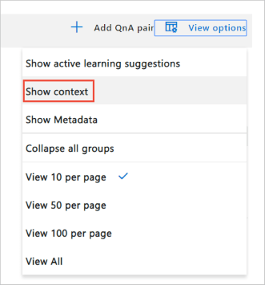
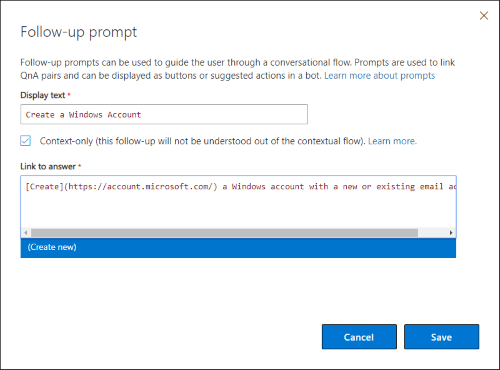
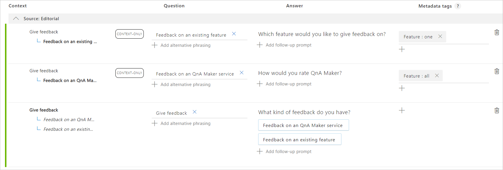
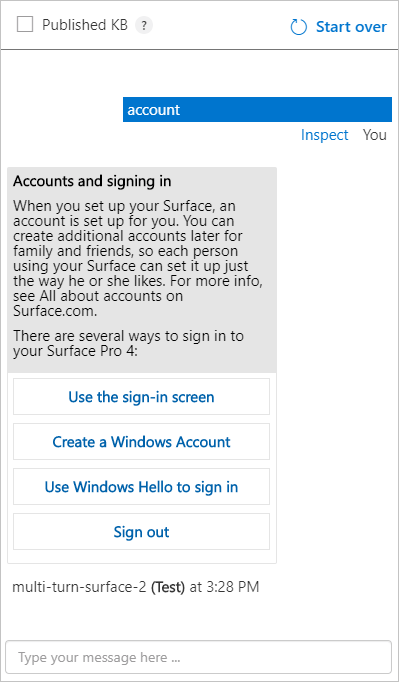

# Use follow-up prompts to create multiple turns of a conversation

Use follow-up prompts and context to manage the multiple turns, known as _multi-turn_, for your bot from one question to another.

Learn from the [demonstration video](https://aka.ms/multiturnexample).

## What is a multi-turn conversation?

Some types of conversation can't be completed in a single turn. When you design your client application (chat bot) conversations, a user may ask a question that needs to be filtered or refined in order to determine the correct answer. This flow through the questions is possible by presenting the user with **follow-up prompts**.

When the user asks the question, QnA Maker returns the answer _and_ any follow-up prompts. This allows you to present the follow-up questions as choices. 

## Example multi-turn conversation with chat bot

A chat bot manages the conversation, question by question, with the user to determine the final answer.


In the preceding image, the user's question needs to be refined before returning the answer. In the knowledge base, the question (#1), has four follow-up prompts, presented in the chat bot as four choices (#2). 

When the user selects a choice (#3), then the next list of refining choices (#4) is presented. This can continue (#5) until the correct and final answer (#6) is determined.

You need to change your client application to manage the contextual conversation.

## Create a multi-turn conversation from document's structure

If you import a document, the multi-turn conversation can be implied from the structure. If that structure exists, QnA Maker creates the follow-up prompt QnA pairs for you. 

The following image of a Microsoft Surface [PDF file](https://github.com/Azure-Samples/cognitive-services-sample-data-files/blob/master/qna-maker/data-source-formats/product-manual.pdf) is meant to be used as a manual. 

](../media/conversational-context/import-file-with-conversational-structure.png#lightbox)

When importing the PDF document, QnA Maker determines follow-up prompts from the structure to create conversational flow. 

](../media/conversational-context/surface-manual-pdf-follow-up-prompt.png#lightbox)

## Filter questions and answers by context

1. Reduce the question and answer pairs displayed to just those with contextual conversations. Select **View options**, then select **Show context (PREVIEW)**. The list will be empty until you add the first question and answer pair with a follow-up prompt. 

    

## Add new QnA pair as follow-up prompt

1. Select **Add QnA pair**. 
1. Enter the new question text, `Give feedback.` with an answer of `What kind of feedback do you have?`.

1. In the **Answer** column for this question, select **Add follow-up prompt**. 
1. The **Follow-up prompt** pop-up dialog allows you to search for an existing question or enter a new question. In this procedure, enter the text `Feedback on an QnA Maker service`, for the **Display text**. 
1. Check **Context-only**. The **Context-only** option indicates that this user text will be understood _only_ if given in response to the previous question. For this scenario, the prompt text doesn't make any sense as a stand-alone question, it only makes sense from the context of the previous question.
1. In the **Link to answer** text box, enter the answer, `How would you rate QnA Maker?`.
1. Select **Create new** then select **Save**. 

    

    This created a new question-and-answer pair and linked the selected question as a follow-up prompt. The **Context** column, for both questions, indicate a follow-up prompt relationship. 

    ](../media/conversational-context/child-prompt-created.png#lightbox)

1. Select **Add follow-up prompt** for the `Give feedback` question to add another follow-up prompt. 
1. Create a new question by entering  `Feedback on an existing feature`, with the answer `Which feature would you like to give feedback on?`.  

1.  Check **Context-only**. The **Context-only** option indicates that this user text will be understood _only_ if given in response to the previous question. For this scenario, the prompt text doesn't make any sense as a stand-alone question, it only makes sense from the context of the previous question.
1.  Select **Save**. 

    This created a new question and linked the question as a follow-up prompt question to the `Give feedback` question.
    
    At this point, the top question has two follow-up prompts liked to the previous question, `Give feedback`.

    ](../media/conversational-context/all-child-prompts-created.png#lightbox)

1. Select **Save and Train** to train the knowledge base with the new questions. 

## Add existing QnA pair as follow-up prompt

1. If you want to link an existing QnA pair as a follow-up prompt, select the row for the question and answer pair.
1. Select **Add follow-up prompt** in that row.
1. In the pop-up dialog, enter the question text in the search box. All matches are returned. Select the question you want as the follow-up, and check **Context-only**, then select **Save**. 

    Once ou have added the follow-up prompt, remember to select **Save and train**.
  
## Add metadata to follow-up prompts 

In the knowledge base, when a question-and-answer pair is linked to follow-up prompts, the metadata filters are applied first, then the follow-ups are returned.

1. For the two follow-up QnA pairs, add metadata to each one:

    |Question|Add metadata|
    |--|--|
    |`Feedback on an QnA Maker service`|"Feature":"all"|
    |`Feedback on an existing feature`|"Feature":"one"|
    
     

1. Save and train. 

    When you send the question `Give feedback` with the metadata filter `Feature` with a value of `all`, only the QnA pair with that metadata will be returned. Both QnA pairs are not returned because they both do not match the filter. 

## Test the QnA set to get all the follow-up prompts

When testing the question with follow-up prompts in the **Test** pane, the response includes the follow-up prompts.



## JSON response for prompts

The QnA Maker _GenerateAnswer_ JSON response includes the follow-up prompts in the `context` property of the first item in the `answers` object:

```JSON
{
    "answers": [
        {
            "questions": [
                "Give feedback"
            ],
            "answer": "What kind of feedback do you have?",
            "score": 100.0,
            "id": 288,
            "source": "Editorial",
            "metadata": [],
            "context": {
                "isContextOnly": false,
                "prompts": [
                    {
                        "displayOrder": 0,
                        "qnaId": 291,
                        "qna": null,
                        "displayText": "Feedback on an QnA Maker service"
                    },
                    {
                        "displayOrder": 0,
                        "qnaId": 292,
                        "qna": null,
                        "displayText": "Feedback on an existing feature"
                    }
                ]
            }
        }
    ]
}
```

The `prompts` array provides text in the `displayText` property and the `qnaId` value so you can show these answers as the next displayed choices in the conversation flow. 

## Prompt order supported in API

The prompt order, returned in the [JSON](#json-response-for-prompts) response, is supported for editing by the API only. 

## Next steps

Learn more about contextual conversations from the [Dialog sample](https://aka.ms/qnamakermultiturnsample) or learn more [conceptual bot design for multi-turn conversations](https://docs.microsoft.com/azure/bot-service/bot-builder-conversations?view=azure-bot-service-4.0).

> [!div class="nextstepaction"]
> [Migrate a knowledge base](../Tutorials/migrate-knowledge-base.md)
