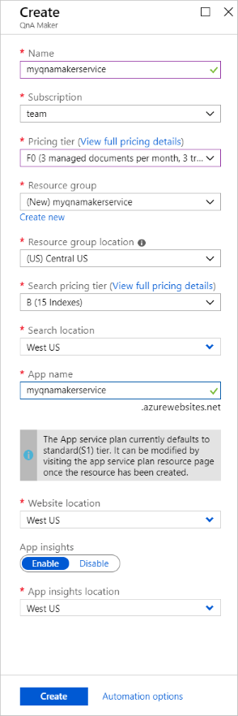
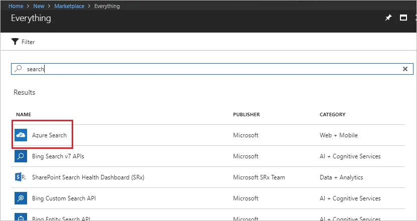

# Manage QnA Maker resources

Before you can create any QnA Maker knowledge bases, you must first set up a QnA Maker service in Azure. Anyone with authorization to create new resources in a subscription can set up a QnA Maker service.

## Types of keys in QnA Maker

Your QnA Maker service deals with two kinds of keys: **subscription keys** and **endpoint keys**.

|Name|Location|Purpose|
|--|--|--|
|Subscription key|[Azure portal](https://azure.microsoft.com/free/?WT.mc_id=A261C142F)|These keys are used to access the [QnA Maker management service APIs](https://go.microsoft.com/fwlink/?linkid=2092179). These APIs let you edit the questions and answers in your knowledge base, and publish your knowledge base. These keys are created when you create a new QnA Maker service.  Find these keys on the **Cognitive Services** resource on the **Keys** page.|
|Endpoint key|[QnA Maker portal](http://www.qnamaker.ai)|These keys are used to access the published knowledge base endpoint to get a response for a user question. You typically use this endpoint in your chat bot or in the client application code that connects to the QnA Maker service. These keys are created when you publish your QnA Maker knowledge base.  Find these keys in the **Service settings** page. Find this page from the user's menu in the upper right of the page on the drop-down menu.|

## Create a new QnA Maker service

This procedure creates the Azure resources needed to manage the knowledge base content. After you complete these steps, you'll find the _subscription_ keys on the **Keys** page for the resource in the Azure portal.

1. Sign in to the Azure portal and [create a QnA Maker](https://ms.portal.azure.com/#create/Microsoft.CognitiveServicesQnAMaker) resource.

1. Select **Create** after you read the terms and conditions:

    

1. In **QnA Maker**, select the appropriate tiers and regions:

    

    * In the **Name** field, enter a unique name to identify this QnA Maker service. This name also identifies the QnA Maker endpoint that your knowledge bases will be associated with.
    * Choose the **Subscription** under which the QnA Maker resource will be deployed.
    * Select the **Pricing tier** for the QnA Maker management services (portal and management APIs). See [more details about SKU pricing](https://aka.ms/qnamaker-pricing).
    * Create a new **Resource Group** (recommended) or use an existing one in which to deploy this QnA Maker resource. QnA Maker creates several Azure resources. When you create a resource group to hold these resources, you can easily find, manage, and delete these resources by the resource group name.
    * Select a **Resource group location**.
    * Choose the **Search pricing tier** of the Azure Search service. If the Free tier option is unavailable (appears dimmed), it means you already have a Free Azure Search tier deployed through your subscription. In that case, you'll need to start with the Basic Azure Search tier. See [Azure Search pricing details](https://azure.microsoft.com/pricing/details/search/).
    * Choose the **Search Location** where you want Azure Search data to be deployed. Restrictions on where customer data must be stored will help determine the location you choose for Azure Search.
    * In the **App name** field, enter a name for your App Service.
    * By default, App Service defaults to the standard (S1) tier. You can change the plan after creation. Learn more about [App Service pricing](https://azure.microsoft.com/pricing/details/app-service/).
    * Choose the **Website location** where App Service will be deployed.

        > [!NOTE]
	    > The **Search Location** can differ from the **Website Location**.

    * Choose whether or not you want to enable **Application Insights**. If **Application Insights** is enabled, QnA Maker collects telemetry on traffic, chat logs, and errors.
    * Choose the **App insights location** where the Application Insights resource will be deployed.
    * For cost savings measures, you can [share](#share-existing-services-with-qna-maker) some but not all Azure resources created for QnA Maker. 

1. After all the fields are validated, select **Create**. The process can take a few minutes to complete.

1. After deployment is completed, you'll see the following resources created in your subscription:

   

    The resource with the _Cognitive Services_ type has your _subscription_ keys.

## Find subscription keys in the Azure portal

You can view and reset your subscription keys from the Azure portal where you created the QnA Maker resource.

1. Go to the QnA Maker resource in the Azure portal and select the resource that has the _Cognitive Services_ type:

    

2. Go to **Keys**:

    

## Find endpoint keys in the QnA Maker portal

Endpoint keys can be managed from the [QnA Maker portal](https://qnamaker.ai).

1. Log in to the [QnA Maker portal](https://qnamaker.ai), go to your profile, and then select **Service settings**:

    

2. View or reset your keys:

    

    >[!NOTE]
    >Refresh your keys if you think they've been compromised. This may require corresponding changes to your client application or bot code.

## Share existing services with QnA Maker

QnA Maker creates several Azure resources. To reduce management and benefit from cost sharing, use the following table to understand what you can and can't share:

|Service|Share|Reason|
|--|--|--|
|Cognitive Services|X|Not possible by design|
|App Service plan|✔|Fixed disk space allocated for an App Service plan. If other apps that sharing the same App Service plan use significant disk space, QnAMaker App Service will encounter problems.|
|App Service|X|Not possible by design|
|Application Insights|✔|Can be shared|
|Search service|✔|1. `testkb` is a reserved name for the QnAMaker service; it can’t be used by others. 2. Synonym map by the name `synonym-map` is reserved for the QnAMaker service. 3. The number of published knowledge bases is limited by Search service tier. If there are free indexes available, other services can use them.|

### Using a single Search service

If you create a QnA service and its dependencies (such as Search) through the portal, a Search service is created for you and linked to the QnA Maker service. After these resources are created, you can update the App service setting to use a previously existing Search service and remove the one you just created.

If you create a QnA service through Azure Resource Manager templates, you can create all resources and control the App Service creation to use an existing Search service.

## Upgrade QnA Maker

|Upgrade|Reason|
|--|--|
|[Upgrade](#upgrade-qna-maker-sku) QnA Maker management SKU|You want to have more questions and answers in your knowledge base.|
|[Upgrade](#upgrade-app-service) App Service SKU|Your knowledge base needs to serve more requests from your client app, such as a chat bot.|
|[Upgrade](#upgrade-the-azure-search-service) Azure Search service|You plan to have many knowledge bases.|

### Upgrade QnA Maker SKU

When you want to have more questions and answers in your knowledge base, beyond your current tier, upgrade your QnA Maker service pricing tier.

To upgrade the QnA Maker management SKU:

1. Go to your QnA Maker resource in the Azure portal, and select **Pricing tier**.

    

1. Choose the appropriate SKU and press **Select**.

    

### Upgrade App Service

 When your knowledge base needs to serve more requests from your client app, upgrade your App Service pricing tier.

You can [scale up](https://docs.microsoft.com/azure/app-service/manage-scale-up) or scale down App Service.

Go to the App Service resource in the Azure portal, and select the **scale up** or **scale down** options as required.

### Upgrade the Azure Search service

If you plan to have many knowledge bases, upgrade your Azure Search service pricing tier.

Currently, you can't perform an in-place upgrade of the Azure search SKU. However, you can create a new Azure search resource with the desired SKU, restore the data to the new resource, and then link it to the QnA Maker stack. To do this, follow these steps:

1. Create a new Azure search resource in the Azure portal, and select the desired SKU.

    

1. Restore the indexes from your original Azure search resource to the new one. See the [backup restore sample code](https://github.com/pchoudhari/QnAMakerBackupRestore).

1. After the data is restored, go to your new Azure search resource, select **Keys**, and write down the **Name** and the **Admin key**:

    

1. To link the new Azure search resource to the QnA Maker stack, go to the QnA Maker App Service.

    

1. Select **Application settings** and modify the settings in the **AzureSearchName** and **AzureSearchAdminKey** fields per step 3.

    

1. Restart the App Service.

    

## Get the latest runtime updates

The QnAMaker runtime is part of the Azure App Service that's deployed when you [create a QnAMaker service](./set-up-qnamaker-service-azure.md) in the Azure portal. Updates are made periodically to the runtime. QnA Maker App Service is in auto-update mode after the April 2019 site extension release (version 5+). This update is designed to take care of ZERO downtime during upgrades.

You can check your current version at https://www.qnamaker.ai/UserSettings. If your version is older than version 5.x, you must restart the App Service to apply the latest updates:

1. Go to your QnAMaker service (resource group) in the [Azure portal](https://portal.azure.com).

    

1. Select the App Service and open the Overview section.

        

1. Restart the App Service. The update process should complete within a couple of seconds. Any dependent applications or bots that use this QnAMaker service will be unavailable to end users during this restart period.

    

## Management service region

The management service of QnA Maker is used only for the QnA Maker portal and for initial data processing. This service is available only in the West US region. No customer data is stored in this West US service.

## Next steps

> [!div class="nextstepaction"]
> [Create and publish a knowledge base](../Quickstarts/create-publish-knowledge-base.md)
