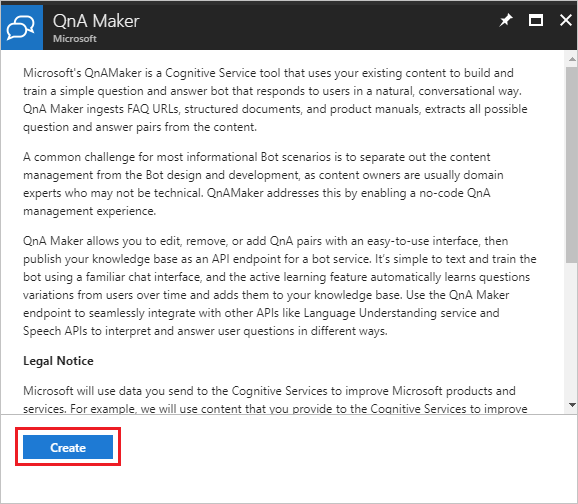
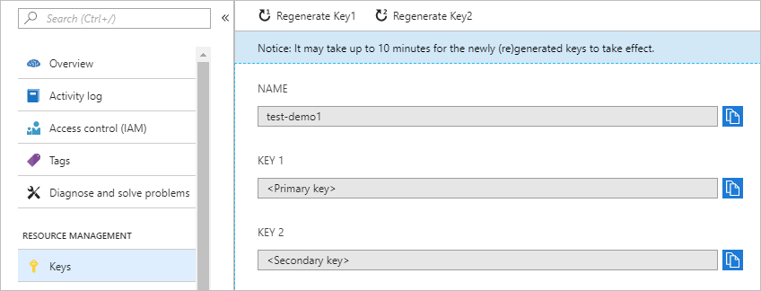
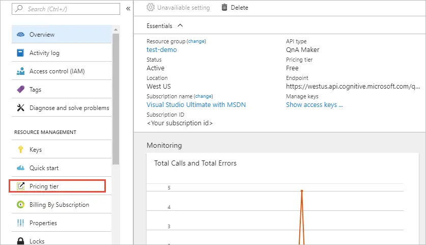
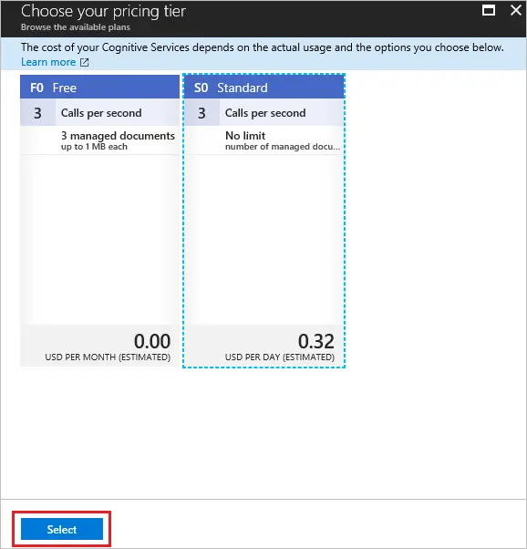

# Manage QnA Maker resources

Before you can create any QnA Maker knowledge bases, you must first set up a QnA Maker service in Azure. Anyone with authorization to create new resources in a subscription can set up a QnA Maker service.

## Types of keys in QnA Maker

Your QnA Maker service deals with two kinds of keys, **subscription keys** and **endpoint keys**.

|Name|Location|Purpose|
|--|--|--|
|Subscription Key|[Azure portal](https://azure.microsoft.com/free/?WT.mc_id=A261C142F)|These keys are used to access the [QnA Maker management service APIs](https://go.microsoft.com/fwlink/?linkid=2092179). These APIs let you edit the questions and answers in your knowledge base, and publish your knowledge base. These keys are created when you create a new QnA Maker service.  Find these keys on the **Cognitive Services** resource, on the **Keys** page.|
|Endpoint Key|[Qna Maker portal](http://www.qnamaker.ai)|These keys are used to access the published knowledge base endpoint to get a response for a user question. You typically use this endpoint in your chat bot, or client application code that connects to the QnA Maker service. These keys are created when you publish your QnA Maker knowledge base.  Find these keys on the **Service settings** page. Find this page from the top, right user's menu as a choice in the drop-down.|

## Create a new QnA Maker service

This procedure creates the Azure resources needed to manage the knowledge base content. When you complete these steps, you find the _subscription_ keys on the **Keys** page for the resource in the Azure portal.

1. Sign in to the Azure portal and [create a QnA Maker](https://ms.portal.azure.com/#create/Microsoft.CognitiveServicesQnAMaker) resource.

1. Select **Create** after reading the terms and conditions.

    

1. In **QnA Maker**, select the appropriate tiers and regions.

    

    * Fill the **Name** with a unique name to identify this QnA Maker service. This name also identifies the QnA Maker endpoint to which your knowledge bases will be associated.
    * Choose the **Subscription** in which the QnA Maker resource will be deployed.
    * Select the **Pricing tier** for the QnA Maker management services (portal and management APIs). See [here](https://aka.ms/qnamaker-pricing) for details on the pricing of the SKUs.
    * Create a new **Resource Group** (recommended) or use an existing one in which to deploy this QnA Maker resource. QnA Maker creates several Azure resources; when you create a resource group to hold these resources, you can easily find, manage, and delete these resources by the resource group name.
    * Select a **Resource group location**.
    * Choose the **Search pricing tier** of the Azure Search service. If you see the Free tier option greyed out, it means you already have a Free Azure Search tier deployed in your subscription. In that case, you will need to start with the Basic Azure Search tier. See details of Azure search pricing [here](https://azure.microsoft.com/pricing/details/search/).
    * Choose the **Search Location** where you want Azure Search data to be deployed. Restrictions in where customer data must be stored will inform the location you choose for Azure Search.
    * Give a name to your App service in **App name**.
    * By default the App service defaults to the standard (S1) tier. You can change the plan after creation. See more details of App service pricing [here](https://azure.microsoft.com/pricing/details/app-service/).
    * Choose the **Website location** where the App Service will be deployed.

        > [!NOTE]
	    > The Search Location can be different from the Website Location.

    * Choose whether you want to enable **Application Insights** or not. If **Application Insights** is enabled, QnA Maker collects telemetry on traffic, chat logs, and errors.
    * Choose the **App insights location** where Application Insights resource will be deployed.
    * For cost savings measures, you can [share](upgrade-qnamaker-service.md?#share-existing-services-with-qna-maker) some but not all Azure resources created for QnA Maker. 

1. Once all the fields are validated, select **Create**. It can take a few minutes to complete.

1. Once the deployment is done, you will see the following resources created in your subscription.

    

    The resource with the type _Cognitive Services_ has your _subscription_ keys.

## Find subscription keys in Azure portal

You can view and reset your subscription keys, which edit your  from the Azure portal where you created the QnA Maker resource. 

1. Go to the QnA Maker resource in the Azure portal and select the resource with the type _Cognitive Services_.

    

2. Go to **Keys**.

    

## Find endpoint keys in QnA Maker portal

Endpoint keys can be managed from the [QnA Maker portal](https://qnamaker.ai).

1. Log in to the [QnA Maker portal](https://qnamaker.ai), go to your profile, and then click **Service settings**.

    

2. View or reset your keys.

    

    >[!NOTE]
    >Refresh your keys if you feel they have been compromised. This may require corresponding changes to your client application or bot code.

## Share existing services with QnA Maker

QnA Maker creates several Azure resources. In order to reduce management and benefit from cost sharing, use the following table to understand what you can and can't share:

|Service|Share|
|--|--|
|Cognitive Services|X|
|App service plan|✔|
|App service|X|
|Application Insights|✔|
|Search service|✔|

## Upgrade QnA Maker

|Upgrade|Reason|
|--|--|
|[Upgrade](#upgrade-qna-maker-sku) QnA Maker management sku|You need to have more questions and answers in your knowledge base.|
|[Upgrade](#upgrade-app-service) App service sku|Your knowledge base needs to serve more requests from your client app such as a chat bot.|
|[Upgrade](#upgrade-azure-search-service) Azure Search service|You plan to have many knowledge bases.|

### Upgrade QnA Maker sku

When you need to have more questions and answers in your knowledge base, beyond your current tier, upgrade your QnA Maker service pricing tier. 

To upgrade the QnA Maker management SKU:

1. Go to your QnA Maker resource in the Azure portal, and select **Pricing tier**.

    

1. Choose the appropriate SKU and press **Select**.

    

### Upgrade App service

 When your knowledge base needs to serve more requests from your client app, upgrade your app service pricing tier.

You can [scale up](https://docs.microsoft.com/azure/app-service/manage-scale-up) or scale down the App service.

Go to the App service resource in the Azure portal, and select **scale up** or **scale down** options as required.

### Upgrade Azure Search service

When you plan to have many knowledge bases, upgrade your Azure Search service pricing tier. 

Currently it is not possible to perform an in place upgrade of the Azure search SKU. However, you can create a new Azure search resource with the desired SKU, restore the data to the new resource, and then link it to the QnA Maker stack.

1. Create a new Azure search resource in the Azure portal, and choose the desired SKU.

    

1. Restore the indexes from your original Azure search resource to the new one. See the backup restore sample code [here](https://github.com/pchoudhari/QnAMakerBackupRestore).

1. Once the data is restored, go to your new Azure search resource, select **Keys**, and note down the **Name** and the **Admin key**.

    

1. To link the new Azure search resource to the QnA Maker stack, go to the QnA Maker App service.

    

1. Select **Application settings** and replace the **AzureSearchName** and **AzureSearchAdminKey** fields from step 3.

    

1. Restart the App service.

    

## Get latest runtime updates

The QnAMaker runtime is part of the Azure App Service deployed when you [create a QnAMaker service](./set-up-qnamaker-service-azure.md) in Azure portal. Updates are made periodically to the runtime. QnA Maker App Service is on auto-update mode after the Apr 2019 site extension release (version 5+). This is already designed to take care of ZERO downtime during upgrades. 

You can check your current version at https://www.qnamaker.ai/UserSettings. If your version is older than version 5.x, you must restart the App Service to apply the latest updates.

1. Go to your QnAMaker service (resource group) in the [Azure portal](https://portal.azure.com)

    

1. Click on the App Service and open the Overview section

     

1. Restart the App service. It should complete within a couple of seconds. Note that any dependent applications or bots that use this QnAMaker service will be unavailable to end-users during this restart period.

    

## Management service region

The management service of QnA Maker, only used for the QnA Maker portal & for initial data processing, is available only in West US. No customer data is stored in this West US service.

## Next steps

> [!div class="nextstepaction"]
> [Create and publish a knowledge base](../Quickstarts/create-publish-knowledge-base.md)
