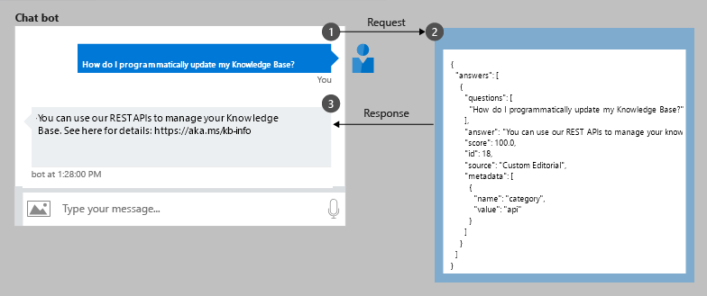

# What is the QnA Maker API service?

QnA Maker is a cloud-based API service that takes natural language questions, and returns the most appropriate answer from your custom knowledge base (KB) of information.

A client application for QnA Maker is any conversational application that communicates with a user in natural language to answer a question. Examples of client applications include social media apps, chat bots, and speech-enabled desktop applications.

## Use QnA Maker knowledge base in a chat bot

Once a QnA Maker knowledge base is published, a client application sends a question to your knowledge base endpoint and receives the results as a JSON response. A common client application for QnA Maker is a chat bot.

|Step|Action|
|:--|:--|
|1|The client application sends the user's _question_ (text in their own words), "How do I programmatically update my Knowledge Base?" to your knowledge base endpoint.|
|2|QnA Maker uses the trained knowledge base to provide the correct answer and any follow-up prompts that can be used to refine the search for the best answer. QnA Maker returns a JSON-formatted response.|
|3|The client application uses the JSON response to make decisions about how to continue the conversation. These decisions can include showing the top answer or presenting more choices to refine the the search for the best answer. |

## What is a knowledge base? 

QnA Maker [imports your content](../concepts/data-sources-supported.md) into a knowledge base of question and answer sets. The import process extracts information about the relationship between the parts of your structured and semi-structured content to imply relationships between the question and answer sets. You can edit these question and answer sets or add new ones.  

The content of the question and answer set includes all the alternate questions for a specific answer, metadata tags used to filter answer choices during the search, and follow-up prompts to continue the search refinement.

After you publish your knowledge base, a client application sends a user's question to your endpoint. Your QnA Maker service processes the question and responds with the best answer. 

## QnA Maker improves the conversation process

QnA Maker provides multi-turn prompts and active learning to help you improve your basic question and answer sets. 

**Multi-turn prompts** give you the opportunity to connect question and answer pairs. This connection allows the client application to provide an answer but also provide more questions to refine the answer. 

After the knowledge base receives questions from users at the published endpoint, QnA Maker applies **active learning** to these real-world questions to suggest changes to your knowledge base to improve the quality. 

## Development lifecycle

QnA Maker provides authoring, training, and publishing along with collaboration permissions to integrate into the full development life cycle. 

## How do I start?

**Step 1**: Create a QnA Maker resource in the [Azure portal](https://portal.azure.com). 

**Step 2**: Create a knowledge base in the [QnA Maker](https://www.qnamaker.ai) portal. Add [files and URLs](../concepts/data-sources-supported.md) to create the knowledge base.  

**Step 3**: Publish your knowledge base and test from your custom endpoint using cURL or Postman. 

**Step 4**: From your client application, programmatically call your knowledge base's endpoint and read the JSON response show the best answer to the user.  

## News and updates

Learn what's new with QnA Maker.

* May 2019:
    * Multi-turn conversations

## Next steps
QnA Maker provides everything you need to build, manage and deploy your custom knowledge base. 

> [!div class="nextstepaction"]
> [Create a QnA Maker service](../how-to/set-up-qnamaker-service-azure.md)