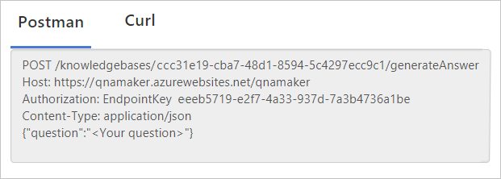

# Get answers to a question from a knowledge base with Python

This quickstart walks you through programmatically getting an answer from a published QnA Maker knowledge base. QnA Maker automatically extracts questions and answers from semi-structured content, like FAQs, from [data sources](../Concepts/data-sources-supported.md). The question, in JSON format, is sent in the body of the API request. 

## Prerequisites

* [Python 3.6 or greater](https://www.python.org/downloads/)
* [Visual Studio Code](https://code.visualstudio.com/)
* You must have a [QnA Maker service](../How-To/set-up-qnamaker-service-azure.md). To retrieve your key, select **Keys** under **Resource Management** in your Azure dashboard for your QnA Maker resource. 
* **Publish** page settings. If you do not have a published knowledge base, create an empty knowledge base, then import a knowledge base on the **Settings** page, then publish. You can download and use [this basic knowledge base](https://github.com/Azure-Samples/cognitive-services-sample-data-files/blob/master/qna-maker/knowledge-bases/basic-kb.tsv). 

    The publish page settings include POST route value, Host value, and EndpointKey value. 

    

The code for this quickstart is in the [https://github.com/Azure-Samples/cognitive-services-qnamaker-python](https://github.com/Azure-Samples/cognitive-services-qnamaker-python/tree/master/documentation-samples/quickstarts/get-answer) repository. 

## Create a Python file

Open VSCode and create a new file named `get-answer-3x.py`.

## Add the required dependencies

At the top of the `get-answer-3x.py` file, add necessary dependencies to the project:

[!code-python[Add the required dependencies](~/samples-qnamaker-python/documentation-samples/quickstarts/get-answer/get-answer-3x.py?range=1-2 "Add the required dependencies")]

The host and route are different than how they appear on the **Publish** page. This is because the python library doesn't allow any routing in the host. The routing that appears on the **Publish** page as part of host has been moved to the route.

## Add the required constants

Add the required constants to access QnA Maker. These values are on the **Publish** page after you publish the knowledge base. 

[!code-python[Add the required constants](~/samples-qnamaker-python/documentation-samples/quickstarts/get-answer/get-answer-3x.py?range=5-25 "Add the required constants")]

## Add a POST request to send question and get an answer

The following code makes an HTTPS request to the QnA Maker API to send the question to the knowledge base and receives the response:

[!code-python[Add a POST request to send question to knowledge base](~/samples-qnamaker-python/documentation-samples/quickstarts/get-answer/get-answer-3x.py?range=27-48 "Add a POST request to send question to knowledge base")]

The `Authorization` header's value includes the string `EndpointKey `. 

## Run the program

Run the program from the command line. It will automatically send the request to the QnA Maker API, then it will print to the console window.

Run the file:

```bash
python get-answer-3x.py
```

[!INCLUDE [JSON request and response](../../../../includes/cognitive-services-qnamaker-quickstart-get-answer-json.md)] 


[!INCLUDE [Clean up files and knowledge base](../../../../includes/cognitive-services-qnamaker-quickstart-cleanup-resources.md)] 

## Next steps

> [!div class="nextstepaction"]
> [QnA Maker (V4) REST API Reference](https://westus.dev.cognitive.microsoft.com/docs/services/5a93fcf85b4ccd136866eb37/operations/5ac266295b4ccd1554da75ff)