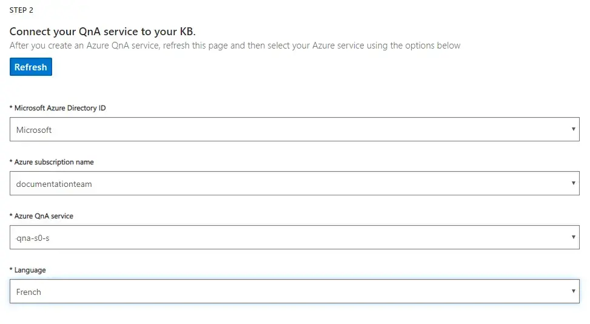
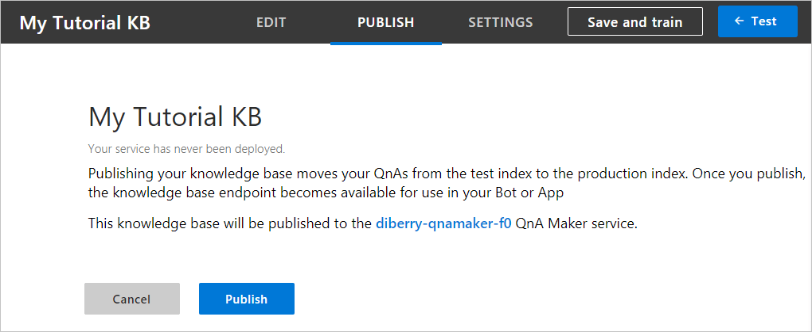

# Tutorial: From QnA Maker portal, create a knowledge base

Create a new knowledge base with questions and answers from a public web-based FAQ. Save, train, and publish the knowledge base. Once the knowledge base is published, send a question and receive an answer with a Curl command. Then create a bot and test the bot with the same question. 

In this tutorial, you learn how to: 

> [!div class="checklist"]
> * Create a knowledge base in the QnA Maker portal
> * Review, save, and train the knowledge base
> * Publish the knowledge base
> * Use Curl to query the knowledge base
> * Create a bot
> 
> [!NOTE]
> The programmatic version of this tutorial is available with a complete solution from the [**Azure-Samples/cognitive-services-qnamaker-csharp** GitHub repository](https://github.com/Azure-Samples/cognitive-services-qnamaker-csharp/tree/master/documentation-samples/tutorials/create-publish-answer-knowledge-base).

## Prerequisites

This tutorial requires an existing [QnA Maker service](../How-To/set-up-qnamaker-service-azure.md). 

## Create a knowledge base 

1. Sign in to the [QnA Maker](https://www.qnamaker.ai) portal. 

1. Select **Create a knowledge base** from the top menu.

    

1. Skip the first step because you will use your existing QnA Maker service. 

1. In the next step, select your existing settings:  

    |Setting|Purpose|
    |--|--|
    |Microsoft Azure Directory Id|Your _Microsoft Azure Directory ID_ is associated with the account you use to sign into the Azure portal and the QnA Maker portal. |
    |Azure Subscription name|Your billing account you created the QnA Maker resource in.|
    |Azure QnA Service|Your existing QnA Maker resource.|

    

1. In the next step, Enter your knowledge base name, `My Tutorial kb`.

    

1. In the next step, populate your kb with the following settings:  

    |Setting name|Setting value|Purpose|
    |--|--|--|
    |URL|`https://docs.microsoft.com/azure/cognitive-services/qnamaker/faqs` |The contents of the FAQ at that URL are formatted with a question followed by an answer. QnA Maker can interpret this format to extract questions and the associated answers.|
    |File |_not used in this tutorial_|This uploads files for questions and answers. |
    |Chit-chat personality|The friend|This gives a friendly and casual personality to common questions and answers. You can edit these questions and answers later. |

    

1. Select **Create your KB** to finish the creation process.

    

## Review KB, save, and train

1. Review the questions and answers. The first page is questions and answers from the URL. 

    

1. Select the last page of questions and answers from the bottom of the table. The page shows questions and answers from the Chit-chat personality. 

1. From the toolbar above the list of questions and answers, select the metadata icon. This shows the metadata tags for each question and answer. The Chit-chat questions have the **editorial: chit-chat** metadata already set. This metadata is returned to the client application along with the selected answer. The client application, such as a chat bot, can use this filtered metadata to determine additional processing or interactions with the user.

    

1. Select **Save and train** in the top menu bar.

## Publish to get KB endpoints

Select the **Publish** button from the top menu. Once you are on the publish page, select **Publish**, next to the **Cancel** button.



After the KB is published, the endpoint is displayed


Do not close this **Publish** page, you will use it to create a bot later in the tutorial. 

## Use Curl to query for an FAQ answer

1. Select the **Curl** tab. 

    

1. Copy the text of the **Curl** tab and execute in a Curl-enabled terminal or command-line. The authorization header's value includes the text `Endpoint` with a trailing space then the key.

1. Replace `<Your question>` with `How large can my KB be?`. This is close to the question, `How large a knowledge base can I create?`, but not exactly the same. QnA Maker applies natural language processing to determine that the two questions are the same.     

1. Execute the Curl command and receive the JSON response including the score and answer. 

    ```TXT
      % Total    % Received % Xferd  Average Speed   Time    Time     Time  Current
                                     Dload  Upload   Total   Spent    Left  Speed
    100   581  100   543  100    38    418     29  0:00:01  0:00:01 --:--:--   447{
      "answers": [
        {
          "questions": [
            "How large a knowledge base can I create?"
          ],
          "answer": "The size of the knowledge base depends on the SKU of Azure search you choose when creating the QnA Maker service. Read [here](https://docs.microsoft.com/azure/cognitive-services/qnamaker/tutorials/choosing-capacity-qnamaker-deployment)for more details.",
          "score": 42.81,
          "id": 2,
          "source": "https://docs.microsoft.com/azure/cognitive-services/qnamaker/faqs",
          "metadata": []
        }
      ]
    }
    
    ```

    QnA Maker is somewhat confident with the score of 42.81%.  

## Use Curl to query for a Chit-chat answer

1. In the Curl-enabled terminal, replace `How large can my KB be?` with a bot conversation-ending statement from the user, such as `Thank you`.   

1. Execute the Curl command and receive the JSON response including the score and answer. 

    ```TXT
      % Total    % Received % Xferd  Average Speed   Time    Time     Time  Current
                                     Dload  Upload   Total   Spent    Left  Speed
    100   525  100   501  100    24    525     25 --:--:-- --:--:-- --:--:--   550{
      "answers": [
        {
          "questions": [
            "Thank you",
            "Thanks",
            "Thnx",
            "Kthx",
            "I appreciate it",
            "Thank you so much",
            "I thank you",
            "My sincere thank"
          ],
          "answer": "You're very welcome.",
          "score": 100.0,
          "id": 109,
          "source": "qna_chitchat_the_friend.tsv",
          "metadata": [
            {
              "name": "editorial",
              "value": "chitchat"
            }
          ]
        }
      ]
    }
   
    ```

    Because the question of `Thank you` exactly matched a Chit-chat question, QnA Maker is completely confident with the score of 100. QnA Maker also returned all the related questions as well as the metadata property containing the Chit-chat metadata tag information.  

## Use Curl to query for the default answer

Any question that QnA Maker is not confident in an answer receives the default answer. This answer is configured in the Azure portal. 

1. In the Curl-enabled terminal, replace `Thank you` with `x`. 

1. Execute the Curl command and receive the JSON response including the score and answer. 

    ```TXT
      % Total    % Received % Xferd  Average Speed   Time    Time     Time  Current
                                     Dload  Upload   Total   Spent    Left  Speed
    100   186  100   170  100    16    272     25 --:--:-- --:--:-- --:--:--   297{
      "answers": [
        {
          "questions": [],
          "answer": "No good match found in KB.",
          "score": 0.0,
          "id": -1,
          "metadata": []
        }
      ]
    }
    ```
    
    QnA Maker returned a score of `0`, which means no confidence but it also returned the default answer. 

## Create a knowledge base bot

Create a bot as a client application for the knowledge base. 

1. Return to the **Publish** page and select **Create Bot**. The Azure portal opens with the bot creation configuration.
1.  Enter the settings to create the bot:

    |Setting|Value|Purpose|
    |--|--|--|
    |Bot name|`my-tutorial-kb-bot`|This is the Azure resource name for the bot.|
    |Subscription|See purpose.|Select the same subscription as you used to create the QnA Maker resources.|
    |Resource group|`my-tutorial-rg`|The resource group used for all the bot-related Azure resources.|
    |Location|`west us`|The bot's Azure resource location.|
    |Pricing tier|`F0`|The free tier for the Azure bot service.|
    |App name|`my-tutorial-kb-bot-app`|This is a web app to support your bot only. This should not be the same app name as your QnA Maker service is already using. Sharing QnA Maker's web app with any other resource is not supported.|
    |SDK Language|C#|This is the underlying programming language used by the bot framework SDK.|
    |QnA Auth Key|**Do not change**|This value is filled in for you.|
    |App service plan/Location|**Do not change**|For this tutorial, the location is not important.|
    |Azure Storage|**Do not change**|Conversation data is stored in Azure Storage tables.|
    |Application Insights|**Do not change**|Logging is sent to Application Insights.|
    |Microsoft App ID|**Do not change**|Active directory user and password is required.|

    
1. Wait a couple of minutes until the bot creation process notification reports success. 
1. Open the new bot resource from the notification. 
1. From **Bot management**, select **Test in Web Chat** and enter the same query as you entered for testing with the Curl command: `How large can my KB be?`. The bot will respond with the same answer: `The size of the knowledge base depends on the SKU of Azure search you choose when creating the QnA Maker service. Read [here](https://docs.microsoft.com/azure/cognitive-services/qnamaker/tutorials/choosing-capacity-qnamaker-deployment)for more details.`
    

    For more information about Azure Bots, see [Use QnA Maker to answer questions](https://docs.microsoft.com/en-us/azure/bot-service/bot-builder-howto-qna?view=azure-bot-service-4.0&tabs=cs)

## Clean up resources

When you are done with the knowledge base bot, remove the resource group, `my-tutorial-rg`, to remove all the Azure resources created in the bot process.

When you are done with the knowledge base, in the QnA Maker portal, select **My knowledge bases**, then select the knowledge base, **My Tutorial kb**, then select the delete icon at the far right in that row.  

## Next steps

For more information, see [Data sources supported](../Concepts/data-sources-supported.md) for more information about support file formats. 

Learn more about Chit-chat [personalities](../Concepts/best-practices.md#chit-chat).

For more information about the default answer, see [No match found](../Concepts/confidence-score.md#no-match-found). 

> [!div class="nextstepaction"]
> [Knowledge base concepts](../Concepts/knowledge-base.md)