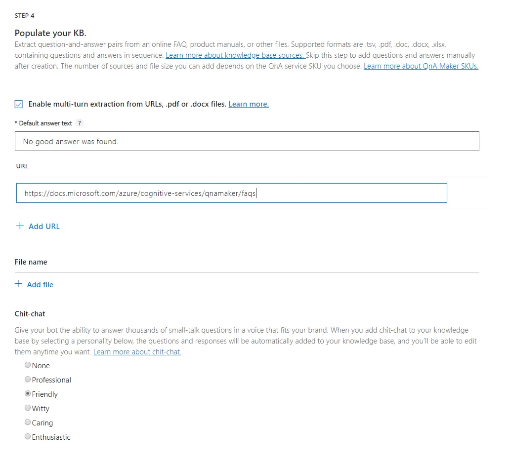
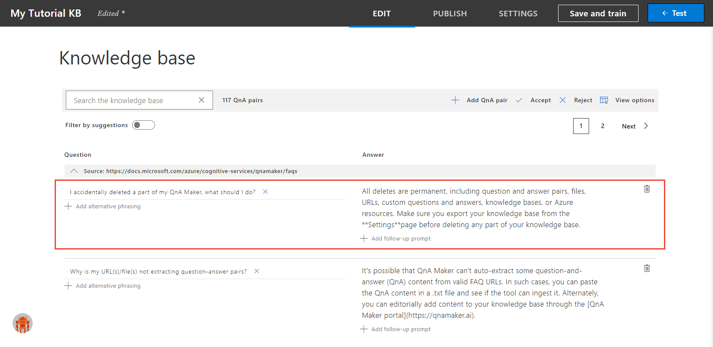
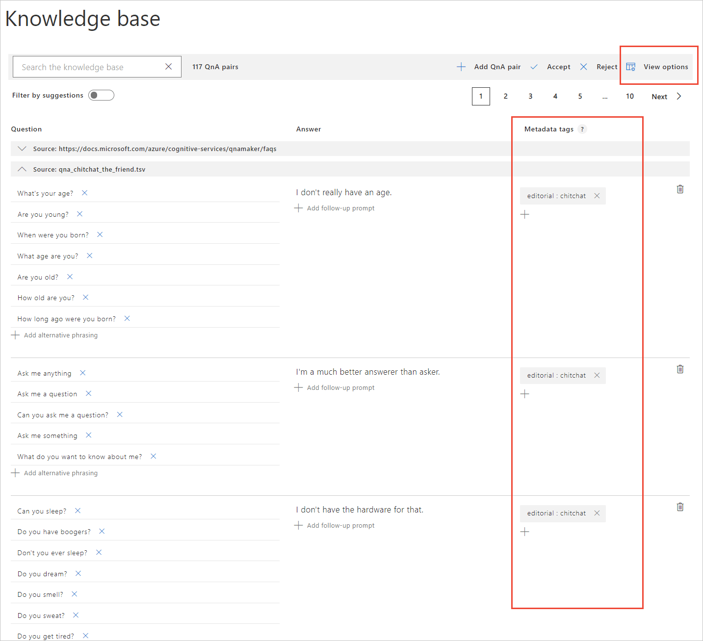
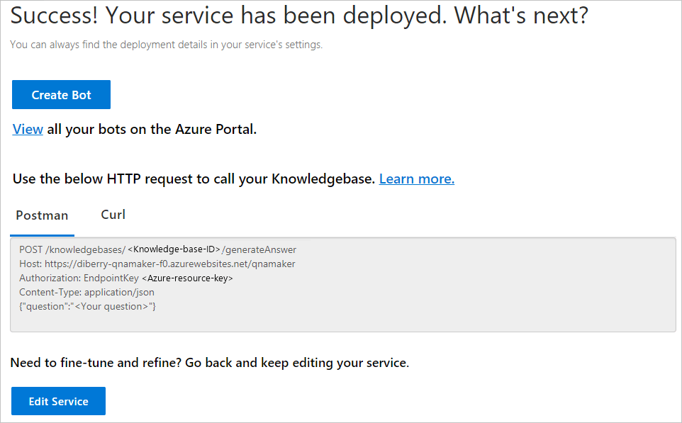

# Quickstart: Create a knowledge base then answer question via the QnA Maker portal

This portal-based tutorial walks you through programmatically creating and publishing a knowledge base, then answering a question from the knowledge base.

In this tutorial, you learn how to: 

> [!div class="checklist"]
* Create a knowledge base
* Review, save, and train the knowledge base
* Publish the knowledge base
* Use Curl to query the knowledge base

> [!NOTE] 
> The programmatic version of this tutorial is available with a complete solution from the [**Azure-Samples/cognitive-services-qnamaker-csharp** Github repository](https://github.com/Azure-Samples/cognitive-services-qnamaker-csharp/tree/master/documentation-samples/tutorials/create-publish-answer-knowledge-base).

## Create a knowledge base 

1. Sign in to the [QnA Maker](https://www.qnamaker.ai) portal. 

1. Select **Create a knowledge base** from the top menu.

    

1. See [QnA Maker service](../How-To/set-up-qnamaker-service-azure.md) to learn how to create a QnA Maker resource in the Azure portal. 

1. In the next step, select the existing settings:  

    |Setting|Purpose|
    |--|--|
    |Microsoft Azure Directory Id|The Microsoft Azure Directory Id is associated with the account you use to sign into the Azure portal and the QnA Maker portal. |
    |Azure Subscription name|The billing account you created the QnA Maker resource in.|
    |Azure QnA Service|The existing QnA Maker resource.|

    

1. In the next step, Enter your knowledge base name, `My Tutorial kb`.

    

1. In the next step, populate your kb with the following settings:  

    |Setting name|Setting value|Purpose|
    |--|--|--|
    |URL|`https://docs.microsoft.com/azure/cognitive-services/qnamaker/faqs` |The contents of that FAQ at that URL are formatted in a question-then-answer style. QnA Maker can interpret this style to extract questions and the associated answers.|
    |File (not used in this tutorial)||This uploads files for questions and answers. See [Data sources supported](../Concepts/data-sources-supported.md) for more information. 
    |Chit-chat personality|The friend|This gives a friendly and casual [personality](../Concepts/best-practices.md#chit-chat) to common questions and answers. You can edit these questions and answers later. |

    

1. Select **Create your KB** to finish the creation process.

    

## Review KB, save, and train

1. Review the questions and answers. The first page is questions and answers from the URL. 

    

1. Select the last page of questions and answers from the bottom of the table. The page shows questions and answers from the Chit-chat personality. 

    

1. From the toolbar above the list of questions and answers, select the gear. This shows the filters for each question and answer. The Chit-chat questions have the **editorial: chit-chat** filter already set. This filter is returned to the client application along with the selected answer. The client application, such as a chat bot, can use this filter to determine the type of answer returned and add to or change the answer based on the filter.

1. Select **Save and train** in the top menu bar.

## Publish to get KB endpoints

Select the **Publish** button from the top menu.


After the KB is published, the endpoint is displayed



## Use curl to query for an FAQ answer

1. Select the **Curl** tab. 

    

1. Copy the text of the **Curl** tab and execute in a Curl-enabled terminal or command-line. The authorization header's value includes the text `Endpoint ` with a trailing space then the key.

1. Replace `<Your question>` with `How large can my KB be?`.   

1. Execute the CURL command and receive the JSON response including the score and answer. 

    ```TXT
      % Total    % Received % Xferd  Average Speed   Time    Time     Time  Current
                                     Dload  Upload   Total   Spent    Left  Speed
    100   581  100   543  100    38    418     29  0:00:01  0:00:01 --:--:--   447{
      "answers": [
        {
          "questions": [
            "How large a knowledge base can I create?"
          ],
          "answer": "The size of the knowledge base depends on the SKU of Azure search you choose when creating the QnA Maker service. Read [here](https://docs.microsoft.com/azure/cognitive-services/qnamaker/tutorials/choosing-capacity-qnamaker-deployment)for more details.",
          "score": 42.81,
          "id": 2,
          "source": "https://docs.microsoft.com/azure/cognitive-services/qnamaker/faqs",
          "metadata": []
        }
      ]
    }
    
    ```

## Use curl to query for a Chit-chat answer

1. In the Curl-enabled terminal, replace `How large can my KB be?`.   

1. Execute the CURL command and receive the JSON response including the score and answer. 

    ```TXT
      % Total    % Received % Xferd  Average Speed   Time    Time     Time  Current
                                     Dload  Upload   Total   Spent    Left  Speed
    100   525  100   501  100    24    525     25 --:--:-- --:--:-- --:--:--   550{
      "answers": [
        {
          "questions": [
            "Thank you",
            "Thanks",
            "Thnx",
            "Kthx",
            "I appreciate it",
            "Thank you so much",
            "I thank you",
            "My sincere thank"
          ],
          "answer": "You're very welcome.",
          "score": 100.0,
          "id": 109,
          "source": "qna_chitchat_the_friend.tsv",
          "metadata": [
            {
              "name": "editorial",
              "value": "chitchat"
            }
          ]
        }
      ]
    }
   
    ```

## Use curl to query for the default answer

Any question that QnA Maker is not confident in an answer receives the default answer. This answer is configured in the Azure portal. For more information about this, see [No match found](../Concepts/confidence-score.md#no-match-found). 

1. In the Curl-enabled terminal, replace `Thank you` with `x`. 

1. Execute the CURL command and receive the JSON response including the score and answer. 

    ```TXT
      % Total    % Received % Xferd  Average Speed   Time    Time     Time  Current
                                     Dload  Upload   Total   Spent    Left  Speed
    100   186  100   170  100    16    272     25 --:--:-- --:--:-- --:--:--   297{
      "answers": [
        {
          "questions": [],
          "answer": "No good match found in KB.",
          "score": 0.0,
          "id": -1,
          "metadata": []
        }
      ]
    }
    ```

## Next steps

> [!div class="nextstepaction"]
> [QnA Maker (V4) REST API Reference](https://westus.dev.cognitive.microsoft.com/docs/services/5a93fcf85b4ccd136866eb37/operations/5ac266295b4ccd1554da75ff)