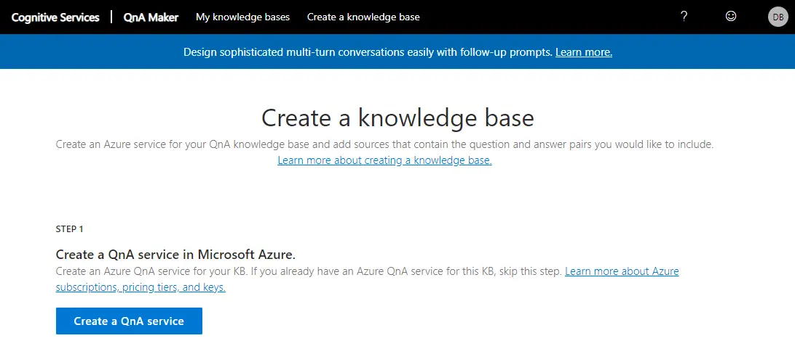

# Quickstart: Create a knowledge base then answer question via the QnA Maker portal

This portal-based tutorial walks you through programmatically creating and publishing a knowledge base, then answering a question from the knowledge base.

## Prerequisites

* You must have a [QnA Maker service](../How-To/set-up-qnamaker-service-azure.md). To retrieve your key, select **Keys** under **Resource Management** in your dashboard. 

> [!NOTE] 
> The programmatic version of this tutorial is available with a complete solution from the [**Azure-Samples/cognitive-services-qnamaker-csharp** Github repository](https://github.com/Azure-Samples/cognitive-services-qnamaker-csharp/tree/master/documentation-samples/tutorials/create-publish-answer-knowledge-base).

## Create a knowledge base 

1. Sign in to the [QnA Maker](https://www.qnamaker.ai) portal. 
1. Select **Create a knowledge base** from the top menu.
    
1. Because you already have a QnA Maker Service, skip to step 2 in the portal. 
1. In the next step, select the existing settings:  

    |Setting|Purpose|
    |--|--|
    |Microsoft Azure Directory Id|The Microsoft Azure Directory Id is associated with the account you use to sign into the Azure portal and the QnA Maker portal. |
    |Azure Subscription name|The billing account you created the QnA Maker resource in.|
    |Azure QnA Service|The existing QnA Maker resource.|

    

1. In the next step, Enter your knowledge base name, `My tutorial kb`.

    

1. In the next step, populate your kb with the following settings:  

    |Setting name|Setting value|Purpose|
    |--|--|--|
    |URL|[`https://docs.microsoft.com/azure/cognitive-services/qnamaker/faqs`](https://docs.microsoft.com/azure/cognitive-services/qnamaker/faqs) |If you look at the contents of that page, you see that the page is formatted in a question-then-answer style. QnA Maker can interpret this style to pull extract questions and the associated answers.|
    |File|none|This uploads files and processes the files for questions and answers. See [Data sources supported](../Concepts/data-sources-supported.md) for more information. 
    |Chit-chat personality|**The friend**|This gives [personality](../Concepts/best-practices.md#chit-chat) to the responses which are friendly and casual. |

    

1. Select **Create your KB** to finish the creation process.

    

## Add questions and answers

### Add questions from a file

### Add questions from a URL

### Add questions from the portal editor

## Publish to get KB endpoints

## Use curl to query for answer

## Next steps

> [!div class="nextstepaction"]
> [QnA Maker (V4) REST API Reference](https://westus.dev.cognitive.microsoft.com/docs/services/5a93fcf85b4ccd136866eb37/operations/5ac266295b4ccd1554da75ff)