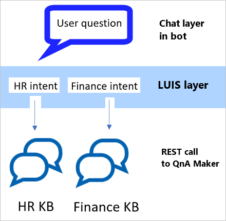
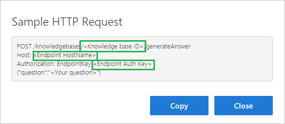
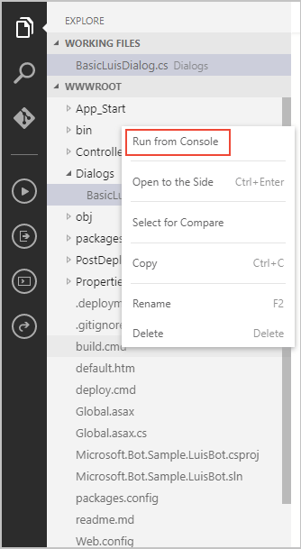
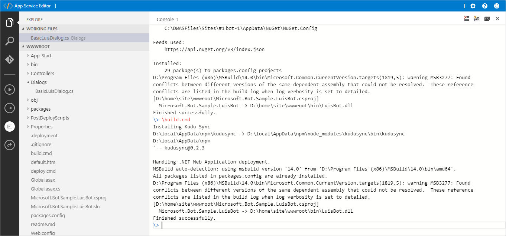
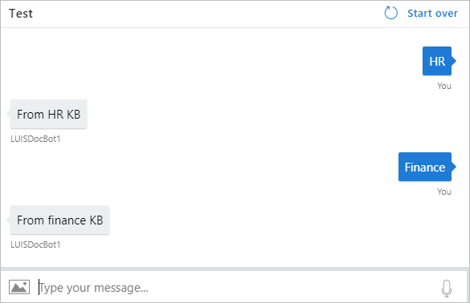

# Use bot with QnA Maker and LUIS to distribute your knowledge base
As your QnA Maker knowledge base grows large, it becomes difficult to maintain it as a single monolithic set and there is a need to split the knowledge base into smaller logical chunks.

While it is straightforward to create multiple knowledge bases in QnA Maker, you will need some logic to route the incoming question to the appropriate knowledge base. You can do this by using LUIS.

This article uses Bot Framework v3 SDK. Please see this [Bot Framework article](https://docs.microsoft.com/azure/bot-service/bot-builder-tutorial-dispatch?view=azure-bot-service-4.0&tabs=csharp), if you are interested in Bot Framework v4 SDK version of this information.

## Architecture



In the above scenario, QnA Maker first gets the intent of the incoming question from a LUIS model, and then use that to route it to the correct QnA Maker knowledge base.

## Create a LUIS app

1. Sign in to the [LUIS](https://www.luis.ai/) portal.
1. [Create an app](https://docs.microsoft.com/azure/cognitive-services/luis/create-new-app).
1. [Add an intent](https://docs.microsoft.com/azure/cognitive-services/luis/add-intents) for each QnA Maker knowledge base. The example utterances should correspond to questions in the QnA Maker knowledge bases.
1. [Train the LUIS app](https://docs.microsoft.com/azure/cognitive-services/luis/luis-how-to-train) and [publish the LUIS app](https://docs.microsoft.com/azure/cognitive-services/luis/publishapp) your LUIS App.
1. In the **Manage** section, make note of your LUIS app ID, LUIS endpoint key, and [custom domain name](../../cognitive-services-custom-subdomains.md). You will need these values later.

## Create QnA Maker knowledge bases

1. Sign in to [QnA Maker](https://qnamaker.ai).
1. [Create](https://www.qnamaker.ai/Create) a knowledge bases for each intent in the LUIS app.
1. Test and publish the knowledge bases. When you publish each KB, make note of the KB ID, resource name (custom subdomain before _.azurewebsites.net/qnamaker_), and the authorization endpoint key. You will need these values later.

    This article assumes the KBs are all created in the same Azure QnA Maker subscription.

    

## Web app Bot

1. [Create a "Basic" Web App bot](https://docs.microsoft.com/azure/bot-service/bot-service-quickstart?view=azure-bot-service-4.0) which automatically includes a LUIS app. Select C# programming language.

1. Once the web app bot is created, in the Azure portal, select the web app bot.
1. Select **Application Settings** in the Web app bot service navigation, then scroll down to **Application settings** section of available settings.
1. Change the **LuisAppId** to the value of the LUIS app created in the preceding  section then select **Save**.


## Change code in BasicLuisDialog.cs
1. From the **Bot Management** section of the web app bot navigation in the Azure portal, select **Build**.
2. Select **Open online code editor**. A new browser tab opens with the online editing environment.
3. In the **WWWROOT** section, select the **Dialogs** directory, then open **BasicLuisDialog.cs**.
4. Add dependencies to the top of the **BasicLuisDialog.cs** file:

    ```csharp
    using System;
    using System.Net.Http;
    using System.Threading.Tasks;
    using System.Collections.Generic;
    using Microsoft.Bot.Builder.Dialogs;
    using Microsoft.Bot.Builder.Luis;
    using Microsoft.Bot.Builder.Luis.Models;
    using Newtonsoft.Json;
    using System.Text;
    ```

5. Add the below classes to deserialize the QnA Maker response:

    ```csharp
    public class Metadata
    {
        public string name { get; set; }
        public string value { get; set; }
    }

    public class Answer
    {
        public IList<string> questions { get; set; }
        public string answer { get; set; }
        public double score { get; set; }
        public int id { get; set; }
        public string source { get; set; }
        public IList<object> keywords { get; set; }
        public IList<Metadata> metadata { get; set; }
    }

    public class QnAAnswer
    {
        public IList<Answer> answers { get; set; }
    }
    ```


6. Add the following class to make an HTTP request to the QnA Maker service. Notice that the **Authorization** header's value includes the word, `EndpointKey` with a space following the word. The JSON result is deserialized into the preceding classes and the first answer is returned.

    ```csharp
    [Serializable]
    public class QnAMakerService
    {
        private string qnaServiceResourceName;
        private string knowledgeBaseId;
        private string endpointKey;

        public QnAMakerService(string resourceName, string kbId, string endpointkey)
        {
            qnaServiceResourceName = resourceName;
            knowledgeBaseId = kbId;
            endpointKey = endpointkey;

        }
        async Task<string> Post(string uri, string body)
        {
            using (var client = new HttpClient())
            using (var request = new HttpRequestMessage())
            {
                request.Method = HttpMethod.Post;
                request.RequestUri = new Uri(uri);
                request.Content = new StringContent(body, Encoding.UTF8, "application/json");
                request.Headers.Add("Authorization", "EndpointKey " + endpointKey);

                var response = await client.SendAsync(request);
                return  await response.Content.ReadAsStringAsync();
            }
        }
        public async Task<string> GetAnswer(string question)
        {
            string uri = qnaServiceResourceName + "/qnamaker/knowledgebases/" + knowledgeBaseId + "/generateAnswer";
            string questionJSON = "{\"question\": \"" + question.Replace("\"","'") +  "\"}";

            var response = await Post(uri, questionJSON);

            var answers = JsonConvert.DeserializeObject<QnAAnswer>(response);
            if (answers.answers.Count > 0)
            {
                return answers.answers[0].answer;
            }
            else
            {
                return "No good match found.";
            }
        }
    }
    ```


7. Modify the BasicLuisDialog class. Each LUIS intent should have a method decorated with **LuisIntent**. The parameter to the decoration is the actual LUIS intent name. The method name that is decorated _should_ be the LUIS intent name for readability and maintainability but doesn't have to be the same at design or run time.

    ```csharp
    [Serializable]
    public class BasicLuisDialog : LuisDialog<object>
    {
        // LUIS Settings
        static string LUIS_appId = "<LUIS APP ID>";
        static string LUIS_apiKey = "<LUIS API KEY>";
        static string LUIS_hostRegion = "westus.api.cognitive.microsoft.com";

        // QnA Maker global settings
        // assumes all KBs are created with same Azure service
        static string qnamaker_endpointKey = "<QnA Maker endpoint KEY>";
        static string qnamaker_resourceName = "my-qnamaker-s0-s";

        // QnA Maker Human Resources Knowledge base
        static string HR_kbID = "<QnA Maker KNOWLEDGE BASE ID>";

        // QnA Maker Finance Knowledge base
        static string Finance_kbID = "<QnA Maker KNOWLEDGE BASE ID>";

        // Instantiate the knowledge bases
        public QnAMakerService hrQnAService = new QnAMakerService("https://" + qnamaker_resourceName + ".azurewebsites.net", HR_kbID, qnamaker_endpointKey);
        public QnAMakerService financeQnAService = new QnAMakerService("https://" + qnamaker_resourceName + ".azurewebsites.net", Finance_kbID, qnamaker_endpointKey);

        public BasicLuisDialog() : base(new LuisService(new LuisModelAttribute(
            LUIS_appId,
            LUIS_apiKey,
            domain: LUIS_hostRegion)))
        {
        }

        [LuisIntent("None")]
        public async Task NoneIntent(IDialogContext context, LuisResult result)
        {
            HttpClient client = new HttpClient();
            await this.ShowLuisResult(context, result);
        }

        // HR Intent
        [LuisIntent("HR")]
        public async Task HumanResourcesIntent(IDialogContext context, LuisResult result)
        {
            // Ask the HR knowledge base
            var qnaMakerAnswer = await hrQnAService.GetAnswer(result.Query);
            await context.PostAsync($"{qnaMakerAnswer}");
            context.Wait(MessageReceived);
        }

        // Finance intent
        [LuisIntent("Finance")]
        public async Task FinanceIntent(IDialogContext context, LuisResult result)
        {
            // Ask the finance knowledge base
            var qnaMakerAnswer = await financeQnAService.GetAnswer(result.Query);
            await context.PostAsync($"{qnaMakerAnswer}");
            context.Wait(MessageReceived);
        }
        private async Task ShowLuisResult(IDialogContext context, LuisResult result)
        {
            await context.PostAsync($"You have reached {result.Intents[0].Intent}. You said: {result.Query}");
            context.Wait(MessageReceived);
        }
    }
    ```


## Build the bot
1. In the code editor, right-click on `build.cmd` and select **Run from Console**.

    

2. The code view is replaced with a terminal window showing the progress and results of the build.

    

## Test the bot
In the Azure portal, select **Test in Web Chat** to test the bot. Type messages from different intents to get the response from the corresponding knowledge base.



## Next steps

> [!div class="nextstepaction"]
> [Integrate your knowledge base with a Power Virtual Agent](../How-To/integrate-with-power-virtual-assistant-fallback-topic.md)
