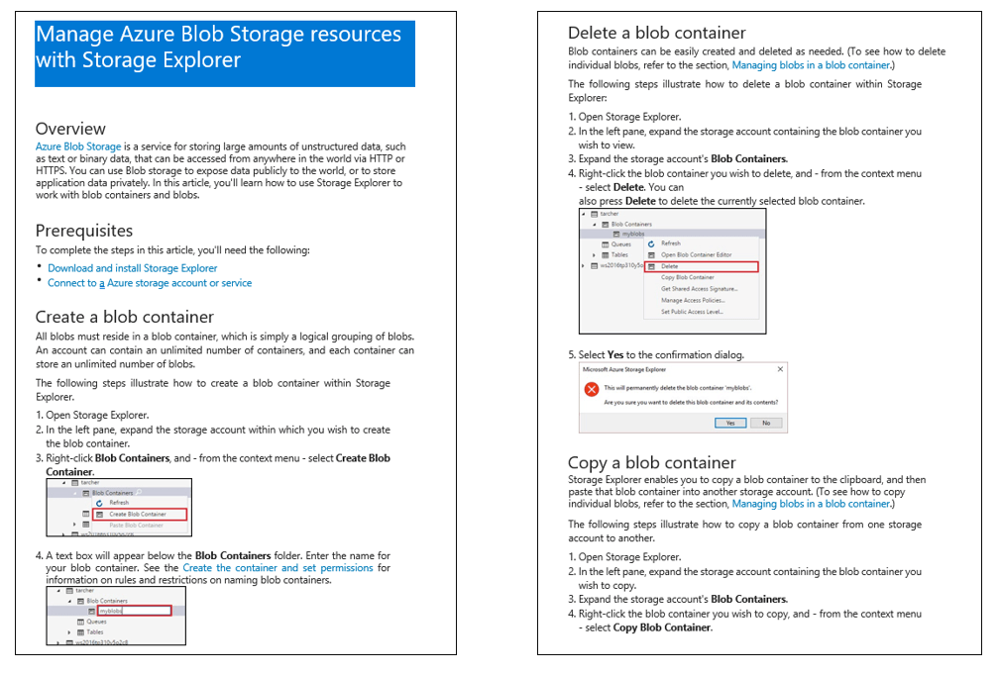

# Format guidelines for imported documents and URLs

Review these formatting guidelines to get the best results for your content.

## Formatting considerations

After importing a file or URL, QnA Maker converts and stores your content in the [markdown format](https://en.wikipedia.org/wiki/Markdown). The conversion process adds new lines in the text, such as `\n\n`. A knowledge of the markdown format helps you to understand the converted content and manage your knowledge base content.

If you add or edit your content directly in your knowledge base, use **markdown formatting** to create rich text content or change the markdown format content that is already in the answer. QnA Maker supports much of the markdown format to bring rich text capabilities to your content. However, the client application, such as a chat bot may not support the same set of markdown formats. It is important to test the client application's display of answers.

## Basic document formatting

QnA Maker identifies sections and subsections and relationships in the file based on visual clues like:

* font size
* font style
* numbering
* colors

|Document examples|
|--|
||


## Product manuals

A manual is typically guidance material that accompanies a product. It helps the user to set up, use, maintain, and troubleshoot the product. When QnA Maker processes a manual, it extracts the headings and subheadings as questions and the subsequent content as answers. See an example [here](https://download.microsoft.com/download/2/9/B/29B20383-302C-4517-A006-B0186F04BE28/surface-pro-4-user-guide-EN.pdf).

Below is an example of a manual with an index page, and hierarchical content

 

> [!NOTE]
> Extraction works best on manuals that have a table of contents and/or an index page, and a clear structure with hierarchical headings.

## Brochures, guidelines, papers, and other files

Many other types of documents can also be processed to generate QA pairs, provided they have a clear structure and layout. These include: Brochures, guidelines, reports, white papers, scientific papers, policies, books, etc. See an example [here](https://qnamakerstore.blob.core.windows.net/qnamakerdata/docs/Manage%20Azure%20Blob%20Storage.docx).

Below is an example of a semi-structured doc, without an index:

 

## Structured QnA Document

The format for structured Question-Answers in DOC files, is in the form of alternating Questions and Answers per line, one question per line followed by its answer in the following line, as shown below:

```text
Question1

Answer1

Question2

Answer2
```

Below is an example of a structured QnA word document:

 

## Structured *TXT*, *TSV* and *XLS* Files

QnAs in the form of structured *.txt*, *.tsv* or *.xls* files can also be uploaded to QnA Maker to create or augment a knowledge base.  These can either be plain text, or can have content in RTF or HTML.

| Question  | Answer  | Metadata (1 key: 1 value) |
|-----------|---------|-------------------------|
| Question1 | Answer1 | <code>Key1:Value1 &#124; Key2:Value2</code> |
| Question2 | Answer2 |      `Key:Value`           |

Any additional columns in the source file are ignored.

### Example of structured Excel file

Below is an example of a structured QnA *.xls* file, with HTML content:

 

### Example of alternate questions for single answer in Excel file

Below is an example of a structured QnA *.xls* file, with several alternate questions for a single answer:

 

After the file is imported, the question-and-answer pair is in the knowledge base as shown below:

 

## Structured data format through import

Importing a knowledge base replaces the content of the existing knowledge base. Import requires a structured .tsv file that contains data source information. This information helps QnA Maker group the question-answer pairs and attribute them to a particular data source.

| Question  | Answer  | Source| Metadata (1 key: 1 value) |
|-----------|---------|----|---------------------|
| Question1 | Answer1 | Url1 | <code>Key1:Value1 &#124; Key2:Value2</code> |
| Question2 | Answer2 | Editorial|    `Key:Value`       |

<a href="#formatting-considerations"></a>

## Multi-turn document formatting

* Use headings and sub-headings to denote hierarchy. For example You can h1 to denote the parent QnA and h2 to denote the QnA that should be taken as prompt. Use small heading size to denote subsequent hierarchy. Don't use style, color, or some other mechanism to imply structure in your document, QnA Maker will not extract the multi-turn prompts.
* First character of heading must be capitalized.
* Do not end a heading with a question mark, `?`.


|Document examples|
|--|
||