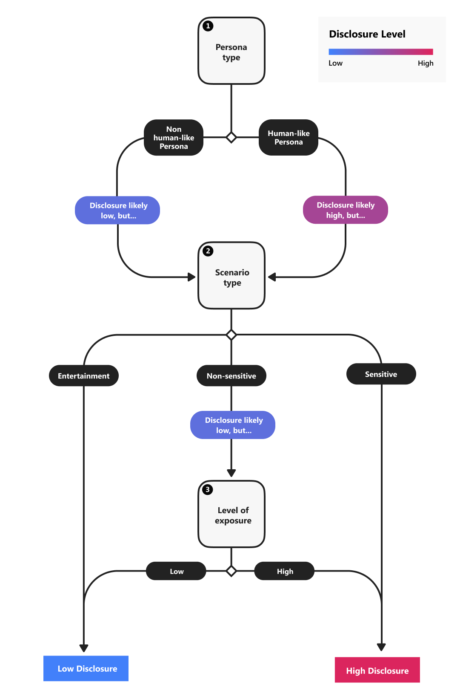

# Disclosure Design Guidelines

## Introduction

### What is disclosure?

Disclosure is a means of letting people know they&#39;re interacting with or listening to a voice that is synthetically generated.

### Why is disclosure necessary?

The need to disclose the synthetic origins of a computer-generated voice is relatively new. In the past, computer-generated voices were obviously that—no one would ever mistake them for a real person. Every day, however, the realism of synthetic voices improves, and they become increasingly indistinguishable from human voices.

### Goals

**Reinforce trust**
 Design with the intention to fail the Turing Test without degrading the experience. Let the users in on the fact that they're interacting with a synthetic voice while allowing them to  engage seamlessly with the experience.

**Adapt to context of use**
 Understand when, where, and how your users will interact with the synthetic voice to provide the right type of disclosure at the right time.

**Set clear expectations**
 Allow users to easily discover and understand the capabilities of the agent. Offer opportunities to learn more about synthetic voice technology upon request.

**Embrace failure**
 Use moments of failure to reinforce the capabilities of the agent.

### How to use this guide

This guide helps you determine which disclosure patterns are best fit for your synthetic voice experience. We then offer examples of how and when to use them. Each of these patterns is designed to maximize transparency with users about synthetic speech while staying true to human-centered design.

Considering the vast body of design guidance on voice experiences, we focus here specifically on:

1. [**Disclosure Assessment**](#disclosure-assessment): A process to determine the type of disclosure recommended for your synthetic voice experience

2. [**How to Disclose**](concepts-disclosure-patterns.md): Examples of disclosure patterns that can be applied to your synthetic voice experience

3. [**When to Disclose**](concepts-disclosure-patterns.md#when-to-disclose): Optimal moments to disclose throughout the user journey

## Disclosure assessment

### Understand Context

Consider your users&#39; expectations about an interaction and the context in which they will experience the voice. If the context makes it clear that a synthetic voice is &quot;speaking,&quot; disclosure may be minimal, momentary, or even unnecessary. Use this worksheet to categorize and gain more insight about the main types of context that impacts disclosure. It will help you in the next step where you'll determine your disclosure level.

|                                    | Context of use                                                                                                                                                                                                                                                                                                                                                       | Potential Risks & Challenges                                                                                                                                                                                                                                                                                                                                                                       |
|------------------------------------|-----------------------------------------------------------------------------------------------------------------------------------------------------------------------------------------------------------------------------------------------------------------------------------------------------------------------------------------------------------------------|-----------------------------------------------------------------------------------------------------------------------------------------------------------------------------------------------------------------------------------------------------------------------------------------------------------------------------------------------------------------------------------------------------|
| **1. Who is speaking?**               | **If any of the following apply, your persona fits under the 'Human-like Persona' category:**  <ul><li> Persona embodies a real human whether it's a fictitious representation or not. (e.g., photograph or a computer-generated rendering of a real person)  <li> The synthetic voice is based on the voice of a widely recognizable real person (e.g., celebrity, political figure) | The more human-like representations you give your persona, the more likely a user will associate it with a real person, or cause them to believe that the content is spoken by a real person rather than computer-generated. </ul>                                                                                                                                                                      |
| **2. What is being said?**            | **If any of the following apply,  your voice experience fits under the 'Sensitive' category:**  <ul><li> Obtains or displays personally identifiable information   <li> Broadcasts time sensitive news/information (e.g., emergency alert)  <li> Aims to help real people communicate with each other (e.g., reads personal emails/texts)   <li> Provides medical/health assistance </ul>            | The use of synthetic voice may not feel appropriate or trustworthy to the people using it when topics are related to sensitive, personal, or urgent matters. They may also expect the same level of empathy and contextual awareness as a real human. |
| **3. What is the level of exposure?** |**Your voice experience most likely fits under the 'High' category if:**   <ul><li>The user will hear or interact with the synthetic voice frequently or for a long duration of time </ul>                                                                                                                                                                             | The importance of being transparent and building trust with users is even higher when establishing long-term relationships.                                                                                                                                                                                                                                                                      |

### Determine Disclosure Level

Use the following flowchart to determine whether your synthetic voice experience requires high or low disclosure based on your context of use.

  

## Reference docs

* [Transparency Note](https://aka.ms/neural-tts-transparency-note)
* [Guidelines for Responsible Deployment](concepts-deployment-guidelines.md)
* [Gating Overview](concepts-gating-overview.md)

## Next steps

* [Refer to Disclosure Design Patterns](concepts-disclosure-patterns.md)
