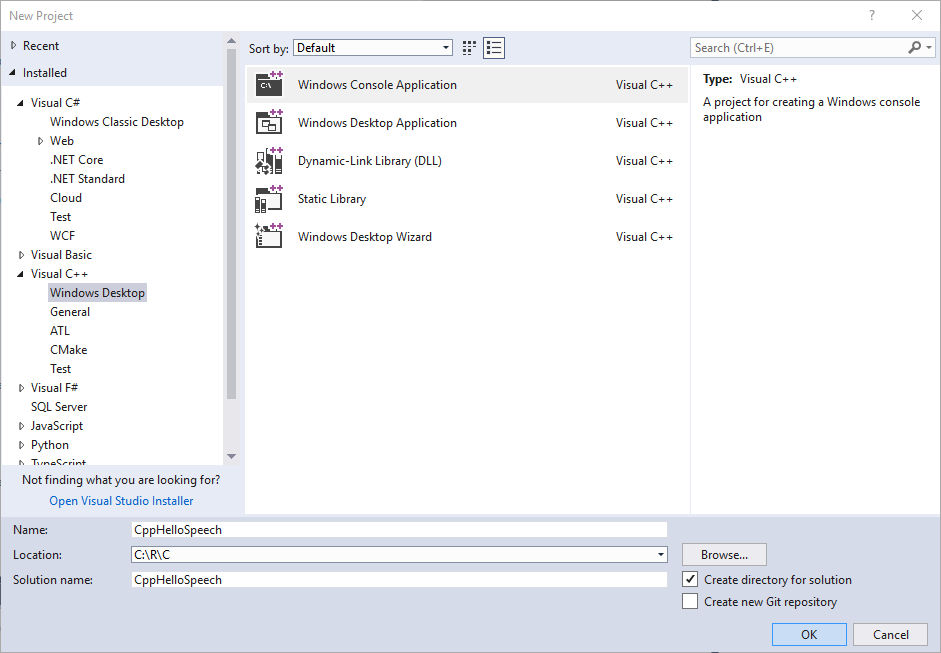

---
title: Speech SDK Quickstart for C++ and Windows | Microsoft Docs
titleSuffix: "Microsoft Cognitive Services"
description: Get information and code samples to help you quickly get started using the Speech SDK with Windows and C++ in Cognitive Services.
services: cognitive-services
author: wolfma61
manager: onano

ms.service: cognitive-services
ms.technology: Speech
ms.topic: article
ms.date: 05/07/2018
ms.author: wolfma
---code
# Quickstart for C++ and Windows

We describe how to create a C++-based console application for Windows Desktop that makes use of the Speech SDK.
The application is based on the [Microsoft Cognitive Services SDK NuGet Package](https://www.nuget.org/packages/Microsoft.CognitiveServices.Speech) and Microsoft VisualStudio 2017.

> [!NOTE]
> If you're looking for a Quickstart for C++ and Linux, please go [here](cpp-linux.md).
> If you're looking for a Quickstart for C# and Windows, please go [here](csharp-windows.md).

> [!NOTE]
> This quick start requires a PC with a working microphone.
> For a sample that recognizes speech from a given audio input file see the [tutorial](stt.md?tabs=cpp#speech-recognition-from-a-file).

> [!NOTE]
> Please ensure that your Visual Studio installation includes the **Desktop development with C++** workload.
> If you're not sure, use these steps to check and fix:
> In Visual Studio 2017, select **Tools** \> **Get Tools and Features** and acknowledge the User Account Control prompt by clicking **Yes**.
> In the **Workloads** tab, if **Desktop development with C++** does not have a set checkbox next to it, set it and click on **Modify** to save changes.

[!include[Get a Subscription Key](includes/get-subscription-key.md)]

## Creating an empty console application project

In Visual Studio 2017, create a new Visual C++ Windows Desktop Windows Console Application with the name "CppHelloSpeech":

If you're running on a 64-bit Windows installation, optionally switch your build platform to `x64`:

## Install and reference the Speech SDK NuGet package

> [!NOTE]
> Ensure the NuGet package manager is enabled for your Visual Studio 2017 installation.
> In Visual Studio 2017, select **Tools** \> **Get Tools and Features** and
> acknowledge the User Account Control prompt by clicking **Yes**. Then click on
> the **Individual components** tab, and look for **NuGet package manager**.
> If the checkbox to its left is not set, make sure to set it and click on **Modify** to save changes.
>
> 

In the Solution Explorer, right-click the solution and click on **Manage NuGet Packages for Solution**.

In the upper-right corner, in the **Package Source** field, choose "Nuget.org".
Search for and install the "Microsoft.CognitiveServices.Speech" package and install it into the CppHelloSpeech project.

In the license screen that pops up, accept the license:

## Add the sample code

Replace the code with the following:

[!code-cpp[Quickstart Code](code/CppHelloSpeech.cpp#code)]

> [!IMPORTANT]
> Replace the subscription key with one that you obtained.

## Build and run the sample

The code should compile without errors now:

Launch the program under the debugger with the Launch button or using the F5 keyboard shortcut:

A console window should pop up, prompting you to say something (in English).
The result of the recognition will be displayed on screen.

## Downloading the sample

The sample from this article can be downloaded [here](https://aka.ms/csspeech/winsample).

## Next steps

* Visit the [tutorials page](tutorials.md?tabs=cpp) for additional samples.
