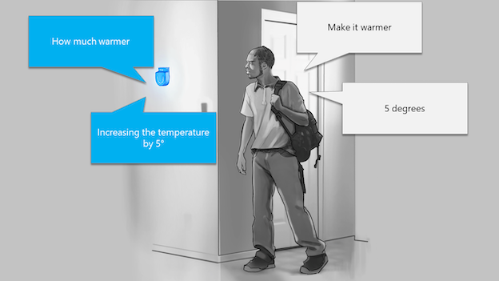
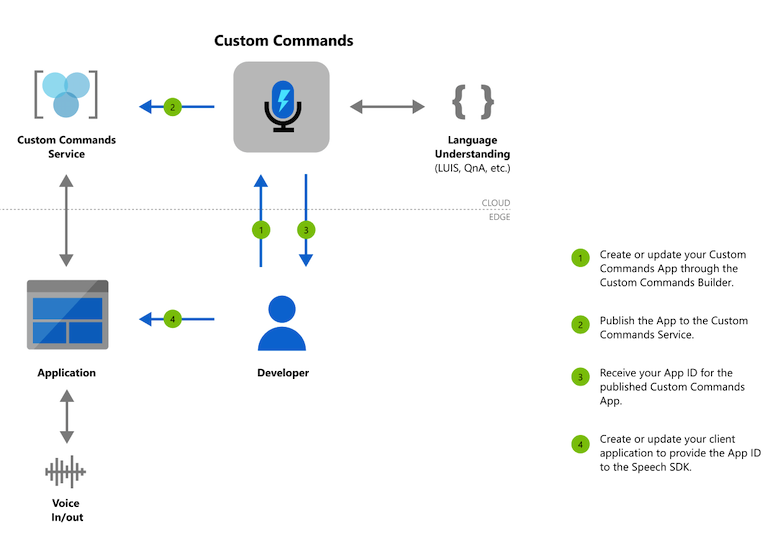

# About Custom Commands Preview

## When to use Custom Commands Preview

[Voice Assistants](voice-assistants.md) listen to users and take an action in response, often speaking back. They use [speech-to-text](speech-to-text.md) to transcribe the user's speech, then take action on the natural language understanding of the text. This action frequently includes spoken output from the assistant generated with [text-to-speech](text-to-speech.md). Devices connect to assistants with the Speech SDK’s `DialogServiceConnector` object.

**Custom Commands** is a streamlined solution for creating a Voice Assistant. It provides a unified authoring experience, an automatic hosting model, and lower complexity versus other assistant creation options like [Direct Line Speech](direct-line-speech.md). This simplification, however, comes with a reduction in flexibility. So, Custom Commands is best suited for task completion or command-and-control scenarios.

For complex conversational interaction and integration with other solutions like the [Virtual Assistant Solution and Enterprise Template](https://docs.microsoft.com/azure/bot-service/bot-builder-enterprise-template-overview) you're encouraged to use Direct Line Speech.

An example of a task completion assistant perfect for Custom Commands is a home automation tool for controlling a thermostat. A user's commands fit into a fixed vocabulary (“turn up the temperature” or “make it cooler”) with a well-defined set of variables (number of degrees, time).

   

## Getting started with Custom Commands Preview

The first step for using Custom Commands to make a Voice Assistant is to get a speech subscription key and access the Custom Commands Builder. From there, you can author a new Custom Commands Application and publish it, after which an on-device application can communicate with it using the Speech SDK.

   

We offer Quickstarts designed to have you running code in less than 10 minutes.

* [Create a Custom Commands Preview Application](quickstart-custom-speech-commands-create-new.md)
* [Create a Custom Commands Preview Application with Parameters](quickstart-custom-speech-commands-create-parameters.md)
* [Connect to a Custom Commands Preview Application with the Speech SDK, C#](quickstart-custom-speech-commands-speech-sdk.md)

## Sample Code

Sample code for creating a Voice Assistant with Custom Commands Preview is available on GitHub.

* [Voice Assistant samples (SDK)](https://aka.ms/csspeech/samples)

## Customization

Voice Assistants built using Azure Speech Services can use the full range of customization options available for [speech-to-text](speech-to-text.md), [text-to-speech](text-to-speech.md), and [custom keyword selection](speech-devices-sdk-create-kws.md).

> [!NOTE]
> Customization options vary by language/locale (see [Supported languages](supported-languages.md)).

## Reference Docs

* [Speech SDK](speech-sdk-reference.md)

## Next Steps

* [Get a Speech Services subscription key for free](get-started.md)
* [Get the Speech SDK](speech-sdk.md)
