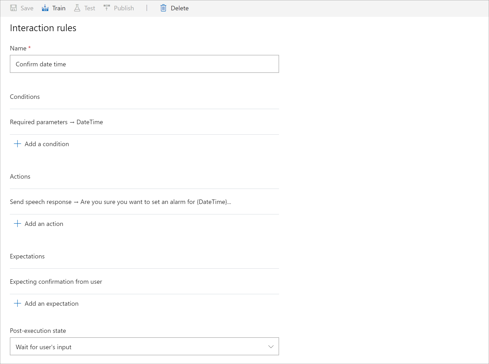

# Add a confirmation to a Command

In this article, you'll learn how to add a confirmation to a command using **Interaction Rules**. Go to [references](./custom-commands-references.md) section to learn more about interaction rules.

## Prerequisites

You must have completed the steps in the following articles:
> [!div class="checklist"]
> * [How To: Create an empty application](./how-to-custom-commands-create-basic-application.md)
> * [How To: Add simple commands](./how-to-custom-commands-add-simple-commands.md)
> * [How To: Add parameters to commands](./how-to-custom-commands-add-simple-commands.md)

## Add confirmation to SetTemperature command

To demonstrate confirmations, you will be using the **SetTemperature** command. For achieving confirmation, you will be creating interaction rules.

### Add interaction rules for confirmation

1. Select **SetTemperature** command from the left pane.
2. Add interaction rules by selecting **Add** in the middle pane and then selecting **Interaction rules** > **Confirm command**.

    This will add 3 interaction rules This rule will ask the user to confirm the date and time of the alarm and is expecting a confirmation (yes/no) for the next turn.

    1. Modify the **Confirm Command** interaction rule as per the following configuration
        1. Rename **Name** to  **`Confirm Temperature`**.
        1. Add a new condition as- **Required parameters > Temperature**
        1. Add a new action as- **Type > Send speech response > `Are you sure you want to set the temperature as {Temperature} degrees?`**
        1. Leave the default value of **Expecting confirmation from user** in the expectations section.
      
         > [!div class="mx-imgBorder"]
         > 
    

    1. Modify the **Confirmation succeeded** interaction rule to handle a successful confirmation (user said yes).
      
          1. Modify **Name** to  **`Confirmation temperature succeeded`**.
          1. Leave the already existing **Confirmation was successful** condition.
          1. Add a new condition as- **Type >  Required Parameters > Temperature**
          1. Leave the default value of **Post-execution state** as **Execute completion rules**.

    1. Modify the **Confirmation denied** (user said no) to handle scenarios when confirmation is denied.

          1. Modify **Name** to  **`Confirmation temperature denied`**.
          1. Leave the already existing **Confirmation was denied** condition.
          1. Add a new condition as- **Type >  Required Parameters > Temperature**
          1. Add a new action as- **Type > Send speech response > `No problem. What temperature then?`**
          1. Leave the default value of **Post-execution state** as **Wait for user's input**.

> [!IMPORTANT]
> In this article, you used the inbuilt confirmation capability. Alternatively, you can also achieve the same by adding the interaction rules one by one, manually.
   

## Try out the changes

Select **Train**, wait for training complete and select **Test**.

- Input: set temperature to 80 degrees
- Output: ok 80?
- Input: No
- Output: no problem. what temperature then?
- Input: 83 degrees
- Output: ok 83?
- Input: Yes
- Output: Ok, setting temperature to 83 degrees

## Next steps

> [!div class="nextstepaction"]
> [How To: Add a one-step correction to a Command](./how-to-custom-commands-add-one-step-correction.md)