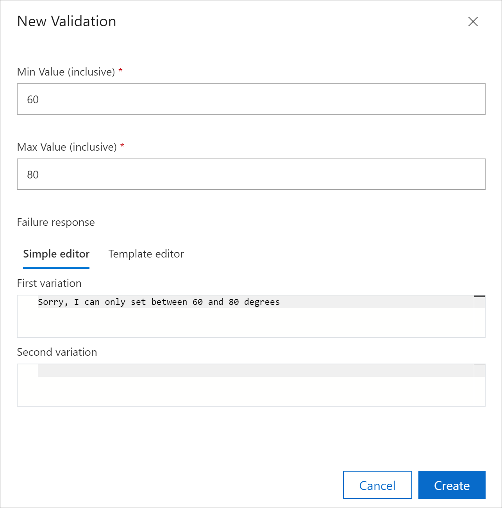

# Add validations to custom command parameters

In this article, you will add validations to parameters and prompts for correction.
**Validations** are constructs applicable to certain parameter types which let user configure constraints on parameter's value.

> [!NOTE]
> For full list of parameter types extending the validation construct, go to [references](./custom-commands-references.md)

## Prerequisites

You must have completed the steps in the following articles:

> [!div class="checklist"]
> * [How To: Create an empty application](./how-to-custom-commands-create-basic-application.md)
> * [How To: Add simple commands](./how-to-custom-commands-add-simple-commands.md)
> * [How To: Add parameters to commands](./how-to-custom-commands-add-simple-commands.md)

## Add validation to SetTemperature command

Let's demonstrate validations using **SetTemperature** command. You will be adding a validation for the **Temperature** parameter.

1. Select **SetTemperature** command in the left pane.
1. Select  **Temperature** in the middle pane.
1. Select **Add a validation** present in the right pane.
1. In the **New validation** window,  as follows, and select **Create**.

    | Parameter Configuration         | Suggested value                                          | Description                                                                        |
    | ----------------- | -------------------------------------------------------- | ------------------------------------------------------------------------------------------------ |
    | Min Value        | `60`               | For Number parameters, the minimum value this parameter can assume |
    | Max Value        | `80`               | For Number parameters, the maximum value this parameter can assume |
    | Failure response > Simple editor |  First Variation > `Sorry, I can only set between 60 and 80 degrees`      | Prompt to ask for a new value if the validation fails                                       |

    > [!div class="mx-imgBorder"]
    > 

## Try it out
1. Select **Train** icon present on top of the right pane.

1. Once, training completes, select **Test** and try a few interactions:

    - Input: Set the temperature to 72 degrees
    - Output: Ok, setting temperature to 72 degrees
    - Input: Set the temperature to 45 degrees
    - Output: Sorry, I can only set between 60 and 80 degrees
    - Input: make it 72 degrees instead
    - Output: Ok, setting temperature to 72 degrees

## Next steps

> [!div class="nextstepaction"]
> [How To: Add a confirmation to a Command](./how-to-custom-commands-add-confirmations.md)
