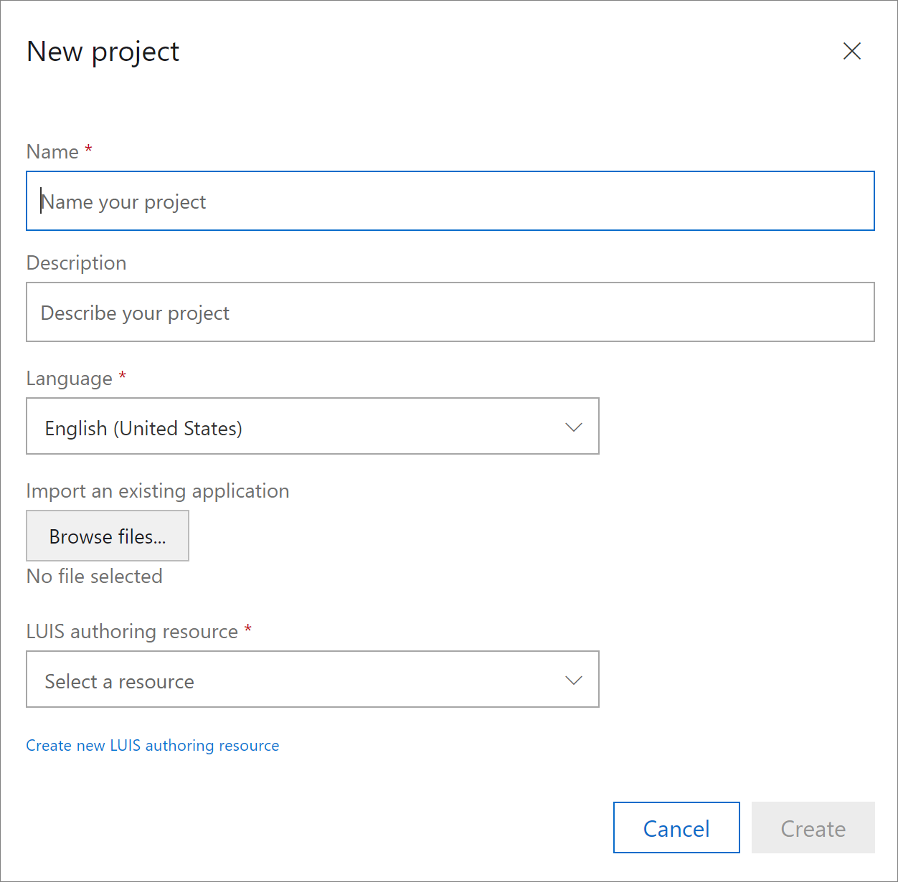
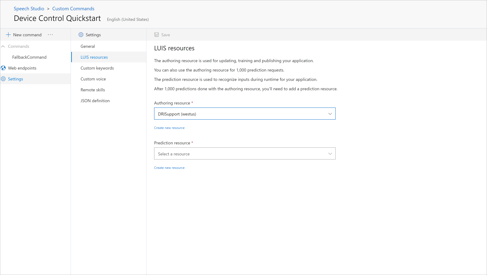

# Create a Custom Commands application

In this article, you will learn how to create and test a basic Custom Commands application.
The created application will have a default **Fallback command** and will process utterances like `Hi` and reply with a fallback message. You will also learn how to configure Luis resources for the application.

## Prerequisites

> [!div class="checklist"]
> * <a href="https://ms.portal.azure.com/#create/Microsoft.CognitiveServicesSpeechServices" target="_blank">Create an Azure Speech resource </a>

  > [!NOTE]
  > At this time, Custom Commands only supports speech subscriptions in the westus, westus2 and neur regions.

## Go to the Speech Studio for Custom Commands

1. In a web browser, go to [Speech Studio](https://speech.microsoft.com/).
1. Enter your credentials to sign in to the portal.

   The default view is your list of Speech subscriptions.
   > [!NOTE]
   > If you don't see the select subscription page, you can navigate there by choosing "Speech resources" from the settings menu on the top bar.

1. Select your Speech subscription, and then select **Go to Studio**.
1. Select **Custom Commands**.

   The default view is a list of the Custom Commands applications you have under your selected subscription.

## Create a Custom Commands project

1. Select **New project** to create a project.

   > [!div class="mx-imgBorder"]
   > 

1. In the **Name** box, enter a project name.
1. In the **Language** list, select a language.
1.  In the **LUIS authoring resource** list, select an authoring resource. If there are no valid authoring resources,    create one by selecting  **Create new LUIS authoring resource**.

       > [!div class="mx-imgBorder"]
       > 

       1. In the **Resource Name** box, enter the name of the resource.
       1. In the **Resource Group** list, select a resource group.
       1. In the **Location** list, select a location.
       1. In the **Pricing Tier** list, select a tier.

      > [!NOTE]
      > You can create resource groups by entering the desired resource group name into the "Resource Group" field. The resource group will be created when **Create** is selected.

1. Next, select **Create** to create your project.
1. After the project is created, select your project.
You should now see overview of your new Custom Commands application.

## Update LUIS resources (optional)

You can update the authoring resource that you selected in the **New project** window, and set a prediction resource. Prediction resource is used for recognition when your Custom Commands application is published. You don't need a prediction resource during the development and testing phases.

1. Select **Settings** in the left pane and select  **LUIS resources** in the middle pane.
1. Select a prediction resource, or create one by selecting **Create new resource**.
1. Select **Save**.
    
    > [!div class="mx-imgBorder"]
    > 

> [!NOTE]
> Because the authoring resource supports only 1,000 prediction endpoint requests per month, you will mandatorily need to set a LUIS prediction resource before publishing your Custom Commands application.

## Test Fallback command
The created application has a default command added by name of **Fallback Command**. This handles utterances like "Hi", "Help me".

1. Select **Train** at the top of the right pane.

1. Once training completes, select **Test**.
    - Input: Hi
    - Output: Add your fallback response here

## Next steps

> [!div class="nextstepaction"]
> [How To: Add simple commands to Custom Command application](./how-to-custom-commands-add-basic-commands.md)
