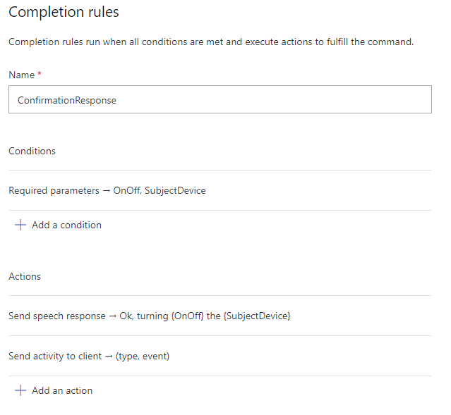
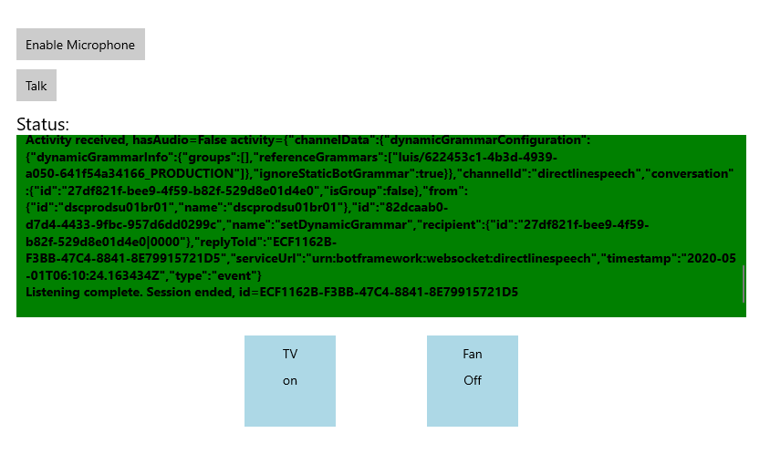

# Send Custom Commands activity to client application

In this article, you learn how to send activity from a Custom Commands application to a client application running the Speech SDK.

You complete the following tasks:

- Define and send a custom JSON payload from your Custom Commands application
- Receive and visualize the custom JSON payload contents from a C# UWP Speech SDK client application

## Prerequisites
> [!div class = "checklist"]
> * [Visual Studio 2019](https://visualstudio.microsoft.com/downloads/)
> * An Azure subscription key for Speech service:
[Get one for free](get-started.md) or create it on the [Azure portal](https://portal.azure.com)
> * A previously [created Custom Commands app](quickstart-custom-commands-application.md)
> * A Speech SDK enabled client app:
[How-to: Integrate with a client application using Speech SDK](./how-to-custom-commands-setup-speech-sdk.md)

## Setup Send activity to client 
1. Open the Custom Commands application you previously created
1. Select **TurnOnOff** command, select **ConfirmationResponse** under completion rule, then select **Add an action**
1. Under **New Action-Type**, select **Send activity to client**
1. Copy the JSON below to **Activity content**
   ```json
   {
     "type": "event",
     "name": "UpdateDeviceState",
     "state": "{OnOff}",
     "device": "{SubjectDevice}"
   }
   ```
1. Click **Save** to create a new rule with a Send Activity action

   > [!div class="mx-imgBorder"]
   > 

## Integrate with client application

In [How-to: Setup client application with Speech SDK (Preview)](./how-to-custom-commands-setup-speech-sdk.md), you created a UWP client application with Speech SDK that handled commands such as `turn on the tv`, `turn off the fan`. With some visuals added, you can see the result of those commands.

Add labeled boxes with text indicating **on** or **off** using the following XML added to `MainPage.xaml`

```xml
<StackPanel Orientation="Horizontal" HorizontalAlignment="Center" Margin="20">
    <Grid x:Name="Grid_TV" Margin="50, 0" Width="100" Height="100" Background="LightBlue">
        <StackPanel>
            <TextBlock Text="TV" Margin="0, 10" TextAlignment="Center"/>
            <TextBlock x:Name="State_TV" Text="off" TextAlignment="Center"/>
        </StackPanel>
    </Grid>
    <Grid x:Name="Grid_Fan" Margin="50, 0" Width="100" Height="100" Background="LightBlue">
        <StackPanel>
            <TextBlock Text="Fan" Margin="0, 10" TextAlignment="Center"/>
            <TextBlock x:Name="State_Fan" Text="off" TextAlignment="Center"/>
        </StackPanel>
    </Grid>
</StackPanel>
```

### Add reference libraries

Since you've created a JSON payload, you need to add a reference to the [JSON.NET](https://www.newtonsoft.com/json) library to handle deserialization.

- Right-client your solution.
- Choose **Manage NuGet Packages for Solution**, Select **Install** 
- Search for **Newtonsoft.json** in the update list, Update **Microsoft.NETCore.UniversalWindowsPlatform** to newest version

> [!div class="mx-imgBorder"]
> 

In `MainPage.xaml.cs', add
- `using Newtonsoft.Json;` 
- `using Windows.ApplicationModel.Core;`

### Handle the received payload

In `InitializeDialogServiceConnector`, replace the `ActivityReceived` event handler with following code. The modified `ActivityReceived` event handler will extract the payload from the activity and change the visual state of the tv or fan respectively.

```C#
connector.ActivityReceived += async (sender, activityReceivedEventArgs) =>
{
    NotifyUser($"Activity received, hasAudio={activityReceivedEventArgs.HasAudio} activity={activityReceivedEventArgs.Activity}");

    dynamic activity = JsonConvert.DeserializeObject(activityReceivedEventArgs.Activity);
    var name = activity?.name != null ? activity.name.ToString() : string.Empty;

    if (name.Equals("UpdateDeviceState"))
    {
        Debug.WriteLine("Here");
        var state = activity?.device != null ? activity.state.ToString() : string.Empty;
        var device = activity?.device != null ? activity.device.ToString() : string.Empty;

        if (state.Equals("on") || state.Equals("off"))
        {
            switch (device)
            {
                case "tv":
                    await CoreApplication.MainView.CoreWindow.Dispatcher.RunAsync(
                        CoreDispatcherPriority.Normal, () => { State_TV.Text = state; });
                    break;
                case "fan":
                    await CoreApplication.MainView.CoreWindow.Dispatcher.RunAsync(
                        CoreDispatcherPriority.Normal, () => { State_Fan.Text = state; });
                    break;
                default:
                    NotifyUser($"Received request to set unsupported device {device} to {state}");
                    break;
            }
        }
        else { 
            NotifyUser($"Received request to set unsupported state {state}");
        }
    }

    if (activityReceivedEventArgs.HasAudio)
    {
        SynchronouslyPlayActivityAudio(activityReceivedEventArgs.Audio);
    }
};
```

## Try it out

1. Start the application
1. Select Enable microphone
1. Select the Talk button
1. Say `turn on the tv`
1. The visual state of the tv should change to "on"
   > [!div class="mx-imgBorder"]
   > 

## Next steps

> [!div class="nextstepaction"]
> [How to: set up web endpoints (Preview)](./how-to-custom-commands-setup-webendpoints.md)