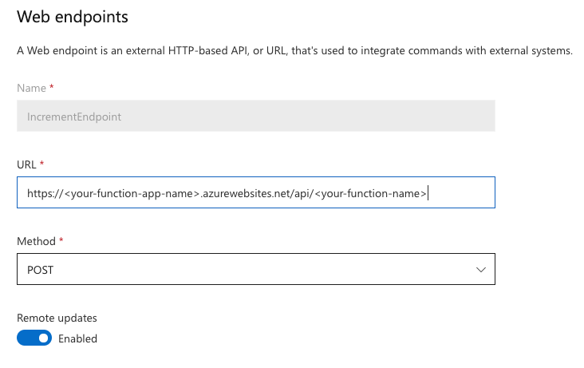
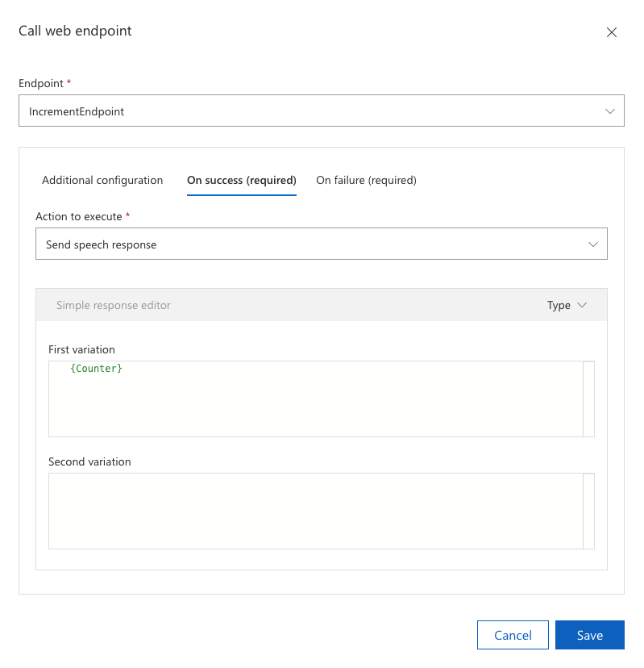
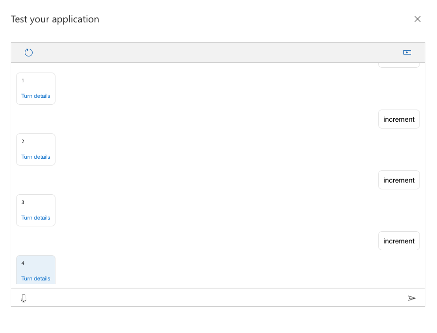

# Update a command from a web endpoint

In this article, you will learn how update an ongoing command from a web endpoint.

## Prerequisites
> [!div class = "checklist"]
> * A previously [created Custom Commands app](quickstart-custom-commands-application.md)

## Create an Azure Function 

For this example we'll need an HTTP-Triggered Azure Function that supports the following input (or a subset of this input).

```JSON
{
  "conversationId": "SomeConversationId",
  "currentCommand": {
    "name": "SomeCommandName",
    "parameters": {
      "SomeParameterName": "SomeParameterValue",
      "SomeOtherParameterName": "SomeOtherParameterValue"
    }
  },
  "currentGlobalParameters": {
      "SomeGlobalParameterName": "SomeGlobalParameterValue",
      "SomeOtherGlobalParameterName": "SomeOtherGlobalParameterValue"
  }
}
```

Lets review the key attributes of this input.

* "conversationId" is the unique identifier of the conversation, note that this id can be generated from the client app
* "currentCommand" is the command currently active in the conversation
* "name" is the name of the command and "parameters" is a map with the current values of the parameters
* "currentGlobalParameters" is also a map like "parameters" but is used for global parameters

The output of the Azure Function needs to support the following format.

```JSON
{
    "updatedCommand": {
      "name": "SomeCommandName",
      "updatedParameters": {
        "SomeParameterName": "SomeParameterValue"
      },
      "cancel": false
    },
    "updatedGlobalParameters": {
      "SomeGlobalParameterName": "SomeGlobalParameterValue"
    }
  }
```

You might recognize this format since is the same one used when [updating a command from the client](./how-to-custom-commands-update-command-from-client.md). 

Now, create an Azure Function based on NodeJS and copy-paste this code

```nodejs
module.exports = async function (context, req) {
    context.log(req.body);
    context.res = {
        body: {
            updatedCommand: {
                name: "IncrementCounter",
                updatedParameters: {
                    Counter: req.body.currentCommand.parameters.Counter + 1
                }
            }
        }
    };
}
```

When we call this Azure Function from Custom Commands, we'll send the current values of the conversation and we'll return the parameters we want to update or if we want to cancel the current command.

# Update the existing Custom Commands app

Now let's hook up the Azure Function with the existing Custom Commands app.

1. Add a new command named IncrementCounter.
1. Add just one example sentence with the value "increment".
1. Add a new parameter called Counter (same name as specified in the Azure Function above) of type Number with a default value of 0.
1. Add a new Web endpoint called IncrementEndpoint with the URL of your Azure Function and with Remote updates enabled.
    > [!div class="mx-imgBorder"]
    > 
1. Create a new Interaction rule called "IncrementRule" and add a Call web endpoint action.
1. In the action configuration, select the IncrementEndpoint, configure On success to Send speech response with the value of counter and On failure with an error message.
    > [!div class="mx-imgBorder"]
    > 
1. Set the post-execution state of the rule to Wait for user's input

# Test it

1. Save and Train your app
1. Click Test
1. Send a few times "increment" (which is the example sentence for the IncrementCounter command)

> [!div class="mx-imgBorder"]
> 

Notice how the value of the Counter parameter is incremented on each turn by the Azure Function.

## Next steps

> [!div class="nextstepaction"]
> [Enable a CI/CD process for your Custom Commands application](./how-to-custom-commands-update-command-from-client.md)