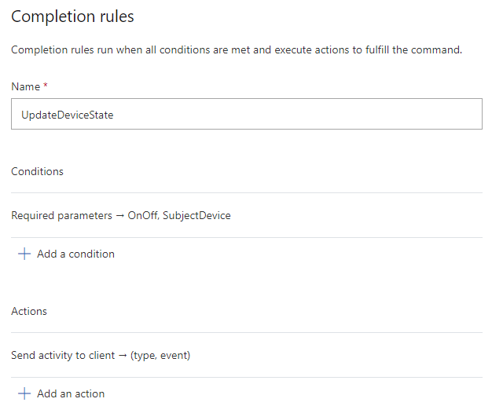
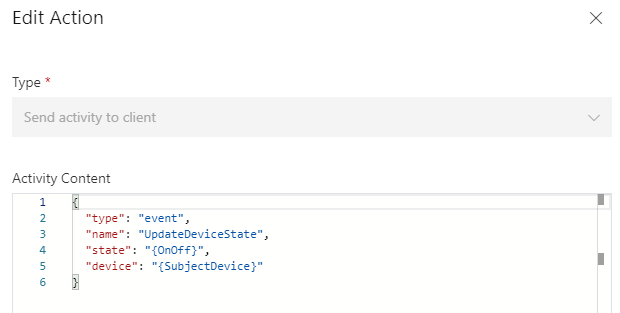

# How To: Fulfill Commands on the client with the Speech SDK (Preview)

In this article, you'll:

- Define and send a custom JSON payload from your Custom Commands application
- Receive and visualize the custom JSON payload contents from a C# UWP Speech SDK client application

## Prerequisites

- [Visual Studio 2019](https://visualstudio.microsoft.com/downloads/)
- An Azure subscription key for Speech Services
   - [Get one for free](get-started.md) or create it on the [Azure portal](https://portal.azure.com)
- A previously created Custom Commands app
   - [Quickstart: Create a Custom Command with Parameters (Preview)](./quickstart-custom-speech-commands-create-parameters.md)
- A Speech SDK enabled client application
   - [Quickstart: Connect to a Custom Command application with the Speech SDK (Preview)](./quickstart-custom-speech-commands-speech-sdk.md)

## Optional: Get started fast

This article describes, step by step, how to make a client application to talk to your Custom Commands application. If you prefer to dive right in, the complete, ready-to-compile source code used in this article is available in the [Speech SDK Samples](https://aka.ms/csspeech/samples).

## Fulfill with JSON payload

1. Open your previously created Custom Commands application from the [Speech Studio](https://speech.microsoft.com/)
1. Check the **Completion Rules** section to make sure you have the previously created rule that responds back to the user
1. To send a payload directly to the client, create a new rule with a Send Activity action
   > [!div class="mx-imgBorder"]
   > 

   | Setting    | Suggested value                                  | Description                                        |
   | ---------- | ------------------------------------------------ | -------------------------------------------------- |
   | Rule Name  | UpdateDeviceState                                | A name describing the purpose of the rule          |
   | Conditions | Required Parameter - `OnOff` and `SubjectDevice` | Conditions that determine when the rule can run    |
   | Actions    | `SendActivity` (see below)                        | The action to take when the rule condition is true |

   > [!div class="mx-imgBorder"]
   > 

   ```json
   {
     "name": "UpdateDeviceState",
     "state": "{OnOff}",
     "device": "{SubjectDevice}"
   }
   ```

## Create visuals for device on or off state

In [Quickstart: Connect to a Custom Command application with the Speech SDK (Preview)](./quickstart-custom-speech-commands-speech-sdk.md) you created a Speech SDK client application that handled commands such as `turn on the tv`, `turn off the fan`. Now add some visuals so you can see the result of those commands.

Add labeled boxes with text indicating **On** or **Off** using the following XML added to `MainPage.xaml.cs`

```xml
<StackPanel Orientation="Horizontal" HorizontalAlignment="Center" Margin="20">
    <Grid x:Name="Grid_TV" Margin="50, 0" Width="100" Height="100" Background="LightBlue">
        <StackPanel>
            <TextBlock Text="TV" Margin="0, 10" TextAlignment="Center"/>
            <TextBlock x:Name="State_TV" Text="Off" TextAlignment="Center"/>
        </StackPanel>
    </Grid>
    <Grid x:Name="Grid_Fan" Margin="50, 0" Width="100" Height="100" Background="LightBlue">
        <StackPanel>
            <TextBlock Text="Fan" Margin="0, 10" TextAlignment="Center"/>
            <TextBlock x:Name="State_Fan" Text="Off" TextAlignment="Center"/>
        </StackPanel>
    </Grid>
</StackPanel>
```

## Handle customizable payload

Now that you've created a JSON payload, you can add a reference to the [JSON.NET](https://www.newtonsoft.com/json) library to handle deserialization.

> [!div class="mx-imgBorder"]
> 

In `InitializeDialogServiceConnector` add the following to your `ActivityReceived` event handler. The additional code will extract the payload from the activity and change the visual state of the tv or fan accordingly.

```C#
connector.ActivityReceived += async (sender, activityReceivedEventArgs) =>
{
    NotifyUser($"Activity received, hasAudio={activityReceivedEventArgs.HasAudio} activity={activityReceivedEventArgs.Activity}");

    dynamic activity = JsonConvert.DeserializeObject(activityReceivedEventArgs.Activity);
    var payload = activity?.Value;

    if(payload?.name == "SetDeviceState")
    {
        var state = payload?.state;
        var device = payload?.device;
        switch(device)
        {
            case "tv":
                State_TV.Text = state;
                break;
            case "fan":
                State_Fan.Text = state;
                break;
            default:
                NotifyUser($"Received request to set unsupported device {device} to {state}");
                break;
        }
    }

    if (activityReceivedEventArgs.HasAudio)
    {
        SynchronouslyPlayActivityAudio(activityReceivedEventArgs.Audio);
    }
};
```

## Try it out

1. Start the application
1. Select Enable microphone
1. Select the Talk button
1. Say `turn on the tv`
1. The visual state of the tv should change to "On"

## Next steps
> [!div class="nextstepaction"]
> [How To: Add validations to Custom Command parameters (Preview)](./how-to-custom-speech-commands-validations.md)

