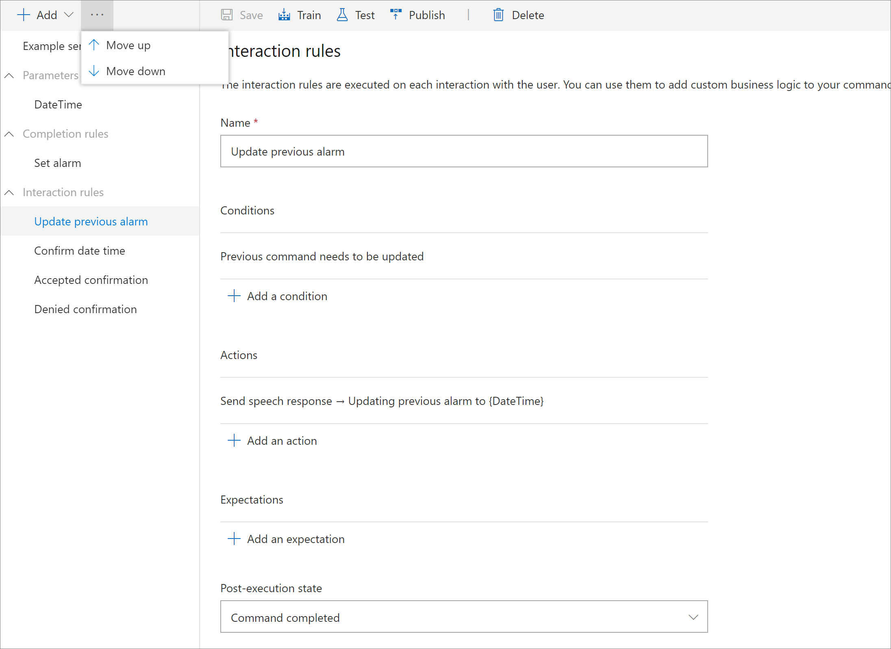

# How To: Add a one-step correction to a Custom Command (Preview)

In this article, you'll learn how to add one-step confirmation to a command.

One-step correction is used to update a command that was just completed.

I.e. if you just set up an alarm, you can change your mind and update the time of the alarm.

- Input: Set alarm for tomorrow at noon
- Output: "Ok, alarm set for 12/06/2019 12:00:00"
- Input: No, tomorrow at 1pm
- Output: "Ok

Keep in mind that this implies that you as a developer have a mechanism to update the alarm in your backend application.

## Prerequisites

You must have completed the steps in the following articles:

- [Quickstart: Create a Custom Command (Preview)](./quickstart-custom-speech-commands-create-new.md)
- [Quickstart: Create a Custom Command with Parameters (Preview)](./quickstart-custom-speech-commands-create-parameters.md)
- [How To: Add a confirmation to a Custom Command (Preview)](./how-to-custom-speech-commands-confirmations.md)

## Add the advanced rules for one-step correction 

To demonstrate one-step correction, let's extend the **SetAlarm** command created in the [Confirmations How To](./how-to-custom-speech-commands-confirmations.md).
 
1. Add an advanced rule to update the previous alarm. 

    This rule will ask the user to confirm the date and time of the alarm and is expecting a confirmation (yes/no) for the next turn.

   | Setting               | Suggested value                                                  | Description                                        |
   | --------------------- | ---------------------------------------------------------------- | -------------------------------------------------- |
   | Rule Name             | Update previous alarm                                            | A name describing the purpose of the rule          |
   | Conditions            | UpdateLastCommand & Required Parameter - DateTime                | Conditions that determine when the rule can run    |   
   | Actions               | SpeechResponse - "- Updating previous alarm to {DateTime}"       | The action to take when the rule condition is true |
   | State after execution | Complete command                                                 | State of the user after the turn                   |

1. Move the rule you just created to the top of advanced rules (scroll over the rule in the panel and click the UP arrow).
   > [!div class="mx-imgBorder"]
   > 

*Note: In a real application, in the Actions section of this rule you'll also send back an activity to the client or call an HTTP endpoint to update the alarm in your system.*

## Try it out

Select the Test panel and try a few interactions.

- Input: Set alarm for tomorrow at noon
- Output: "Are you sure you want to set an alarm for 12/07/2019 12:00:00?"
- Input: Yes
- Output: "Ok, alarm set for 12/07/2019 12:00:00"
- Input: No, tomorrow at 1pm
- Output: "Updating previous alarm to 12/07/2019 13:00:00"
