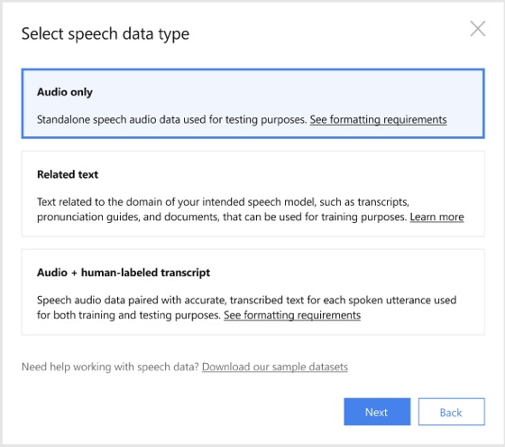
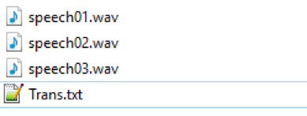

# Prepare test data

Whether you are testing to see how accurate Microsoft speech recognition is or training your own models, you'll need data (in the form of audio and/or text).  In this page we cover the types of data, how they are used, and how to manage them.

## Data types

This table lists accepted data types, when each data type should be used, and the recommended quantity. Not every data type is required to create a model.

| Data type | Used of testing | Quantity | Used for training | Quantity |
|-----------|-----------------|----------|-------------------|----------|
| Audio | Yes Used for visual inspection | 5+ audio files | No | N/a |
| Audio + Human-labeled transcripts | Yes Used to evaluate accuracy | 0.5 - 5 hours of audio | Yes | 10 - 1,000 hours of audio |
| Related text | No | N/a | Yes | 10-500 MB of related text |

Files should be grouped by type into a dataset and uploaded as a zip file. Each dataset can only contain a single data type.

## Upload data

When you are ready to upload your data, click **Upload data** to launch the wizard and create your first dataset. You'll be asked to select a speech data type for your dataset, before allowing you to upload your data.

Each dataset you upload must meet the requirements for the data type that you choose. It is important to correctly format your data prior to upload. This ensures the data will be accurately processed by the Custom Speech service. Requirements are listed in the following sections.

After your dataset is uploaded, you have a few options:

* You can navigate to the **Testing** tab and visually inspect audio only or audio + human-labeled transcription data.
* You can navigate to the **Training** tab and us audio + human transcription data or related text data to train a custom model.

## Audio data for testing

Use this table to ensure that your audio files are formatted correctly for use with Custom Speech:

| Property | Value |
|----------|-------|
| File format | RIFF (WAV) |
| Sample rate | 8,000 Hz or 16,000 Hz |
| Channels | 1 (mono) |
| Sample format | PCM, 16-bit |
| Archive format | .zip |
| Maximum zip size | 2 GB |

If your audio doesn’t satisfy these properties or you want to check if it does, we suggest downloading sox to check or convert the audio. Below are some examples of how each of these activities can be done through the command line for Windows, macOS, or Linux.

### How to check the audio format of a file

These commands demonstrate how to check the audio format of a file.

| Platform | Command |
|----------|---------|
| Windows | TBD |
| Linux | TBD |
| macOS | TBD |

### How to convert an audio file

These commands demonstrate how to down sample from 16KHz to 8KHz.

| Platform | Command |
|----------|---------|
| Windows | TBD |
| Linux | TBD |
| macOS | TBD |

## Audio + human-labeled transcript data for testing/training

If you want to measure the accuracy of Microsoft’s speech recognition on your audio files, you must have them transcribed by a human (word by word) so a comparison can be made.  Similarly if you want to improve the accuracy of the speech recognition system you must feed in audio with it’s corresponding human to teach the machine.

Human transcription is time consuming and costly, but necessary to evaluate accuracy or train a very accurate speech recognition model.  While we accept transcripts of all quality, it’s always best to make sure every word is transcribed.  The term garbage in equals garbage out applies to transcription as well.  We have set up a Transcription Guideline for developers serious about achieving the highest recognition quality.  

| Data | File format | Naming convention | Sample |
|------|-------------|-------------------|--------|
| Audio | TBD | TBD | TBD |
| Human-labeled transcripts | TBD | TBD | TBD |

**<< Archer/Mark - Please update this table to reflect how it should be rendered in the doc >>**

This is a sample data set that illustrates three audio + human-labeled transcript pairs:

Navigate to Speech-to-text/Custom Speech/Data.  Select Upload Data to upload your own test Audio + human-labeled transcript dataset yourself as a zip or upload our samples.   

## Related text data for training

If you have product names or features that are unique, and you want to make sure they are recognized correctly, it is important to include them for training (if I were Microsoft I would want to make sure Azure, Office 365, and Cortana are recognized properly).  Related text datasets helps solve this problem by introducing two types of text datasets listed below:

| Data type | How this improves recognition | Links |
|-----------|-------------------------------|-------|
| Utterances and/or sentences | These can improve accuracy when recognizing product names, or industry-specific vocabulary within the context of a sentence. | <li>[Samples](placeholder)</li><li>[File format guidelines](placeholder)</li> |
| Pronunciations | These can improve pronunciation of uncommon terms, acronyms, or other words with undefined pronunciations. | <li>[Samples](placeholder)</li><li>[File format guidelines](placeholder)</li> |

Store the utterances into a single text file in sentence form or in multiple text files.  The more aligned the text data is to what is spoken the more effective in improving accuracy.

To upload related text, navigate to Speech-to-text/Custom Speech/Data.  Upload your own Related Text dataset yourself as a zip or upload our example. Click on Upload data to begin the upload process.  Once uploaded, go to the Training tab to begin using the dataset to train a model to improve accuracy.

**<< Archer/Ed/Mark - Where do the audio + human transcription guidelines and related text guidelines belong? >>**

## Next steps

* [Inspect and evaluate your data quality](placeholder)
* [Train your model](placeholder)
* [Deploy your model](placeholder)
