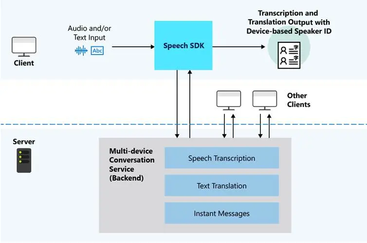

# What is Multi-device Conversation?

**Multi-device Conversation** makes it easy to create a speech or text conversation between multiple clients and coordinate the messages sent between them.

Multi-device Conversation has two main functions: 

(1) it coordinates and manages the sending and receiving of messages between clients

(2) it makes it easy to handle transcription and translation: clients can send the service audio or text, and the audio will be transcribed, and then both the transcription and any additional text messages can also be translated to the chosen language of all other clients. 

This helps you make a solution that works across an array of devices, including mobile (Android or iOS), PC, Linux, and MacOS. Each device can independently send audio and/or text to all other devices.

Whereas **Conversation Transcription** works on a single device with a multichannel microphone array, **Multi-device Conversation** is suited for scenarios with multiple devices, each with a single microphone. 

> [!NOTE]
> You can have up to 100 participants per conversation, of which 10 can be speaking at any given time.

## Key features

- **Cross-platform support** – clients can be mobile apps (Android / iOS), Windows desktop apps, or web apps
- **Create or join a conversation** - Easily manage a conversation 
- **Readable transcripts** – The transcription will have punctuation and sentence breaks for easier readability
- **Voice or text input** – Each user can speak or type on their own device
- **Multi-speaker diarization** – If every speaker uses a separate device, the service will attribute messages based on which device sent it
- **Real-time transcription** – Get a transcript of what is being said, so you can follow along the text in real-time or save it for later
- **Real-time translation** – Translate the transcription into more than 60 languages, so each person can receive content in their own language

## Use cases

### Multilingual group conversations

### Accessibility for people who are deaf or hard of hearing
Build a solution or feature to help transcribe speech in a group scenario, so that each person can follow the transcript on his or her own device.

### Education

### Presentations
Build a solution for presentation scenarios, to help transcribe and/or translate the speech into the languages of the audience.

## How it works

All clients will use the Speech SDK to create or join a conversation. The Speech SDK interacts with a backend service for multi-device conversation, which manages the lifetime of a conversation, including the list of participants, each client’s chosen languages, and all messages the clients send.  

Each client can send audio or text. Audio will be transcribed to text. If clients have chosen different languages, then all messages will be translated to those specified languages before being sent to all clients.

## Language support

When creating or joining a conversation you can specify two different types of languages:

|  | [Speech-to-text](language-support.md#speech-to-text) | [Text](language-support.md#text-languages) |
|-----------------------------------|----------------|------|
| Speech recognition & translation | ?? | ? |
| Send an instant message | ?? | ?? |
| Follow along in your own language | ?? | ?? |

## Next steps

> [!div class="nextstepaction"]
> [Translate conversations in real time](quickstarts/conversation-translator-multiple-languages.md)