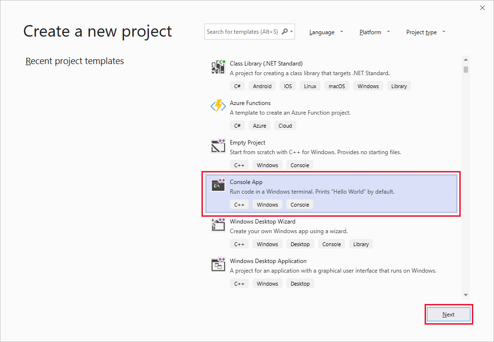

# Quickstart: Recognize speech in C++ on Windows Desktop using the Speech SDK

[!INCLUDE [Selector](../../../includes/cognitive-services-speech-service-quickstart-selector.md)]

We describe how to create a C++-based console application for Windows Desktop that makes use of the Speech SDK.
The application is based on the [Microsoft Cognitive Services Speech SDK NuGet Package](https://aka.ms/csspeech/nuget) and Microsoft Visual Studio 2017.

## Prerequisites

* A subscription key for the Speech service. See [Try the speech service for free](get-started.md).
* A Windows PC with a working microphone.
* [Microsoft Visual Studio 2017](https://www.visualstudio.com/), Community Edition or higher.
* The **Desktop development with C++** workload in Visual Studio and the **NuGet package manager** component in Visual Studio.
  You can enable both in **Tools** \> **Get Tools and Features**, under the **Workloads** and **Individual components** tabs, respectively:

  

  

## Create a Visual Studio project

In Visual Studio 2017, create a new Visual C++ Windows Desktop Windows Console Application. In the **New Project** dialog box, from the left pane, expand **Installed** \> **Visual C++** \> **Windows Desktop** and then select **Windows Console Application**. For the project name, enter *helloworld*.

If you're running on a 64-bit Windows installation, optionally switch your build platform to `x64`:

## Install and reference the Speech SDK NuGet package

In the Solution Explorer, right-click the solution and click on **Manage NuGet Packages for Solution**.

In the upper-right corner, in the **Package Source** field, choose "Nuget.org".
From the **Browse** tab, search for the "Microsoft.CognitiveServices.Speech" package, select it and check the **Project** and **helloworld** boxes on the right, and select **Install** to install it into the helloworld project.

> [!NOTE]
> The current version of the Cognitive Services Speech SDK is `1.0.0`.

In the license screen that pops up, accept the license:

## Add the sample code

1. Replace your default starter code with the following one:

   [!code-cpp[Quickstart Code](~/samples-cognitive-services-speech-sdk/quickstart/cpp-windows/helloworld/helloworld.cpp#code)]

1. Replace the string `YourSubscriptionKey` with your subscription key.

1. Replace the string `YourServiceRegion` with the [region](regions.md) associated with your subscription (for example, `westus` for the free trial subscription).

1. Save changes to the project.

## Build and run the sample

1. Build the application. From the menu bar, select **Build** > **Build Solution**. The code should compile without errors now:

   

1. Start the application. From the menu bar, select **Debug** > **Start Debugging**, or press **F5**.

   

1. A console window pops up, prompting you to say something (in English).
   The result of the recognition will be displayed on screen.

   

[!INCLUDE [Download the sample](../../../includes/cognitive-services-speech-service-speech-sdk-sample-download-h2.md)]
Look for this sample in the `quickstart/cpp-windows` folder.

## Next steps

* [Get our samples](speech-sdk.md#get-the-samples)
