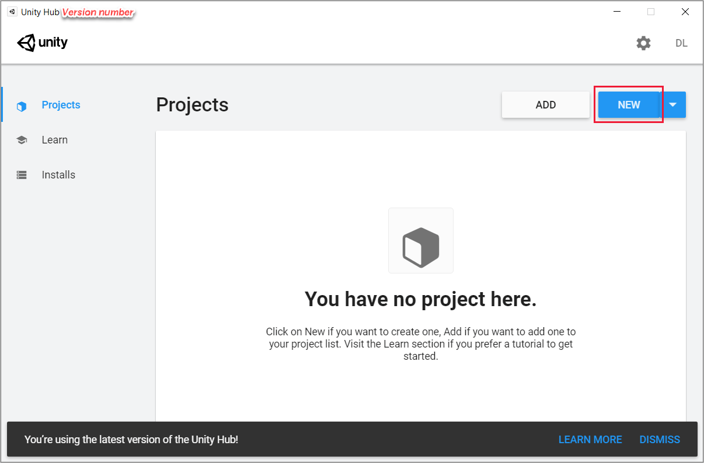
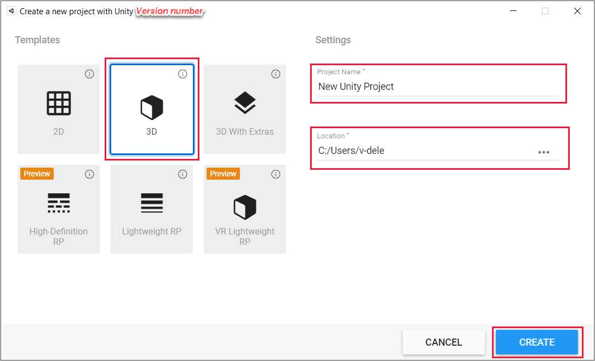
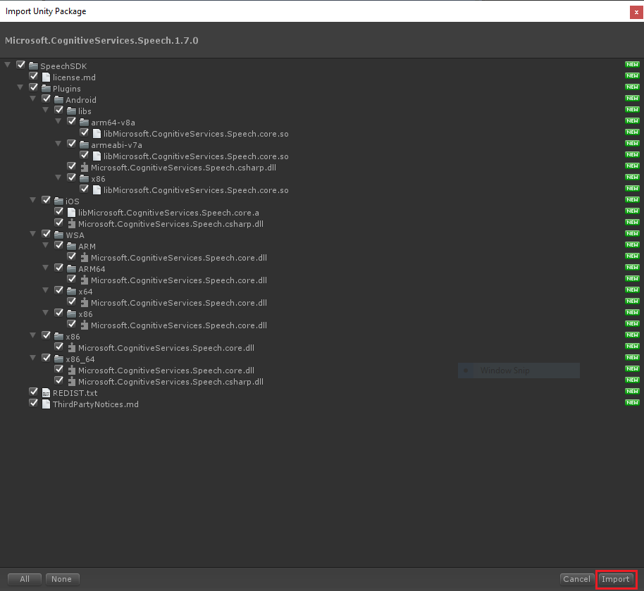
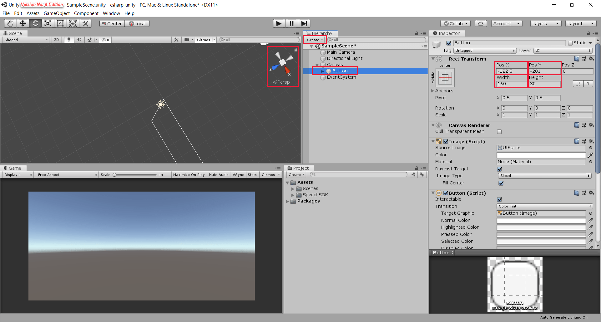
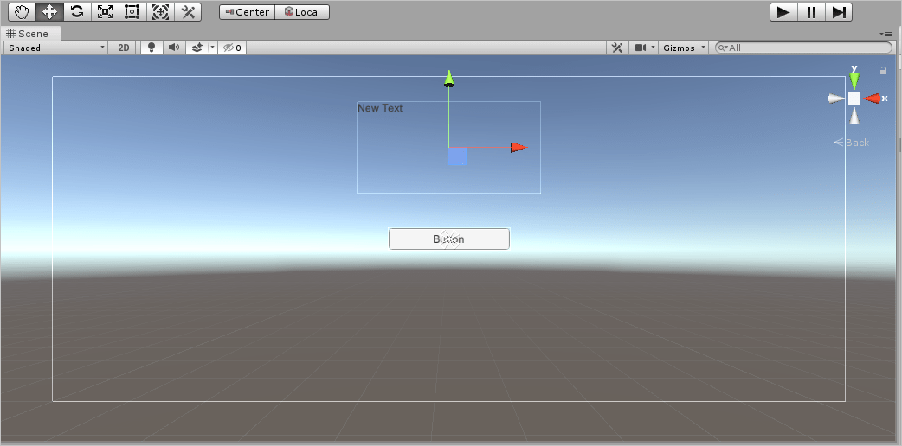
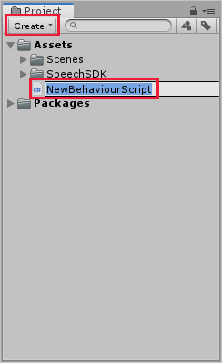
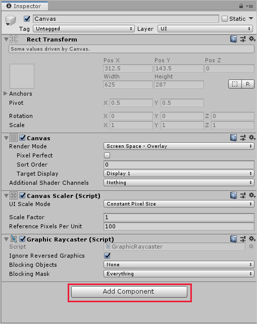
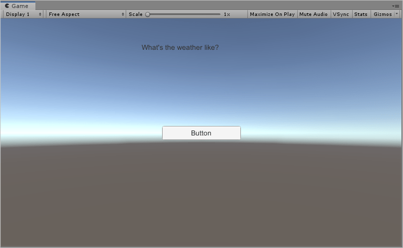

# Quickstart: Recognize speech with the Speech SDK for Unity (Beta)

Quickstarts are also available for [text-to-speech](quickstart-text-to-speech-csharp-unity.md).

[!INCLUDE [Selector](../../../includes/cognitive-services-speech-service-quickstart-selector.md)]

Use this guide to create a speech-to-text application using [Unity](https://unity3d.com/) and the Speech SDK for Unity (Beta).
When finished, you can talk into your device to transcribe speech to text in real time.
If you're new to Unity, we suggest you study the [Unity User Manual](https://docs.unity3d.com/Manual/UnityManual.html) before developing your application.

> [!NOTE]
> The Speech SDK for Unity is currently in beta.
> It supports Windows Desktop (x86 and x64) or Universal Windows Platform (x86, x64, ARM/ARM64), and Android (x86, ARM32/64).

## Prerequisites

To complete this project, you'll need:

- [Unity 2018.3 or later](https://store.unity.com/) with [Unity 2019.1 adding support for UWP ARM64](https://blogs.unity3d.com/2019/04/16/introducing-unity-2019-1/#universal).
- [Visual Studio 2019](https://visualstudio.microsoft.com/downloads/). Version 15.9 or higher of Visual Studio 2017 is also acceptable.
  - For ARM64 support, install the [optional build tools for ARM64, and the Windows 10 SDK for ARM64](https://blogs.windows.com/buildingapps/2018/11/15/official-support-for-windows-10-on-arm-development/).
- A subscription key for the Speech Service. [Get one for free](get-started.md).
- Access to your computer's microphone.

## Create a Unity project

1. Open Unity. If you're using Unity for the first time, the **Unity Hub** *<version number>* window appears. (You can also open Unity Hub directly to get to this window.)

   
1. Select **New**. The **Create a new project with Unity** *<version number>* window appears.

   
1. In **Project Name**, enter **csharp-unity**.
1. In **Templates**, if **3D** isn't already selected, select it.
1. In **Location**, select or create a folder to save the project in.
1. Select **Create**.

After a bit of time, the Unity Editor window appears.

## Install the Speech SDK

To install the Speech SDK for Unity, follow these steps:

[!INCLUDE [License Notice](../../../includes/cognitive-services-speech-service-license-notice.md)]

1. Download and open the [Speech SDK for Unity (Beta)](https://aka.ms/csspeech/unitypackage), which is packaged as a Unity asset package (.unitypackage). When the asset package is opened, the **Import Unity Package** dialog box appears.

   
1. Ensure that all files are selected, and select **Import**. After a few moments, the Unity asset package is imported into your project.

For more information about importing asset packages into Unity, see the [Unity documentation](https://docs.unity3d.com/Manual/AssetPackages.html).

## Add UI

Now let's add a minimal UI to our scene. This UI consists of a button to trigger speech recognition and a text field to display the result. In the [**Hierarchy** window](https://docs.unity3d.com/Manual/Hierarchy.html), a sample scene is shown that Unity created with the new project.

1. At the top of the **Hierarchy** window, select **Create** > **UI** > **Button**.

   This action creates three game objects that you can see in the **Hierarchy** window: a **Button** object, a **Canvas** object containing the button, and an **EventSystem** object.

   

1. [Navigate the **Scene** view](https://docs.unity3d.com/Manual/SceneViewNavigation.html) so you have a good view of the canvas and the button in the [**Scene** view](https://docs.unity3d.com/Manual/UsingTheSceneView.html).

1. In the [**Inspector** window](https://docs.unity3d.com/Manual/UsingTheInspector.html) (by default on the right), set the **Pos X** and **Pos Y** properties to **0**, so the button is centered in the middle of the canvas.

1. In the **Hierarchy** window, select **Create** > **UI** > **Text** to create a **Text** object.

1. In the **Inspector** window, set the **Pos X** and **Pos Y** properties to **0** and **120**, and set the **Width** and **Height** properties to **240** and **120**. These values ensure that the text field and the button don't overlap.

When you're done, the **Scene** view should look similar to this screenshot:

## Add the sample code

To add the sample script code for the Unity project, follow these steps:

1. In the [Project window](https://docs.unity3d.com/Manual/ProjectView.html), select **Create** > **C# script** to add a new C# script.

   
1. Name the script `HelloWorld`.

1. Double-click `HelloWorld` to edit the newly created script.

   > [!NOTE]
   > To configure the code editor to be used by Unity for editing, select **Edit** > **Preferences**, and then go to the **External Tools** preferences. For more information, see the [Unity User Manual](https://docs.unity3d.com/Manual/Preferences.html).

1. Replace the existing script with the following code:

   [!code-csharp[Quickstart Code](~/samples-cognitive-services-speech-sdk/quickstart/csharp-unity/Assets/Scripts/HelloWorld.cs#code)]

1. Find and replace the string `YourSubscriptionKey` with your Speech Services subscription key.

1. Find and replace the string `YourServiceRegion` with the [region](regions.md) associated with your subscription. For example, if you're using the free trial, the region is `westus`.

1. Save the changes to the script.

Now return to the Unity Editor and add the script as a component to one of your game objects:

1. In the **Hierarchy** window, select the **Canvas** object.

1. In the **Inspector** window, select the **Add Component** button.

   

1. In the drop-down list, search for the `HelloWorld` script we created above and add it. A **Hello World (Script)** section appears in the **Inspector** window, listing two uninitialized properties, **Output Text** and **Start Reco Button**. These Unity component properties match public properties of the `HelloWorld` class.

1. Select the **Start Reco Button** property's object picker (the small circle icon to the right of the property), and choose the **Button** object you created earlier.

1. Select the **Output Text** property's object picker, and choose the **Text** object you created earlier.

   > [!NOTE]
   > The button also has a nested text object. Make sure you do not accidentally pick it for text output
   > (or rename one of the text objects using the **Name** field in the **Inspector** window to avoid confusion).

## Run the application in the Unity Editor

Now you're ready to run the application within the Unity Editor.

1. In the Unity Editor toolbar (below the menu bar), select the **Play** button (a right-pointing triangle).

1. Go to [**Game** view](https://docs.unity3d.com/Manual/GameView.html), and wait for the **Text** object to display **Click button to recognize speech**. (It displays **New Text** when the application hasn't started or isn't ready to respond.)

1. Select the button and speak an English phrase or sentence into your computer's microphone. Your speech is transmitted to the Speech Services and transcribed to text, which appears in the **Game** view.

   

1. Check the [**Console** window](https://docs.unity3d.com/Manual/Console.html) for debug messages. If the **Console** window isn't showing, go to the menu bar and select **Window** > **General** > **Console** to display it.

1. When you're done recognizing speech, select the **Play** button in the Unity Editor toolbar to stop the application.

## Additional options to run this application

This application can also be deployed to as an Android app, a Windows stand-alone app, or a UWP application.
For more information, see our [sample repository](https://aka.ms/csspeech/samples). The `quickstart/csharp-unity` folder describes the configuration for these additional targets.

## Next steps

> [!div class="nextstepaction"]
> [Explore C# samples on GitHub](https://aka.ms/csspeech/samples)

## See also

- [Train a model for Custom Speech](how-to-custom-speech-train-model.md)
