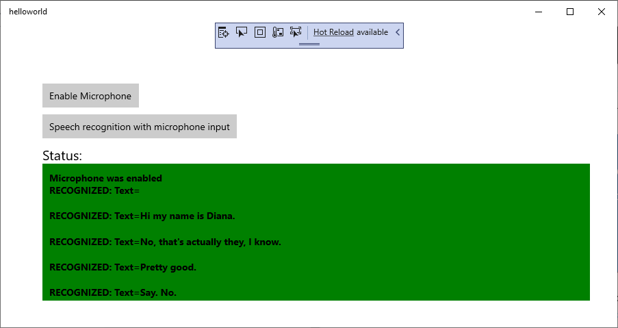

# Quickstart: Recognize speech using cross-platform Xamarin app by using the Speech SDK

Quickstarts are also available for [speech to text](quickstart-csharp-uwp.md), [speech synthesis](quickstart-text-to-speech-csharp-uwp.md) and [speech translation](quickstart-translate-speech-uwp.md).

In this article, you develop a cross-platform C# application using Xamarin for Universal Windows Platform (UWP), Android and iOS by using the Cognitive Services [Speech SDK](speech-sdk.md). The program transcribes speech to text in real time from your device's or simulator's microphone. The application is built with the [Speech SDK NuGet Package](https://aka.ms/csspeech/nuget) and Microsoft Visual Studio 2019 (any edition).

> [!NOTE]
> The Universal Windows Platform lets you develop apps that run on any device that supports Windows 10, including PCs, Xbox, Surface Hub, and other devices.

## Prerequisites

This quickstart requires:

* [Visual Studio 2019](https://visualstudio.microsoft.com/downloads/).
* An Azure subscription key for the Speech Service. [Get one for free](get-started.md).
* A Windows PC with Windows 10 Fall Creators Update (10.0; Build 16299) or later and with a working microphone.
* [Xamarin installation to Visual Studio](https://docs.microsoft.com/xamarin/get-started/installation/?pivots=windows).
* [Xamarin Android installation on Windows](https://docs.microsoft.com/xamarin/android/get-started/installation/windows).
* [Xamarin iOS installation on Windows](https://docs.microsoft.com/xamarin/ios/get-started/installation/windows/?pivots=windows).
* To target Android: an Android device (ARM32/64, x86; API 23: Android 6.0 Marshmallow or higher) [enabled for development](https://developer.android.com/studio/debug/dev-options) with a working microphone.
* To target iOS: an iOS device (ARM64) or an iOS simulator (x64) [enabled for development](https://docs.microsoft.com/xamarin/ios/get-started/installation/device-provisioning/) with a working microphone.
* For Windows ARM64 build support, install the [optional build tools, and Windows 10 SDK for ARM/ARM64](https://blogs.windows.com/buildingapps/2018/11/15/official-support-for-windows-10-on-arm-development/).

## Create a Visual Studio project

[!INCLUDE ]

## Add sample code

Now add the XAML code that defines the user interface of the application, and add the C# code-behind implementation.

1. In **Solution Explorer**, open `MainPage.xaml`.

1. In the designer's XAML view, insert the following XAML snippet into the **Grid** tag (between `<Grid>` and `</Grid>`):

   [!code-xml[UI elements](~/samples-cognitive-services-speech-sdk/quickstart/csharp-uwp/helloworld/MainPage.xaml#StackPanel)]

1. In **Solution Explorer**, open the code-behind source file `MainPage.xaml.cs`. (It's grouped under `MainPage.xaml`.)

1. Replace all the code in it with the following snippet:

   [!code-csharp[Quickstart Code](~/samples-cognitive-services-speech-sdk/quickstart/csharp-uwp/helloworld/MainPage.xaml.cs#code)]

1. In the source file's `SpeechRecognitionFromMicrophone_ButtonClicked` handler, find the string `YourSubscriptionKey`, and replace it with your subscription key.

1. In the `SpeechRecognitionFromMicrophone_ButtonClicked` handler, find the string `YourServiceRegion`, and replace it with the [region](regions.md) associated with your subscription. (For example, use `westus` for the free trial subscription.)

1. From the menu bar, choose **File** > **Save All** to save your changes.

## Build and run the application

Now you are ready to build and test your application.

1. From the menu bar, choose **Build** > **Build Solution** to build the application. The code should compile without errors now.

1. Choose **Debug** > **Start Debugging** (or press **F5**) to start the application. The **helloworld** window appears.

   

1. Select **Enable Microphone**, and when the access permission request pops up, select **Yes**.

   

1. Select **Speech recognition with microphone input**, and speak an English phrase or sentence into your device's microphone. Your speech is transmitted to the Speech Services and transcribed to text, which appears in the window.

   

## Next steps

> [!div class="nextstepaction"]
> [Explore C# samples on GitHub](https://aka.ms/csspeech/samples)

## See also

- [Quickstart: Translate speech with the Speech SDK for C# (UWP)](quickstart-translate-speech-uwp.md)
- [Train a model for Custom Speech](how-to-custom-speech-train-model.md)
