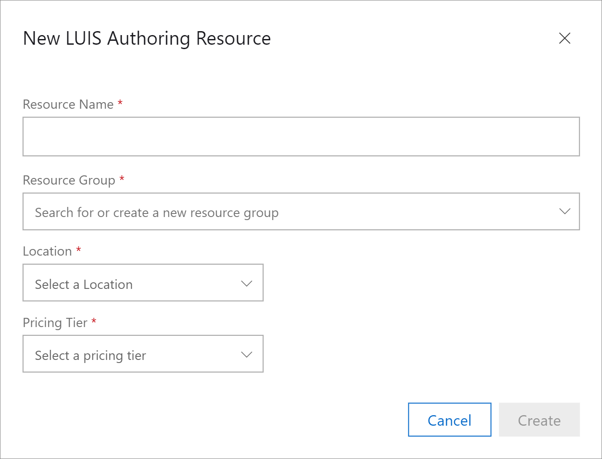

# Create an end to end voice assistant using Custom Commands
In this article you will create a Custom Commands application and integrate it to a UWP to have an end to end voice assistant.

## Prerequisites

> [!div class="checklist"]
> * <a href="https://ms.portal.azure.com/#create/Microsoft.CognitiveServicesSpeechServices" target="_blank">Create an Azure Speech resource </a>
> * Download the sample
[HospitalityDemo](https://github.com/Azure-Samples/Cognitive-Services-Voice-Assistant/tree/master/custom-commands/hospitality/skill).

  > [!NOTE]
  > At this time, Custom Commands only supports speech subscriptions in the westus, westus2 and neur regions.

## Go to the Speech Studio for Custom Commands

1. In a web browser, go to [Speech Studio](https://speech.microsoft.com/).
1. Enter your credentials to sign in to the portal.

   The default view is your list of Speech subscriptions.
   > [!NOTE]
   > If you don't see the select subscription page, you can navigate there by choosing "Speech resources" from the settings menu on the top bar.

1. Select your Speech subscription, and then select **Go to Studio**.
1. Select **Custom Commands**.

   The default view is a list of the Custom Commands applications you have under your selected subscription.

## Import an existing application as a new Custom Commands project
1. Select **New project** to create a project.

   > [!div class="mx-imgBorder"]
   > 

1. In the **Name** box, enter a project name.
1. In the **Language** list, select a language.
1. Select **Browse files** and in the browse window, select the HospitalityDemo.json file.
1.  In the **LUIS authoring resource** list, select an authoring resource. If there are no valid authoring resources,    create one by selecting  **Create new LUIS authoring resource**.

       > [!div class="mx-imgBorder"]
       > 

       1. In the **Resource Name** box, enter the name of the resource.
       1. In the **Resource Group** list, select a resource group.
       1. In the **Location** list, select a location.
       1. In the **Pricing Tier** list, select a tier.

      > [!NOTE]
      > You can create resource groups by entering the desired resource group name into the "Resource Group" field. The resource group will be created when **Create** is selected.

1. Next, select **Create** to create your project.
1. After the project is created, select your project.
You should now see overview of your new Custom Commands application.

## Try out some voice commands
1. Select **Train** present at the top of the right pane.
1. Once training is completed, select **Test**.
    1. Turn on the tv
    1. Set the temperature to 80 degrees
    1. Turn it off
    1. Set an alarm

## Integrate Custom Commands application in an assistant

TODO - Refer to How-To speech sdk
In the section above, you used the existing chat panel in the browser window. Next, let's access the Custom Commands application from a custom client.

1. For the application to be accessible outside the Custom Commands portal, it first needs to be published. Select **Publish** present on top of the right pane.
1. Once publish completes, a new window will appear with the 
1. If you are developing on windows, we recommend you first use the Windows Voice Assistant Client. Download it [here](https://github.com/Azure-Samples/Cognitive-Services-Voice-Assistant/releases/download/20200519.7/WindowsVoiceAssistantClient-20200519.7.zip).
1. Next extract the files, and launch **VoiceAssistantClient.exe**
