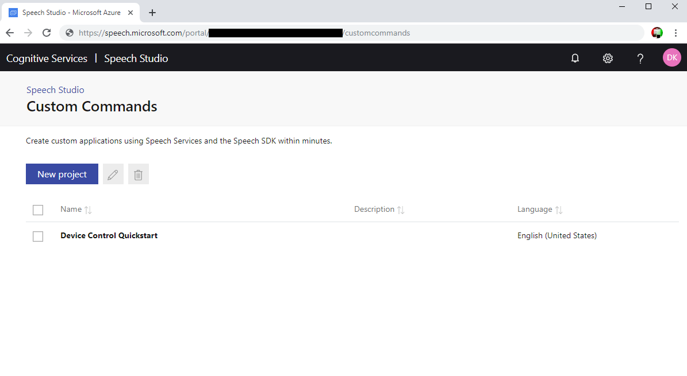

# Quickstart: Create a Custom Command (Preview)

In this article, you'll learn how to create and test a hosted Custom Commands application.
The application will recognize an utterance like "turn on the tv" and respond with a simple message "Ok, turning on the tv".

> [!div class="mx-imgBorder"]
> 

## Prerequisites

- A Speech subscription. [Try the speech service for free](~/articles/cognitive-services/speech-service/get-started.md).

  > [!NOTE]
  > During preview, only the westus2 region is supported for subscription keys.

- A [Language Understanding](https://www.luis.ai/home) (LUIS) authoring key:
  1. Open a web browser and navigate to the [Azure portal](https://portal.azure.com)
  1. Select Create a resource
  1. Search for and select Language Understanding
  1. Select Authoring in the create options
  1. After the resource is deployed, go to the resource and copy the key from the Quickstart or Keys section

> [!div class="mx-imgBorder"]
> 

## Go to the Speech Studio for Custom Commands

1. Open your web browser, and navigate to the [Speech Studio](https://speech.microsoft.com/)
1. Enter your credentials to sign in to the portal

   - The default view is your list of Speech subscriptions
     > [!NOTE]
     > If you don't see the select subscription page, you can navigate there by choosing "Speech resources" from the settings menu on the top bar.

1. Select your Speech subscription, then select **Go to Studio**
1. Select **Custom Commands (Preview)**.

The default view is a list of the Custom Commands applications you created.

## Create a Custom Commands project

1. Select New project to create a new project

   > [!div class="mx-imgBorder"]
   > 

1. Enter the project name and Language and select **Next** to continue
1. Enter your LUIS authoring key
1. Once created, select your project

Your view should now be an overview of your Custom Commands application.

## Create a new Command

Now you can create a Command. Let's use an example that will take a single utterance `turn on the tv` and respond with the message `Ok, turning on the TV`.

1. Create a new Command by selecting the `+` icon next to commands and give it the name `TurnOn`
1. Select **Save**

> [!div class="mx-imgBorder"]
> 

A Command is a set of:

| Group            | Description                                                                                                                 |
| ---------------- | --------------------------------------------------------------------------------------------------------------------------- |
| Sample Sentences | Example utterances the user can say to trigger this Command                                                                 |
| Parameters       | Information required to complete the Command                                                                                |
| Completion Rules | The actions to be taken to fulfill the Command. For example, to respond to the user or communicate with another web service |
| Advanced Rules   | Additional rules to handle more specific or complex situations                                                              |

### Add a Sample Sentence

Let's start with Sample Sentences and provide an example of what the user can say:

```
turn on the tv
```

For now, we have no parameters so we can move on to Completion Rules.

### Add a Completion Rule

Now add a Completion Rule to respond to the user indicating that an action is being taken.

> [!div class="mx-imgBorder"]
> 

| Setting    | Suggested value                        | Description                                        |
| ---------- | -------------------------------------- | -------------------------------------------------- |
| Rule Name  | Confirmation Message                   | A name describing the purpose of the rule          |
| Conditions | None                                   | Conditions that determine when the rule can run    |
| Actions    | SpeechResponse "Ok, turning on the TV" | The action to take when the rule condition is true |

That's what's needed to handle this interaction.

## Try it out

Test the behavior using the Test chat panel.

> [!div class="mx-imgBorder"]
> 

- A: "turn on the tv"
- B: "Ok, turning on the tv"

## Next steps
> [!div class="nextstepaction"]
> [Quickstart: Create a Custom Command with Parameters (Preview)](./quickstart-custom-speech-commands-create-parameters.md)
