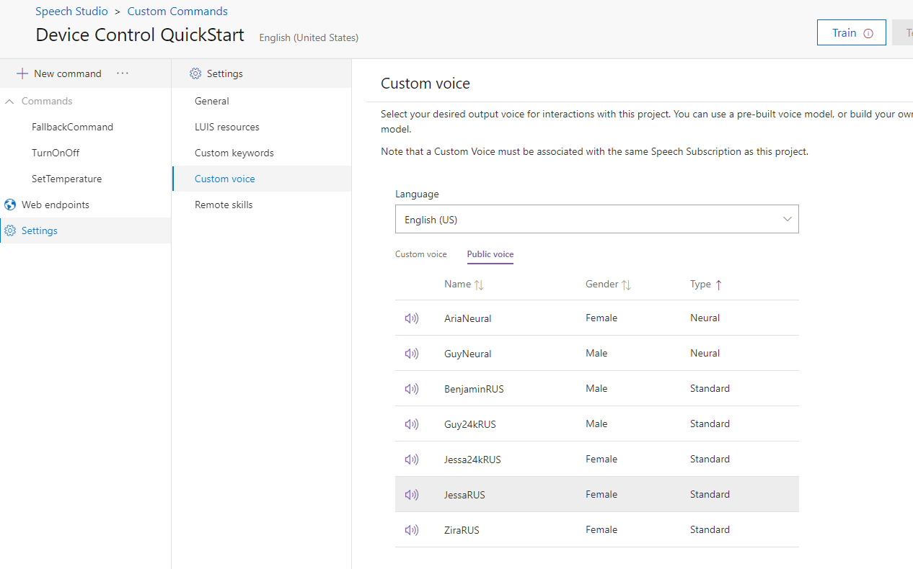

# Quickstart: Use Custom Commands with Custom Voice (Preview)

In the [previous article](./quickstart-custom-speech-commands-create-parameters.md), we created a new Custom Commands project to respond to commands with parameters.

In this article, we will select a custom output voice for the application.

## Select a Custom Voice

1. Open the project [we created previously](./quickstart-custom-speech-commands-create-parameters.md)
1. Select **Settings** from the left pane
1. Select **Custom Voice** from the middle pane
1. Select the desired custom or public voice from the table
1. Select **Save**

> [!div class="mx-imgBorder"]
> 

> [!NOTE]
> Custom voices can be created from the Custom Voice project page. Select the **Speech Studio** link, then **Custom Voice** to get started.

Now the application will respond in the selected custom voice, instead of the default voice.

## Next steps
> [!div class="nextstepaction"]
> [Quickstart: Connect to a Custom Command application with the Speech SDK (Preview)](./quickstart-custom-speech-commands-speech-sdk.md)

