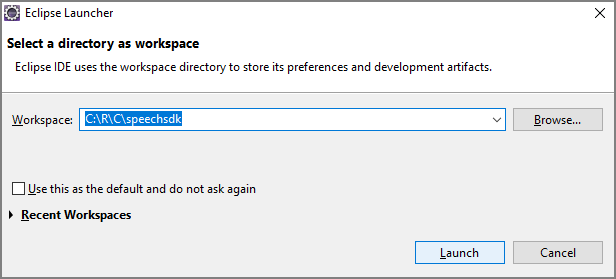

# Quickstart: Recognize speech in Java in the Java Run-Time Environment

[!include[Selector](../../../includes/cognitive-services-speech-service-quickstart-selector.md)]

This document describes how to create a Java-based console application for the Java Run-Time Environment (JRE) that makes use of the Speech SDK.
The application is based on the Microsoft Cognitive Services SDK Maven Package.
We use Eclipse as an Integrated Development Environment (IDE).

## Prerequisites

* A subscription key for the Speech service. See [Try the speech service for free](get-started.md).
* A PC (Windows x64, Ubuntu 16.04 x64) capable to run Eclipse, with a working microphone.
* 64-bit JRE/JDK for Java 8 or higher.
* Version 4.8 of [Eclipse](https://www.eclipse.org), 64-bit version.

## Create and configure your project

1. Start Eclipse, and create an empty workspace:

   

1. Create a new Java project in the empty workspace.

   

1. Convert the Java project to use the Maven build system.

   

1. Double-click the file `pom.xml` to edit it.
   Switch to the XML tab.

1. Inside the repository section (create one if none is present), add a reference to the Maven repository for the Speech SDK:

   [!code-xml[POM Repositories](~/samples-cognitive-services-speech-sdk/quickstart/java-jre/pom.xml#repositories)]

1. Inside the dependencies section (create one if none is present), add the Speech SDK version 0.6.0 as a dependency:

   [!code-xml[POM Dependencies](~/samples-cognitive-services-speech-sdk/quickstart/java-jre/pom.xml#dependencies)]

## Add the sample code

1. Start by creating a new empty class named "Main" into your Java project.

   

1. Replace all code in `Main.java` with the following:

   [!code-java[Quickstart Code](~/samples-cognitive-services-speech-sdk/quickstart/java-jre/src/speechsdk/quickstart/Main.java#code)]

1. Replace the string `YourSubscriptionKey` with your subscription key.

1. Replace the string `YourServiceRegion` with the [region](regions.md) associated with your subscription (for example, `westus` for the free trial subscription).

1. Save changes to the project.

## Build and run the sample

Press F11, or select **Run** \> **Debug**.
The next 15 speech input from your microphone will be recognized and logged in the console window.

[!include[Download the sample](../../../includes/cognitive-services-speech-service-speech-sdk-sample-download-h2.md)]
Look for this sample in the `quickstart/java-jre` folder.

## Next steps

* [Get our samples](speech-sdk.md#get-the-samples)
