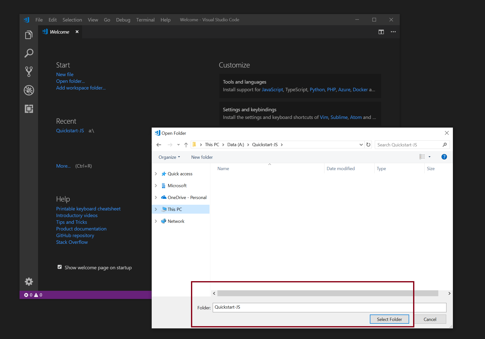
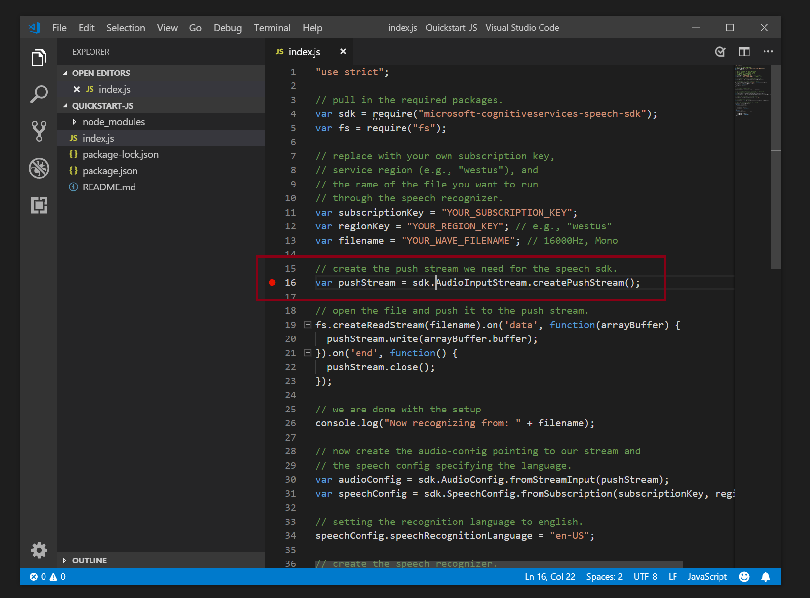
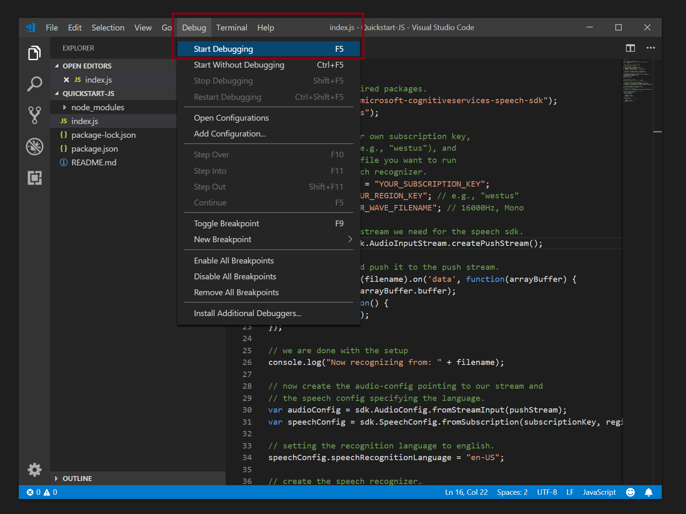

# Quickstart: Recognize speech with the Speech SDK for Node.js

[!INCLUDE [Selector](../../../includes/cognitive-services-speech-service-quickstart-selector.md)]

In this article, you'll learn how to create a Node.js project using the JavaScript binding of the Cognitive Services Speech SDK to transcribe speech to text.
The application is based on the Microsoft [Cognitive Services Speech SDK](https://aka.ms/csspeech/npmpackage).

## Prerequisites

* An Azure subscription key for the Speech Service. [Get one for free](get-started.md).
* A current version of [Node.js](https://nodejs.org).

## Create a new project

Create a new folder and initialize the project.

```sh
npm init -f
```

This will init the package.json files with default values. You will probably want to edit this file later.

## Install the Speech SDK

Add the Speech SDK to your Node.js project.

```
npm install microsoft-cognitiveservices-speech-sdk
```

This downloads and installs the latest version of the Speech SDK and any required prerequisites from npmjs. The SDK will be installed in the `node_modules` directory inside your project folder.

## Use the Speech SDK

Create a new file in the folder, named `index.js` and open this file with a text editor.

> [!NOTE]
> Please note that in Node.js the Speech SDK does not support the microphone or the File data type. Both are only supported on browsers. Instead, use the Stream interface to the Speech SDK, either through `AudioInputStream.createPushStream()` or `AudioInputStream.createPullStream()`.

In this example, we will use the `PushAudioInputStream` interface.

Add the following JavaScript code:

[!code-javascript[Quickstart Code](~/samples-cognitive-services-speech-sdk/quickstart/js-node/index.js#code)]

## Run the sample

To launch the app, adapt `YourSubscriptionKey`, `YourServiceRegion`, and `YourAudioFile.wav` to your configuration. Then you can execute it by calling the following command:

```sh
node index.js
```

It will trigger a recognition using the provided filename and present the output on the console.

Here is a sample output of running `index.js` after updating the subscription key and using the file `whatstheweatherlike.wav`.

```json
SpeechRecognitionResult {
  "privResultId": "9E30EEBD41AC4571BB77CF9164441F46",
  "privReason": 3,
  "privText": "What's the weather like?",
  "privDuration": 15900000,
  "privOffset": 300000,
  "privErrorDetails": null,
  "privJson": {
    "RecognitionStatus": "Success",
    "DisplayText": "What's the weather like?",
    "Offset": 300000,
    "Duration": 15900000
  },
  "privProperties": null
}
```

## Install and use the Speech SDK with Visual Studio Code

You can run the sample from Visual Studio Code as well. Follow these steps to install, open, and execute the quickstart:

1. Start Visual Studio Code and click on "Open Folder", then navigate to the quickstart folder

   

1. Open a terminal in Visual Studio Code

   

1. Run npm to install the dependencies

   

1. Now you are ready to open `index.js`and set a breakpoint

   

1. To start debugging, either hit F5 or select Debug/Start Debugging from the menu

   

1. When a breakpoint is hit, you can inspect the callstack and variables

   

1. Any output will be shown in the debug console window

   

## Next steps

> [!div class="nextstepaction"]
> [Explore Node.js samples on GitHub](https://aka.ms/csspeech/samples)
