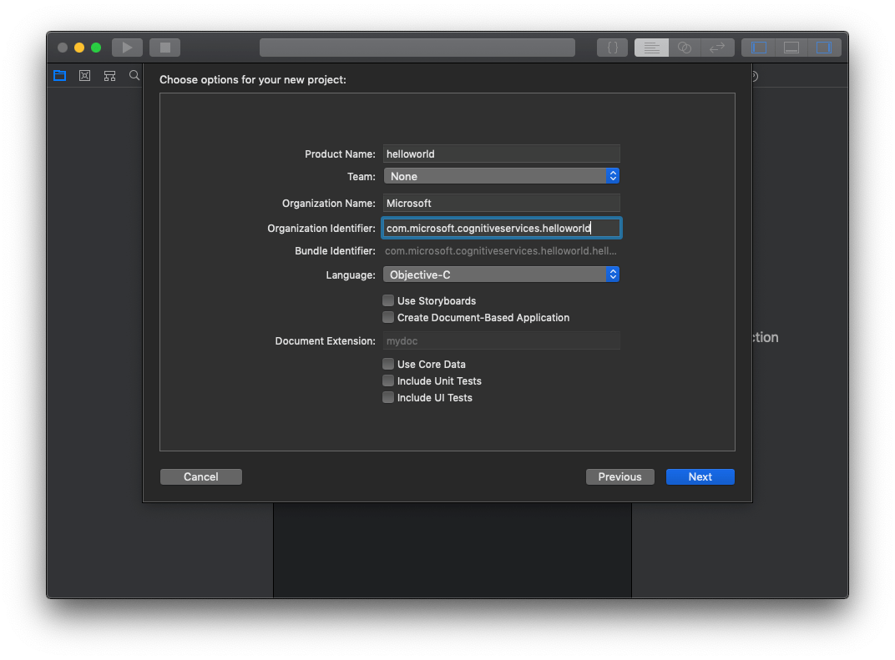
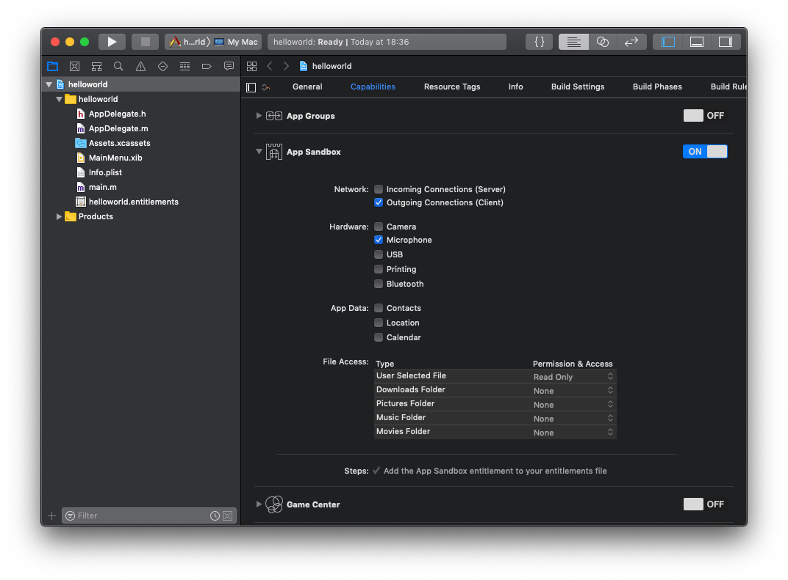
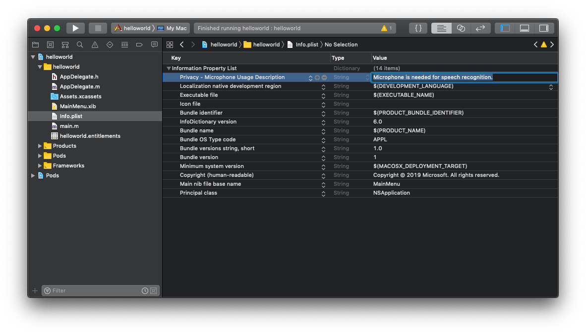

# Quickstart: Recognize speech in Objective-C on macOS by using the Speech SDK

Quickstarts are also available for [speech synthesis](quickstart-text-to-speech-objectivec-macos.md).

In this article, you learn how to create a macOS app in Objective-C by using the Azure Cognitive Services Speech SDK to transcribe speech recorded from a microphone to text.

## Prerequisites

Before you get started, you'll need:

* A [subscription key](get-started.md) for the Speech Service.
* A macOS machine with [Xcode 9.4.1](https://geo.itunes.apple.com/us/app/xcode/id497799835?mt=12) or later and macOS 10.13 or later.

## Get the Speech SDK for macOS

[!INCLUDE [License notice](../../../includes/cognitive-services-speech-service-license-notice.md)]

The Cognitive Services Speech SDK for Mac is distributed as a framework bundle. It can be used in Xcode projects as a [CocoaPod](https://cocoapods.org/) or downloaded from https://aka.ms/csspeech/macosbinary and linked manually. This article uses a CocoaPod.

## Create an Xcode project

Start Xcode, and start a new project by selecting **File** > **New** > **Project**. In the template selection dialog box, select the **Cocoa App** template.

In the dialog boxes that follow, make the following selections.

1. In the **Project Options** dialog box:
    1. Enter a name for the quickstart app, for example, *helloworld*.
    1. Enter an appropriate organization name and an organization identifier if you already have an Apple developer account. For testing purposes, use a name like *testorg*. To sign the app, you need a proper provisioning profile. For more information, see the [Apple developer site](https://developer.apple.com/).
    1. Make sure **Objective-C** is selected as the language for the project.
    1. Clear the check boxes to use storyboards and to create a document-based application. The simple UI for the sample app is created programmatically.
    1. Clear all the check boxes for tests and core data.

    

1. Select a project directory:
    1. Choose a directory to put the project in. This step creates a helloworld directory in your home directory that contains all the files for the Xcode project.
    1. Disable the creation of a Git repo for this example project.
1. Set the entitlements for network and microphone access. Select the app name in the first line in the overview on the left to get to the app configuration. Then select the **Capabilities** tab.
    1. Enable the **App sandbox** setting for the app.
    1. Select the check boxes for **Outgoing Connections** and **Microphone** access.

    

1. The app also needs to declare use of the microphone in the `Info.plist` file. Select the file in the overview, and add the **Privacy - Microphone Usage Description** key with a value like *Microphone is needed for speech recognition*.

    

1. Close the Xcode project. You use a different instance of it later after you set up the CocoaPods.

## Install the SDK as a CocoaPod

1. Install the CocoaPod dependency manager as described in its [installation instructions](https://guides.cocoapods.org/using/getting-started.html).
1. Go to the directory of your sample app, which is helloworld. Place a text file with the name *Podfile* and the following content in that directory:

   [!code-ruby[Quickstart code](~/samples-cognitive-services-speech-sdk/quickstart/objectivec-macos/helloworld/Podfile)]
1. Go to the helloworld directory in a terminal, and run the command `pod install`. This command generates a `helloworld.xcworkspace` Xcode workspace that contains both the sample app and the Speech SDK as a dependency. This workspace is used in the following steps.

## Add the sample code

1. Open the workspace `helloworld.xcworkspace` in Xcode.
1. Replace the contents of the autogenerated `AppDelegate.m` file with the following code:

   [!code-objectivec[Quickstart code](~/samples-cognitive-services-speech-sdk/quickstart/objectivec-macos/helloworld/helloworld/AppDelegate.m#code)]
1. Replace the string `YourSubscriptionKey` with your subscription key.
1. Replace the string `YourServiceRegion` with the [region](regions.md) associated with your subscription. For example, use `westus` for the free trial subscription.

## Build and run the sample

1. Make the debug output visible by selecting **View** > **Debug Area** > **Activate Console**.
1. Build and run the example code by selecting **Product** > **Run** from the menu. You also can select **Play**.
1. After you select the button and say a few words, you should see the text you have spoken on the lower part of the screen. When you run the app for the first time, you should be prompted to give the app access to your computer's microphone.

## Next steps

> [!div class="nextstepaction"]
> [Explore Objective-C samples on GitHub](https://aka.ms/csspeech/samples)
