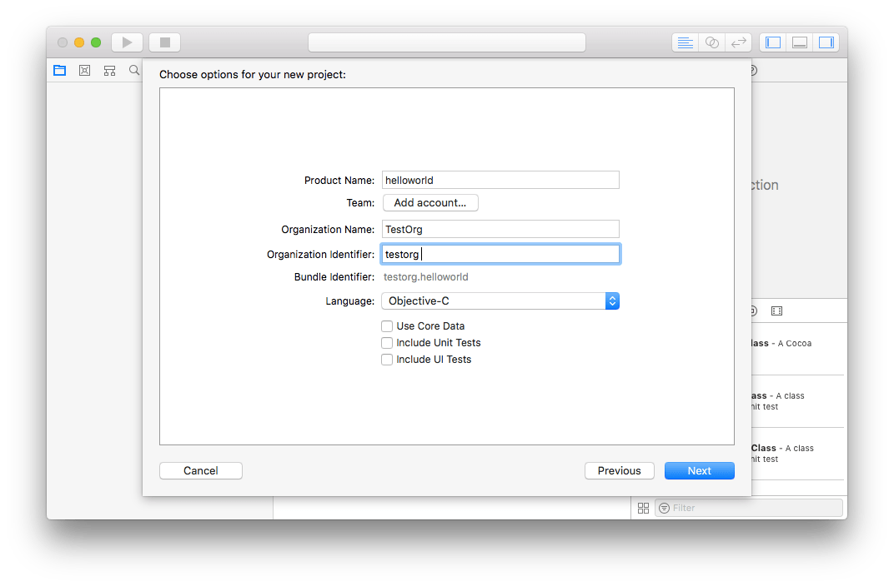
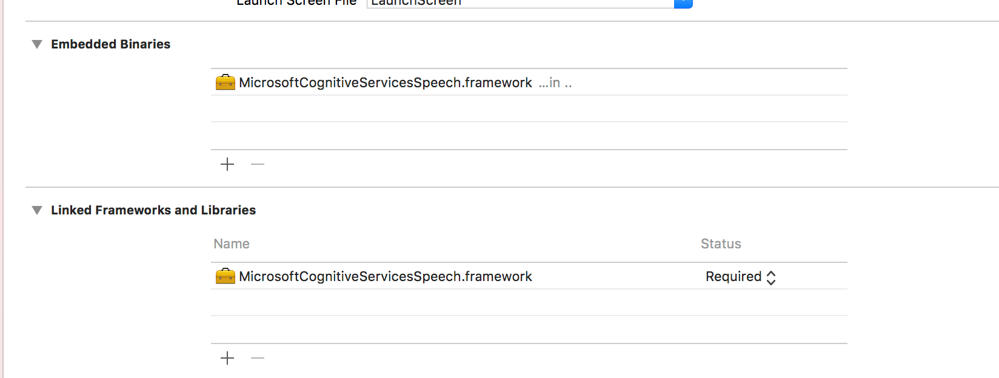
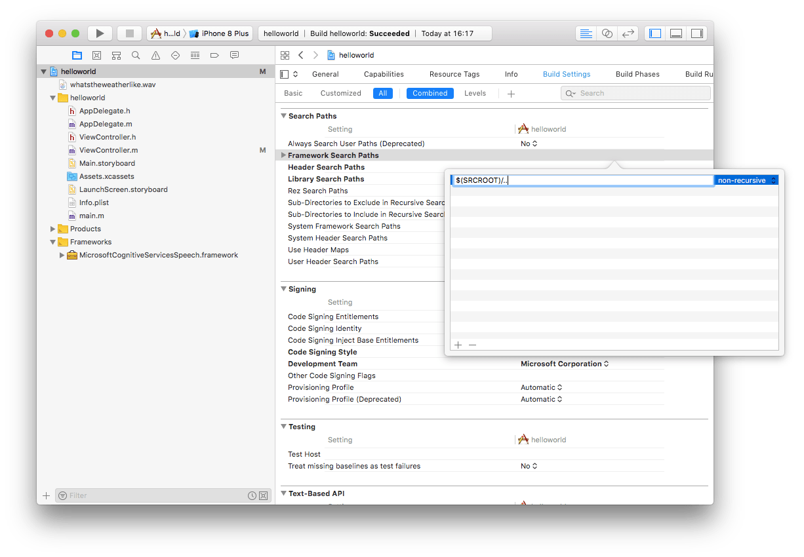
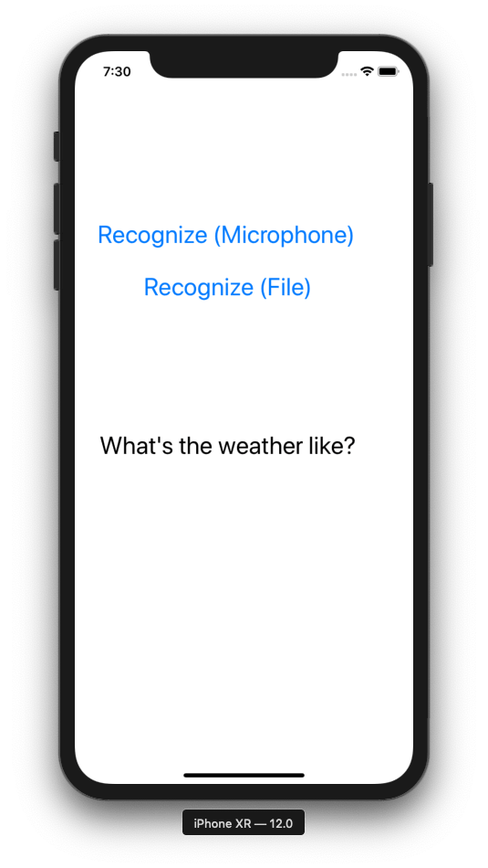

# Quickstart: Recognize speech in Objective-C on iOS using the Speech Service SDK

[!INCLUDE [Selector](../../../includes/cognitive-services-speech-service-quickstart-selector.md)]

In this article, you learn how to create an iOS app in Objective-C using the Cognitive Services Speech SDK to transcribe an audio file with recorded speech to text.

## Prerequisites

Before you get started, here's a list of prerequisites:

* A [subscription key](get-started.md) for the Speech Service
* A macOS machine with [Xcode 9.4.1](https://geo.itunes.apple.com/us/app/xcode/id497799835?mt=12) or later
* The target set to iOS version 11.4

## Get the Speech SDK for iOS

[!INCLUDE [License Notice](../../../includes/cognitive-services-speech-service-license-notice.md)]

The current version of the Cognitive Services Speech SDK is `1.1.0`.

The Cognitive Services Speech SDK for Mac and iOS is currently distributed as a Cocoa Framework.
It can be downloaded from https://aka.ms/csspeech/iosbinary. Download the file to your home directory.

## Create an Xcode Project

Start Xcode, and start a new project by clicking **File** > **New** > **Project**.
In the template selection dialog, choose the "iOS Single View App" template.

In the dialogs that follow, make the following selections:

1. Project Options Dialog
    1. Enter a name for the quickstart app, for example `helloworld`.
    1. Enter an appropriate organization name and organization identifier, if you already have an Apple developer account. For testing purposes, you can just pick any name like `testorg`. In order to sign the app, you also need a proper provisioning profile. Please refer to the [Apple developer site](https://developer.apple.com/) for details.
    1. Make sure Objective-C is chosen as the language for the project.
    1. Disable all checkboxes for tests and core data.
    
1. Select project directory
    1. Choose your home directory to put the project in. This will create a `helloworld` directory in your home directory that contains all the files for the Xcode project.
    1. Disable the creation of a Git repo for this example project.
    1. Adjust the paths to the SDK in the *Project Settings*.
        1. In the **General** tab under the **Embedded Binaries** header, add the SDK library as a framework: **Add embedded binaries** > **Add other...** > Navigate to your home directory and choose the file `MicrosoftCognitiveServicesSpeech.framework`. This will also automatically add the SDK library to the header **Linked Framework and Libraries**.
        
        1. Go to the **Build Settings** tab and activate **All** settings.
        1. Add the directory `$(SRCROOT)/..` to the *Framework Search Paths* under the **Search Paths** heading.
        

## Set up the UI

The example app will have a very simple UI: Two buttons to start speech recognition either from file or from microphone input, and a text label to display the result.
The UI is set up in the `Main.storyboard` part of the project.
Open the XML view of the storyboard by right-clicking the `Main.storyboard` entry of the project tree and selecting **Open As...** > **Source Code**.
Replace the autogenerated XML with this:

[!code-xml[](~/samples-cognitive-services-speech-sdk/quickstart/objectivec-ios/helloworld/helloworld/Base.lproj/Main.storyboard)]

## Add the sample code

1. Download the [sample wav file](https://raw.githubusercontent.com/Azure-Samples/cognitive-services-speech-sdk/f9807b1079f3a85f07cbb6d762c6b5449d536027/samples/cpp/windows/console/samples/whatstheweatherlike.wav) by right-clicking the link and choosing **Save target as...**.
Add the wav file to the project as a resource by dragging it from a Finder window into the root level of the Project view.
Click **Finish** in the following dialog without changing the settings.
1. Replace the contents of the autogenerated `ViewController.m` file by:

   [!code-objectivec[Quickstart Code](~/samples-cognitive-services-speech-sdk/quickstart/objectivec-ios/helloworld/helloworld/ViewController.m#code)]
1. Replace the string `YourSubscriptionKey` with your subscription key.
1. Replace the string `YourServiceRegion` with the [region](regions.md) associated with your subscription (for example, `westus` for the free trial subscription).
1. Add the request for microphone access. Right click the `Info.plist` entry of the project tree and select **Open As...** > **Source Code**. Add the following lines into the `<dict>` section and then save the file.
    ```xml
    <key>NSMicrophoneUsageDescription</key>
    <string>Need microphone access for speech recognition from microphone.</string>
    ```

## Building and Running the Sample

1. Make the debug output visible (**View** > **Debug Area** > **Activate Console**).
1. Choose either the iOS simulator or a iOS device connected to your development machine as the destination for the app from the list in the **Product** -> **Destination** menu.
1. Build and run the example code in the iOS simulator by selecting **Product** -> **Run** from the menu or clicking the **Play** button.
Currently the Speech SDK only supports 64bit iOS platforms.
1. After you click the "Recognize (File)" button in the app, you should see the contents of the audio file "What's the weather like?" on the lower part of the screen.

 

1. After you click the "Recognize (Microphone)" button in the app and say a few words, you should see the text you have spoken on the lower part of the screen.

[!INCLUDE [Download the sample](../../../includes/cognitive-services-speech-service-speech-sdk-sample-download-h2.md)]
Look for this sample in the `quickstart/objectivec-ios` folder.

## Next steps

> [!div class="nextstepaction"]
> [Get our samples](speech-sdk.md#get-the-samples)
