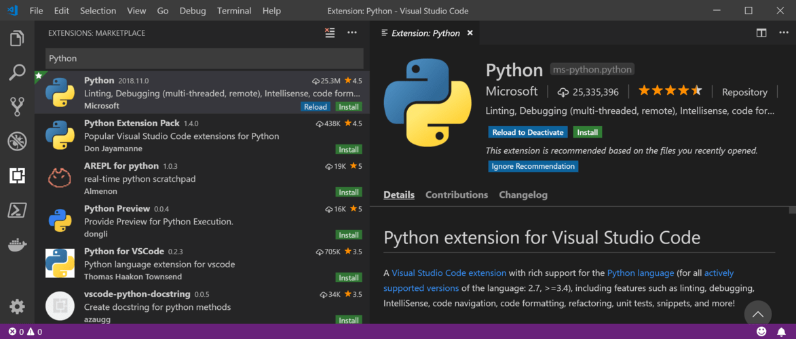
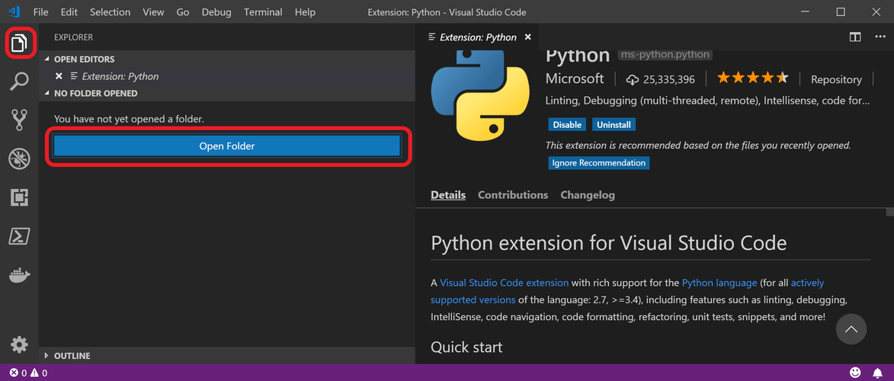
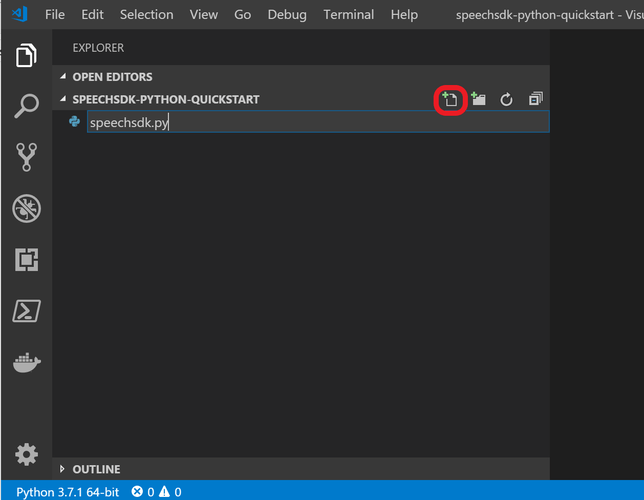
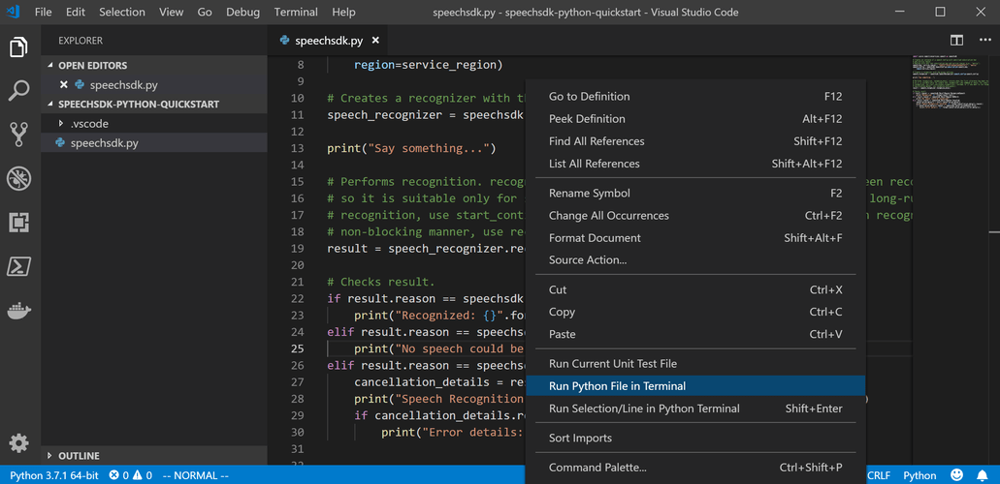

# Quickstart: Using the Speech Service from Python

[!INCLUDE [Selector](../../../includes/cognitive-services-speech-service-quickstart-selector.md)]

This article shows how to use the Speech Service through the Speech SDK for Python. It illustrates how to recognize speech from microphone input.

## Prerequisites

Before you get started, here's a list of prerequisites:

* A [subscription key](get-started.md) for the Speech Service.
* Python 3.5 (64 bit) or later is required. Downloads are available [here](https://www.python.org/downloads/).
* The Python Speech SDK package is available for Windows (x64), Mac (macOS X version 10.12 or later), and Linux (Ubuntu 16.04 or 18.04 on x64).
* On Ubuntu, run the following commands for the installation of required packages:

  ```sh
  sudo apt-get update
  sudo apt-get install build-essential libssl1.0.0 libcurl3 libasound2 wget
  ```

* On Windows, you also need the [Microsoft Visual C++ Redistributable for Visual Studio 2017](https://support.microsoft.com/help/2977003/the-latest-supported-visual-c-downloads) for your platform.

## Get the Speech SDK Python Package

[!INCLUDE [License Notice](../../../includes/cognitive-services-speech-service-license-notice.md)]

The Cognitive Services Speech SDK Python package can be installed from [PyPI](https://pypi.org/) using this command on the command line:

```sh
pip install azure-cognitiveservices-speech
```

The current version of the Cognitive Services Speech SDK is `1.2.0`.

## Support and Updates

Updates to the Speech SDK Python package will be distributed via PyPI, and announced on the [Release Notes](./releasenotes.md) page.
If a new version is available, you can update to it with the command `pip install --upgrade azure-cognitiveservices-speech`.
You can check which version is currently installed by inspecting the `azure.cognitiveservices.speech.__version__` variable.

If you have a problem or are missing a feature, have a look at our [support page](./support.md).

## Create a Python Application using the Speech SDK

### Running the Sample in a Terminal

You can either copy the [code](#quickstart-code) from this quickstart to a source file `quickstart.py` and run it in your IDE or in the console

```sh
python quickstart.py
```

or you can download this quickstart tutorial as a [Jupyter](https://jupyter.org) notebook from the [Cognitive Services Speech samples repository](https://github.com/Azure-Samples/cognitive-services-speech-sdk/) and run it as a notebook.

### Quickstart code

[!code-python[Quickstart Code](~/samples-cognitive-services-speech-sdk/quickstart/python/quickstart.py#code)]

[!INCLUDE [Download this sample](../../../includes/cognitive-services-speech-service-speech-sdk-sample-download-h2.md)]
Look for this sample in the `quickstart/python` folder.

### Installing the Speech SDK Python Package and Running the Sample in Visual Studio Code

1. [Download](https://www.python.org/downloads/) and install a 64-bit version (3.5 or later) of Python on your computer.
1. [Download](https://code.visualstudio.com/Download) and install Visual Studio Code.
1. Open Visual Studio Code and install the Python extension by selecting **File** > **Preferences** > **Extensions** from the menu and searching for "Python".
   
1. Create a folder to store the project in, for example using Windows Explorer.
1. In Visual Studio Code, click on the **File** icon, and then open the folder you created.
   
1. Create a new Python source file `speechsdk.py`, by clicking on the new file icon.
   
1. Copy, paste, and save the [Python code](#quickstart-code) to the newly created file.
1. Insert your Speech Service subscription information.
1. If a Python interpreter has already been selected, it will be displayed on the left side of the status bar at the bottom of the window.
   Otherwise, you can bring up a list of available Python interpreters by opening the **Command Palette** (`Ctrl+Shift+P`) and typing **Python: Select Interpreter**, and choose an appropriate one.
1. If the Speech SDK Python package is not yet installed for the Python interpreter you selected, this can be easily done from within Visual Studio Code.
   To install the Speech SDK package, open a terminal by bringing up the Command Palette again (`Ctrl+Shift+P`) and typing **Terminal: Create New Integrated Terminal**.
   In the terminal that opens, enter the command `python -m pip install azure-cognitiveservices-speech`, or the appropriate command for your system.
1. To run the sample code, right-click somewhere inside the editor and select **Run Python File in Terminal**.
   Say a few words once prompted, and the transcribed text should be displayed shortly afterwards.
   

If there are issues following these instructions, refer to the more extensive [Visual Studio Code Python tutorial](https://code.visualstudio.com/docs/python/python-tutorial).

## Next steps

> [!div class="nextstepaction"]
> [Get our samples](speech-sdk.md#get-the-samples)

