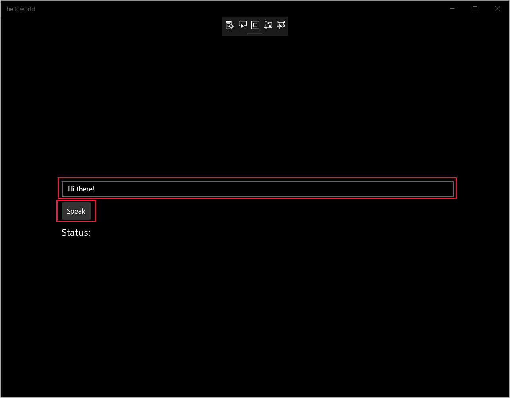
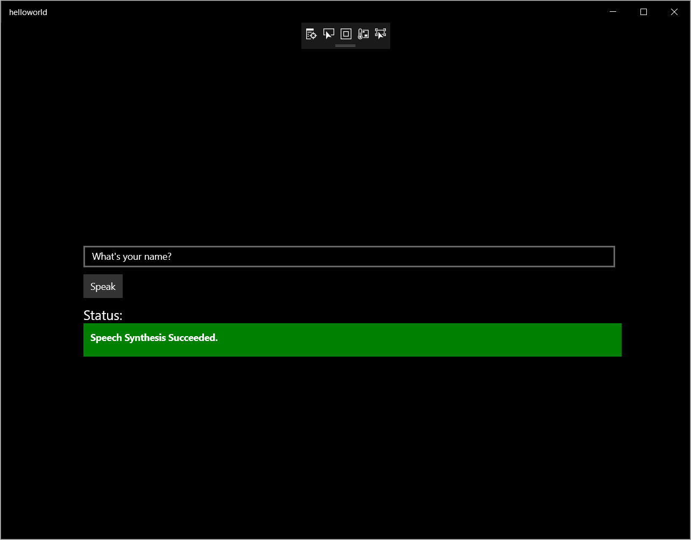

# Quickstart: Synthesize speech in a UWP app by using the Speech SDK

Quickstarts are also available for [speech recognition](quickstart-csharp-uwp.md), [speech translation](quickstart-translate-speech-uwp.md), and [voice assistant](quickstart-speech-assistant-csharp-uwp.md).

In this article, you develop a C# Universal Windows Platform (UWP) application by using the Cognitive Services [Speech SDK](speech-sdk.md). The program synthesizes speech from text in real time to your device's speaker. You build the application using the [Speech SDK NuGet Package](https://aka.ms/csspeech/nuget) and Microsoft Visual Studio 2019 (any edition).

> [!NOTE]
> The Universal Windows Platform lets you develop apps that run on any device that supports Windows 10, including PCs, Xbox, Surface Hub, and other devices.

## Prerequisites

This quickstart requires:

* [Visual Studio 2019](https://visualstudio.microsoft.com/downloads/).
* An Azure subscription key for the Speech Service. [Get one for free](get-started.md).

## Create a Visual Studio project

[!INCLUDE ]

## Add sample code

Now add the XAML code that defines the user interface of the application, and add the C# code-behind implementation.

1. In **Solution Explorer**, open `MainPage.xaml`.

1. In the designer's XAML view, insert the following XAML snippet into the **Grid** tag (between `<Grid>` and `</Grid>`):

   [!code-xml[UI elements](~/samples-cognitive-services-speech-sdk/quickstart/text-to-speech/csharp-uwp/helloworld/MainPage.xaml#StackPanel)]

1. In **Solution Explorer**, open the code-behind source file `MainPage.xaml.cs`. (It's grouped under `MainPage.xaml`.)

1. Replace all the code in it with the following snippet:

   [!code-csharp[Quickstart Code](~/samples-cognitive-services-speech-sdk/quickstart/text-to-speech/csharp-uwp/helloworld/MainPage.xaml.cs#code)]

1. In the source file's `Speak_ButtonClicked` handler, find the string `YourSubscriptionKey`, and replace it with your subscription key.

1. In the `Speak_ButtonClicked` handler, find the string `YourServiceRegion`, and replace it with the [region](regions.md) associated with your subscription. (For example, use `westus` for the free trial subscription.)

1. From the menu bar, choose **File** > **Save All** to save your changes.

## Build and run the application

Now you are ready to build and test your application.

1. From the menu bar, choose **Build** > **Build Solution** to build the application. The code should compile without errors now.

1. Choose **Debug** > **Start Debugging** (or press **F5**) to start the application. The **helloworld** window appears.

   

1. Enter some text into the textbox, and click **Speak**. Your text is transmitted to the Speech Services and synthesized to speech, which plays on your speaker.

    

## Next steps

> [!div class="nextstepaction"]
> [Explore C# samples on GitHub](https://aka.ms/csspeech/samples)

## See also

- [Create and use Custom Voice models](how-to-custom-voice-create-voice.md)
- [Record voice samples](record-custom-voice-samples.md)
