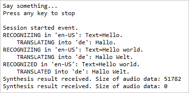

# Quickstart: Translate speech with the Speech SDK for Java

In this quickstart, you'll create a simple Java application that captures user speech from your computer's microphone, translates the speech, and transcribes the translated text to the command line in real time. This application is designed to run on 64-bit Windows or 64-bit Ubuntu Linux 16.04/18.04, and is built with the Speech SDK Maven package and the Eclipse Java IDE.

For a complete list of languages available for speech translation, see [language support](language-support.md).

## Prerequisites

This quickstart requires:

* Operating System: 64-bit Windows or 64-bit Ubuntu Linux 16.04/18.04
* [Eclipse Java IDE](https://www.eclipse.org/downloads/)
* [Java 8](https://www.oracle.com/technetwork/java/javase/downloads/jre8-downloads-2133155.html) or [JDK 8](https://www.oracle.com/technetwork/java/javase/downloads/index.html)
* An Azure subscription key for the Speech Service. [Get one for free](get-started.md).

If you're running Ubuntu 16.04/18.04, make sure these dependencies are installed before starting Eclipse.

```console
sudo apt-get update
sudo apt-get install build-essential libssl1.0.0 libasound2 wget
```

> [!NOTE]
> For the Speech Devices SDK and the Roobo device, see [Speech Devices SDK](speech-devices-sdk.md).

## Create and configure project

[!INCLUDE [](../../../includes/cognitive-services-speech-service-quickstart-java-create-proj.md)]

## Add sample code

1. To add a new empty class to your Java project, select **File** > **New** > **Class**.

1. In the **New Java Class** window, enter **speechsdk.quickstart** into the **Package** field, and **Main** into the **Name** field.

   

1. Replace all code in `Main.java` with the following snippet:

   ```java
   package speechsdk.quickstart;

   import java.io.IOException;
   import java.util.Map;
   import java.util.Scanner;
   import java.util.concurrent.ExecutionException;
   import com.microsoft.cognitiveservices.speech.*;
   import com.microsoft.cognitiveservices.speech.translation.*;

   public class Main {

       public static void translationWithMicrophoneAsync() throws InterruptedException, ExecutionException, IOException
       {
           // Creates an instance of a speech translation config with specified
           // subscription key and service region. Replace with your own subscription key
           // and service region (e.g., "westus").
           SpeechTranslationConfig config = SpeechTranslationConfig.fromSubscription("YourSubscriptionKey", "YourServiceRegion");

           // Sets source and target language(s).
           String fromLanguage = "en-US";
           config.setSpeechRecognitionLanguage(fromLanguage);
           config.addTargetLanguage("de");

           // Sets voice name of synthesis output.
           String GermanVoice = "Microsoft Server Speech Text to Speech Voice (de-DE, Hedda)";
           config.setVoiceName(GermanVoice);

           // Creates a translation recognizer using microphone as audio input.
           TranslationRecognizer recognizer = new TranslationRecognizer(config);
           {
               // Subscribes to events.
               recognizer.recognizing.addEventListener((s, e) -> {
                   System.out.println("RECOGNIZING in '" + fromLanguage + "': Text=" + e.getResult().getText());

                   Map<String, String> map = e.getResult().getTranslations();
                   for(String element : map.keySet()) {
                       System.out.println("    TRANSLATING into '" + element + "': " + map.get(element));
                   }
               });

               recognizer.recognized.addEventListener((s, e) -> {
                   if (e.getResult().getReason() == ResultReason.TranslatedSpeech) {
                       System.out.println("RECOGNIZED in '" + fromLanguage + "': Text=" + e.getResult().getText());

                       Map<String, String> map = e.getResult().getTranslations();
                       for(String element : map.keySet()) {
                           System.out.println("    TRANSLATED into '" + element + "': " + map.get(element));
                       }
                   }
                   if (e.getResult().getReason() == ResultReason.RecognizedSpeech) {
                       System.out.println("RECOGNIZED: Text=" + e.getResult().getText());
                       System.out.println("    Speech not translated.");
                   }
                   else if (e.getResult().getReason() == ResultReason.NoMatch) {
                       System.out.println("NOMATCH: Speech could not be recognized.");
                   }
               });

               recognizer.synthesizing.addEventListener((s, e) -> {
                   System.out.println("Synthesis result received. Size of audio data: " + e.getResult().getAudio().length);
               });

               recognizer.canceled.addEventListener((s, e) -> {
                   System.out.println("CANCELED: Reason=" + e.getReason());

                   if (e.getReason() == CancellationReason.Error) {
                       System.out.println("CANCELED: ErrorCode=" + e.getErrorCode());
                       System.out.println("CANCELED: ErrorDetails=" + e.getErrorDetails());
                       System.out.println("CANCELED: Did you update the subscription info?");
                   }
               });

               recognizer.sessionStarted.addEventListener((s, e) -> {
                   System.out.println("\nSession started event.");
               });

               recognizer.sessionStopped.addEventListener((s, e) -> {
                   System.out.println("\nSession stopped event.");
               });

               // Starts continuous recognition. Uses StopContinuousRecognitionAsync() to stop recognition.
               System.out.println("Say something...");
               recognizer.startContinuousRecognitionAsync().get();

               System.out.println("Press any key to stop");
               new Scanner(System.in).nextLine();

               recognizer.stopContinuousRecognitionAsync().get();
           }
       }

       public static void main(String[] args) {
           try {
               translationWithMicrophoneAsync();
           } catch (Exception ex) {
               System.out.println("Unexpected exception: " + ex.getMessage());
               assert(false);
               System.exit(1);
           }
       }
   }
   ```

1. Replace the string `YourSubscriptionKey` with your subscription key.

1. Replace the string `YourServiceRegion` with the [region](regions.md) associated with your subscription (for example, `westus` for the free trial subscription).

1. Save changes to the project.

## Build and run the app

Press F11, or select **Run** > **Debug**.

The speech input from your microphone will be transcribed into German and logged in the console window. Press "Enter" to stop capturing speech.



## Next steps

Additional samples, such as how to read speech from an audio file, and output translated text as synthesized speech, are available on GitHub.

> [!div class="nextstepaction"]
> [Explore Java samples on GitHub](https://aka.ms/csspeech/samples)

## See also

- [Quickstart: Recognize speech, Java (Windows, Linux)](quickstart-java-jre.md)
- [Customize acoustic models](how-to-customize-acoustic-models.md)
- [Customize language models](how-to-customize-language-model.md)
