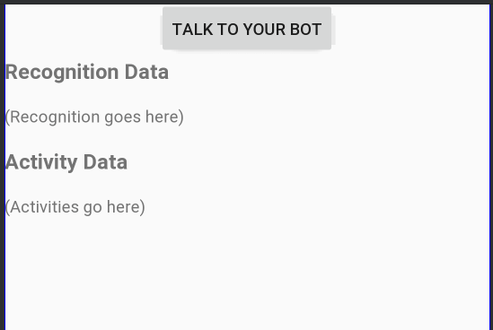
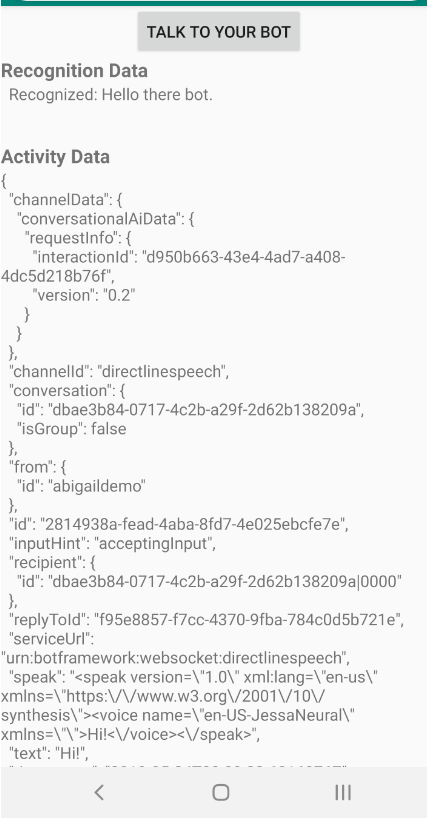

# Quickstart: Create a voice-first virtual assistant in Java on Android by using the Speech SDK

A quickstart is also available for [speech-to-text](quickstart-java-android.md).

In this article, you'll build a voice-first virtual assistant with Java for Android using the [Speech SDK](speech-sdk.md). This application will connect to a previously authored bot, which has been configured to use the [Direct Line Speech channel](https://docs.microsoft.com/azure/bot-service/bot-service-channel-connect-directlinespeech), send a voice request, and return a voice response activity (if configured). 

This application is built with the Speech SDK Maven package and Android Studio 3.3. The Speech SDK is currently compatible with Android devices having 32/64-bit ARM and Intel x86/x64 compatible processors.

> [!NOTE]
> For the Speech Devices SDK and the Roobo device, see [Speech Devices SDK](speech-devices-sdk.md).

## Prerequisites

* An Azure subscription key for the Speech Services. [Get one for free](get-started.md).
* A previously created bot configured with the [Direct Line Speech channel](https://docs.microsoft.com/azure/bot-service/bot-service-channel-connect-directlinespeech)
* [Android Studio](https://developer.android.com/studio/) v3.3 or later
 
    > [!NOTE]
    > In preview, the Direct Line Speech channel currently supports only the **westus2** region.

    > [!NOTE]
    > The 30-day trial for the standard pricing tier described in [Try Speech Services for free](get-started.md) is restricted to **westus** (not **westus2**) and is thus not compatible with Direct Line Speech. Free and standard tier **westus2** subscriptions are compatible.

## Create and configure a project

[!INCLUDE [](../../../includes/cognitive-services-speech-service-quickstart-java-android-create-proj.md)]

## Create user interface

We will create a basic user interface for the application. Edit the layout for your main activity, `activity_main.xml`. Initially, the layout includes a title bar with your application's name, and a TextView containing the text "Hello World!".

Next, replace the contents of the `activity_main.xml` with the following code:

   ```xml
   <?xml version="1.0" encoding="utf-8"?>
   <LinearLayout xmlns:android="http://schemas.android.com/apk/res/android"
    xmlns:tools="http://schemas.android.com/tools"
    android:layout_width="match_parent"
    android:layout_height="match_parent"
    android:orientation="vertical"
    tools:context=".MainActivity">

    <Button
        android:id="@+id/button"
        android:layout_width="wrap_content"
        android:layout_height="wrap_content"
        android:layout_gravity="center"
        android:onClick="onBotButtonClicked"
        android:text="Talk to your bot" />

    <TextView
        android:layout_width="match_parent"
        android:layout_height="wrap_content"
        android:text="Recognition Data"
        android:textSize="18dp"
        android:textStyle="bold" />

    <TextView
        android:id="@+id/recoText"
        android:layout_width="match_parent"
        android:layout_height="wrap_content"
        android:text="  \n(Recognition goes here)\n" />

    <TextView
        android:layout_width="match_parent"
        android:layout_height="wrap_content"
        android:text="Activity Data"
        android:textSize="18dp"
        android:textStyle="bold" />

    <TextView
        android:id="@+id/activityText"
        android:layout_width="match_parent"
        android:layout_height="match_parent"
        android:scrollbars="vertical"
        android:text="  \n(Activities go here)\n" />

   </LinearLayout>
   ```

This XML defines a simple interface to interact with your bot.

* The `button` element initiates an interaction and invokes the `onBotButtonClicked` method when clicked.
* The `recoText` element will display the speech-to-text results as you talk to your bot.
* The `activityText` element will display the JSON payload for the latest Bot Framework activity from your bot.

The text and graphical representation of your UI should now look like this:



## Add sample code

1. Open `MainActivity.java`, and replace the contents with the following code:

   ```java
    package samples.speech.cognitiveservices.microsoft.com;

    import android.media.AudioFormat;
    import android.media.AudioManager;
    import android.media.AudioTrack;
    import android.support.v4.app.ActivityCompat;
    import android.support.v7.app.AppCompatActivity;
    import android.os.Bundle;
    import android.text.method.ScrollingMovementMethod;
    import android.view.View;
    import android.widget.TextView;

    import com.microsoft.cognitiveservices.speech.audio.AudioConfig;
    import com.microsoft.cognitiveservices.speech.audio.PullAudioOutputStream;
    import com.microsoft.cognitiveservices.speech.dialog.BotConnectorConfig;
    import com.microsoft.cognitiveservices.speech.dialog.SpeechBotConnector;

    import org.json.JSONException;
    import org.json.JSONObject;

    import static android.Manifest.permission.*;

    public class MainActivity extends AppCompatActivity {
        // Replace below with your bot's own Direct Line Speech channel secret
        private static String channelSecret = "YourChannelSecret";
        // Replace below with your own speech subscription key
        private static String speechSubscriptionKey = "YourSpeechSubscriptionKey";
        // Replace below with your own speech service region (note: only 'westus2' is currently supported)
        private static String serviceRegion = "YourSpeechServiceRegion";

        private SpeechBotConnector botConnector;

        @Override
        protected void onCreate(Bundle savedInstanceState) {
            super.onCreate(savedInstanceState);
            setContentView(R.layout.activity_main);

            TextView recoText = (TextView) this.findViewById(R.id.recoText);
            TextView activityText = (TextView) this.findViewById(R.id.activityText);
            recoText.setMovementMethod(new ScrollingMovementMethod());
            activityText.setMovementMethod(new ScrollingMovementMethod());

            // Note: we need to request permissions for audio input and network access
            int requestCode = 5; // unique code for the permission request
            ActivityCompat.requestPermissions(MainActivity.this, new String[]{RECORD_AUDIO, INTERNET}, requestCode);
        }

        public void onBotButtonClicked(View v) {
            // Recreate the SpeechBotConnector on each button press, ensuring that the existing one is closed
            if (botConnector != null) {
                botConnector.close();
                botConnector = null;
            }

            // Create the SpeechBotConnector from the channel and speech subscription information
            BotConnectorConfig config = BotConnectorConfig.fromSecretKey(channelSecret, speechSubscriptionKey, serviceRegion);
            botConnector = new SpeechBotConnector(config, AudioConfig.fromDefaultMicrophoneInput());

            // Optional step: preemptively connect to reduce first interaction latency
            botConnector.connectAsync();

            // Register the SpeechBotConnector's event listeners
            registerEventListeners();

            // Begin sending audio to your bot
            botConnector.listenOnceAsync();
        }

        private void registerEventListeners() {
            TextView recoText = (TextView) this.findViewById(R.id.recoText); // 'recoText' is the ID of your text view
            TextView activityText = (TextView) this.findViewById(R.id.activityText); // 'activityText' is the ID of your text view

            // Recognizing will provide the intermediate recognized text while an audio stream is being processed
            botConnector.recognizing.addEventListener((o, recoArgs) -> {
                recoText.setText("  Recognizing: " + recoArgs.getResult().getText());
            });

            // Recognized will provide the final recognized text once audio capture is completed
            botConnector.recognized.addEventListener((o, recoArgs) -> {
                recoText.setText("  Recognized: " + recoArgs.getResult().getText());
            });

            // SessionStarted will notify when audio begins flowing to the service for a turn
            botConnector.sessionStarted.addEventListener((o, sessionArgs) -> {
                recoText.setText("Listening...");
            });

            // SessionStopped will notify when a turn is complete and it's safe to begin listening again
            botConnector.sessionStopped.addEventListener((o, sessionArgs) -> {
            });

            // Canceled will be signaled when a turn is aborted or experiences an error condition
            botConnector.canceled.addEventListener((o, canceledArgs) -> {
                recoText.setText("Canceled (" + canceledArgs.getReason().toString() + ") error details: {}" + canceledArgs.getErrorDetails());
                botConnector.disconnectAsync();
            });

            // ActivityReceived is the main way your bot will communicate with the client and uses bot framework activities.
            botConnector.activityReceived.addEventListener((o, activityArgs) -> {
                try {
                    // Here we use JSONObject only to "pretty print" the condensed Activity JSON
                    String rawActivity = activityArgs.getActivity().serialize();
                    String formattedActivity = new JSONObject(rawActivity).toString(2);
                    activityText.setText(formattedActivity);
                } catch (JSONException e) {
                    activityText.setText("Couldn't format activity text: " + e.getMessage());
                }

                if (activityArgs.hasAudio()) {
                    // Text-to-speech audio associated with the activity is 16 kHz 16-bit mono PCM data
                    final int sampleRate = 16000;
                    int bufferSize = AudioTrack.getMinBufferSize(sampleRate, AudioFormat.CHANNEL_OUT_MONO, AudioFormat.ENCODING_PCM_16BIT);

                    AudioTrack track = new AudioTrack(
                            AudioManager.STREAM_MUSIC,
                            sampleRate,
                            AudioFormat.CHANNEL_OUT_MONO,
                            AudioFormat.ENCODING_PCM_16BIT,
                            bufferSize,
                            AudioTrack.MODE_STREAM);

                    track.play();

                    PullAudioOutputStream stream = activityArgs.getAudio();

                    // Audio is streamed as it becomes available. Play it as it arrives.
                    byte[] buffer = new byte[bufferSize];
                    long bytesRead = 0;

                    do {
                        bytesRead = stream.read(buffer);
                        track.write(buffer, 0, (int) bytesRead);
                    } while (bytesRead == bufferSize);

                    track.release();
                }
            });
        }
    }
   ```

   * The `onCreate` method includes code that requests microphone and internet permissions.

   * The method `onBotButtonClicked` is, as noted earlier, the button click handler. A button press triggers a single interaction ("turn") with your bot.

   * The `registerEventListeners` method demonstrates the events used by the SpeechBotConnector and basic handling of incoming activities.

1. In the same file, replace the configuration strings to match your resources:

    * Replace `YourChannelSecret` with the Direct Line Speech channel secret for your bot.

    * Replace `YourSpeechSubscriptionKey` with your subscription key.

    * Replace `YourServiceRegion` with the [region](regions.md) associated with your subscription (Note: only 'westus2' is currently supported).

## Build and run the app

1. Connect your Android device to your development PC. Make sure you have enabled [development mode and USB debugging](https://developer.android.com/studio/debug/dev-options) on the device.

1. To build the application, press Ctrl+F9, or choose **Build** > **Make Project** from the menu bar.

1. To launch the application, press Shift+F10, or choose **Run** > **Run 'app'**.

1. In the deployment target window that appears, choose your Android device.

   

Once the application and its activity have launched, click the button to begin talking to your bot. Transcribed text will appear as you speak and the latest activity have you received from your bot will appear when it is received. If your bot is configured to provide spoken responses, the speech-to-text will automatically play.



## Next steps

> [!div class="nextstepaction"]
> [Explore Java samples on GitHub](https://aka.ms/csspeech/samples)
> [Connect Direct Line Speech to your bot](https://docs.microsoft.com/azure/bot-service/bot-service-channel-connect-directlinespeech)

## See also
- [About voice-first virtual assistants](voice-first-virtual-assistants.md)
- [Custom wake words](speech-devices-sdk-create-kws.md)
