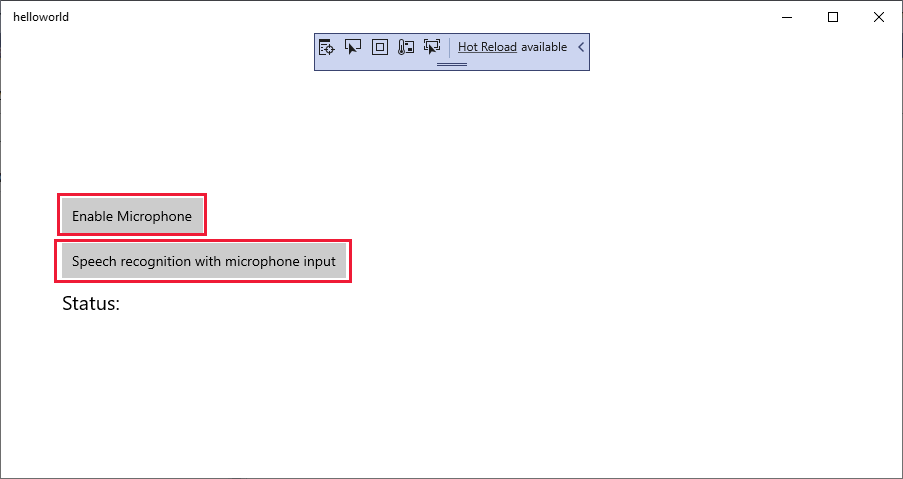

## Prerequisites

Before you get started, make sure to:

1. [Create a Speech resource and get a subscription key]().
2. [Setup your development environment](../../../quickstart-platform-csharp-unity.md). Use this quickstart to install and configure Unity.

If you've already done this, great. Let's keep going.

## Open your project in Visual Studio

The first step is to make sure that you have your project open in Visual Studio.

## Start with some boilerplate code

Let's add some code that works as a skeleton for our project.

1. In **Solution Explorer**, open `MainPage.xaml`.

2. In the designer's XAML view, insert the following XAML snippet into the **Grid** tag (between `<Grid>` and `</Grid>`):

   [!code-xml[UI elements](~/samples-cognitive-services-speech-sdk/quickstart/csharp-uwp/helloworld/MainPage.xaml#StackPanel)]

3. In **Solution Explorer**, open the code-behind source file `MainPage.xaml.cs`. (It's grouped under `MainPage.xaml`.)

4. Replace the code with the following bas code:

[!code-csharp[UI elements](~/samples-cognitive-services-speech-sdk/quickstart/csharp-uwp/helloworld/MainPage.xaml.cs?range=6-50,55-56,94-154)]

## Create a Speech configuration

Before you can initialize a `SpeechRecognizer` object, you need to create a configuration that uses your subscription key and subscription region. Insert this code in the `RecognizeSpeechAsync()` method.

> [!NOTE]
> This sample uses the `FromSubscription()` method to build the `SpeechConfig`. For a full list of available methods, see [SpeechConfig Class](https://docs.microsoft.com/dotnet/api/)
[!code-csharp]

## Initialize a SpeechRecognizer

Now, let's create a `SpeechRecognizer`. This object is created inside of a using statement to ensure the proper release of unmanaged resources. Insert this code in the `RecognizeSpeechAsync()` method, right below your Speech configuration.
[!code-csharp]

## Recognize a phrase

From the `SpeechRecognizer` object, you're going to call the `RecognizeOnceAsync()` method. This method lets the Speech service know that you're sending a single phrase for recognition, and that once the phrase is identified to stop reconizing speech.

Inside the using statement, add this code:
[!code-csharp]

## Display the recognition results (or errors)

When the recognition result is returned by the Speech service, you'll want to do something with it. We're going to keep it simple and print the result to the status panel.

[!code-csharp]

## Build and run the application

Now you are ready to build and test your application.

1. From the menu bar, choose **Build** > **Build Solution** to build the application. The code should compile without errors now.

1. Choose **Debug** > **Start Debugging** (or press **F5**) to start the application. The **helloworld** window appears.

   

1. Select **Enable Microphone**, and when the access permission request pops up, select **Yes**.

   

1. Select **Speech recognition with microphone input**, and speak an English phrase or sentence into your device's microphone. Your speech is transmitted to the Speech Services and transcribed to text, which appears in the window.

   

## Next steps

> [!div class="nextstepaction"]
> [Explore C# samples on GitHub](https://aka.ms/csspeech/samples)
